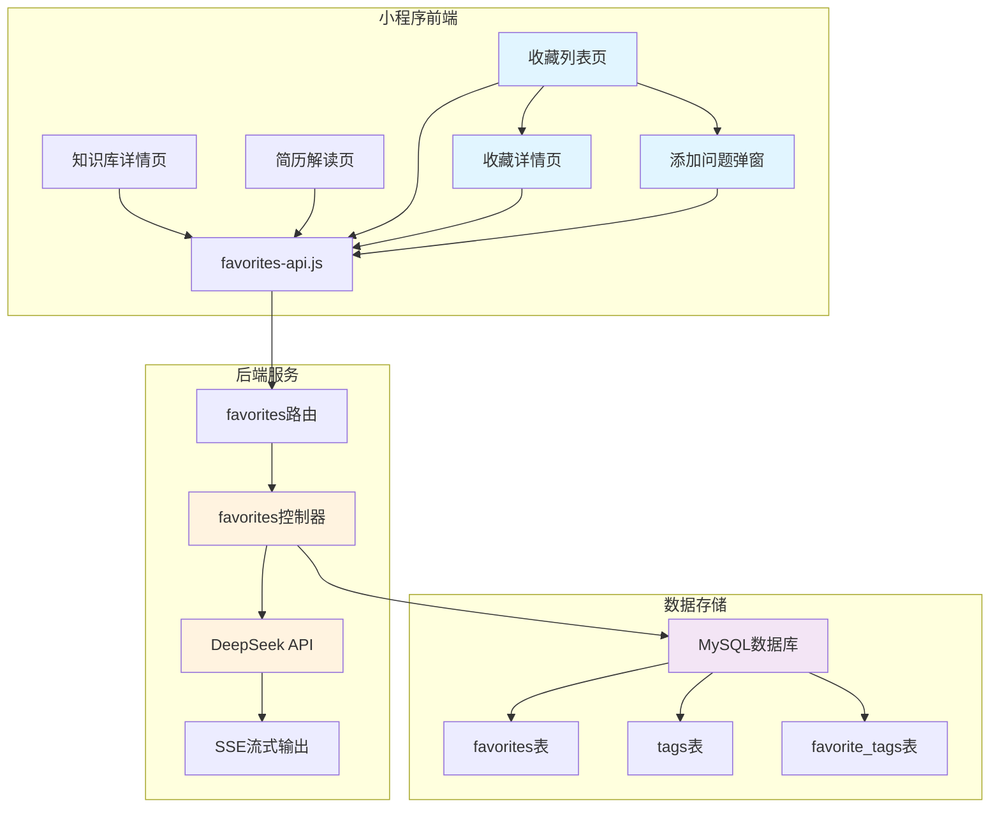

# Design Document - 我的收藏功能

## Overview

"我的收藏"功能是一个完整的知识管理系统，允许用户收藏、管理和查看来自不同来源的面试问题和答案。系统整合了知识库、简历解读和自定义问题三个来源，提供标签分类、搜索筛选、AI生成答案（流式输出）等功能。

**核心价值：**
- 统一管理来自多个来源的面试问题
- 支持自定义问题并通过AI生成专业答案
- 提供标签分类和搜索功能，方便大量问题的管理
- 使用流式输出技术，提升AI答案生成的用户体验
- 复用towxml组件，完美渲染Markdown格式的答案

**技术特点：**
- 前后端分离架构，整合到现有的统一后端服务
- MySQL数据库存储，支持高效查询和分页
- Server-Sent Events (SSE) 实现流式输出
- 会员限制：免费用户10条，会员无限

## Architecture

### 系统架构图



### 技术栈

**前端：**
- 微信小程序原生框架
- Vant Weapp UI组件库
- towxml Markdown渲染组件
- favorites-api.js API客户端

**后端：**
- Node.js + Express.js
- MySQL 8.0+ 数据库
- DeepSeek AI API
- Server-Sent Events (SSE)

**数据流：**
1. 用户操作 → 小程序页面
2. 页面调用 → favorites-api.js
3. API客户端 → 后端 /api/favorites/*
4. 后端处理 → MySQL数据库 / DeepSeek API
5. 响应返回 → 前端更新UI

## Components and Interfaces

### 前端组件结构

#### 1. 收藏列表页 (`pages/favorites/index`)

**功能：**
- 展示所有收藏的问题列表
- 支持标签筛选
- 分页加载（每页20条）
- 添加自定义问题
- 下拉刷新

**UI布局：**
```
┌─────────────────────────────┐
│  我的收藏                    │
├─────────────────────────────┤
│  🏷️ 标签筛选区               │
│  [全部] [简历] [Spark] ...  │
├─────────────────────────────┤
│  ┌─────────────────────┐    │
│  │ 📝 问题标题...       │    │
│  │ 🏷️ 标签1 标签2      │    │
│  │ 📅 2024-01-01       │    │
│  │ 📂 来源：知识库      │    │
│  └─────────────────────┘    │
│  ┌─────────────────────┐    │
│  │ 📝 问题标题...       │    │
│  │ 🏷️ 标签3            │    │
│  │ 📅 2024-01-02       │    │
│  │ 📂 来源：简历解读    │    │
│  └─────────────────────┘    │
├─────────────────────────────┤
│  ➕ 添加自定义问题           │
└─────────────────────────────┘
```

**关键数据：**
```javascript
{
  favoritesList: [],      // 收藏列表
  allTags: [],           // 所有标签（带问题数量）
  activeTag: null,       // 当前筛选标签
  page: 1,               // 当前页码
  hasMore: true,         // 是否有更多数据
  loading: false         // 加载状态
}
```

#### 2. 收藏详情页 (`pages/favorites/detail`)

**功能：**
- 显示完整的问题和答案
- 使用towxml渲染Markdown答案
- 编辑标签
- 删除收藏
- 分享功能

**UI布局：**
```
┌─────────────────────────────┐
│  ❓ 问题标题                 │
├─────────────────────────────┤
│  🏷️ [标签1] [标签2] [+]    │
├─────────────────────────────┤
│  📝 答案内容（Markdown）     │
│                             │
│  # 标题                     │
│  正文内容...                │
│  ```code```                 │
│                             │
├─────────────────────────────┤
│  📂 来源：知识库 - HDFS      │
│  📅 收藏时间：2024-01-01    │
├─────────────────────────────┤
│  [编辑] [删除] [分享]       │
└─────────────────────────────┘
```

#### 3. 添加问题弹窗组件 (`components/add-question-modal`)

**功能：**
- 输入自定义问题
- 调用AI生成答案（流式输出）
- 添加标签
- 保存到收藏

**UI布局：**
```
┌─────────────────────────────┐
│  添加自定义问题              │
├─────────────────────────────┤
│  ┌─────────────────────┐    │
│  │ 请输入问题...       │    │
│  │                     │    │
│  └─────────────────────┘    │
├─────────────────────────────┤
│  🏷️ 添加标签                │
│  [标签1] [x] [标签2] [x]   │
│  [+ 添加新标签]             │
├─────────────────────────────┤
│  💡 AI正在生成答案...       │
│  ████████░░░░░░ 60%         │
│                             │
│  答案预览（实时更新）        │
│  正在生成中...              │
├─────────────────────────────┤
│  [取消] [保存到收藏]        │
└─────────────────────────────┘
```

#### 4. 收藏按钮组件 (`components/favorite-button`)

**功能：**
- 显示收藏状态（已收藏/未收藏）
- 切换收藏状态
- 提供视觉反馈

**样式：**
- 未收藏：⭐️ 空心星星
- 已收藏：⭐ 实心星星（金色）
- 点击动画：缩放+旋转效果

### 后端接口设计

#### API路由 (`server/src/routes/favorites.js`)

```javascript
// 收藏管理
POST   /api/favorites              // 创建收藏
GET    /api/favorites              // 获取收藏列表（分页、筛选）
GET    /api/favorites/:id          // 获取收藏详情
PUT    /api/favorites/:id          // 更新收藏（编辑问题、标签）
DELETE /api/favorites/:id          // 删除收藏

// 标签管理
GET    /api/favorites/tags         // 获取所有标签
POST   /api/favorites/:id/tags     // 为收藏添加标签
DELETE /api/favorites/:id/tags/:tagId  // 删除收藏的标签

// AI生成答案（流式）
POST   /api/favorites/generate-answer  // 生成答案（SSE流式输出）

// 统计
GET    /api/favorites/stats        // 获取收藏统计信息
```

#### 控制器 (`server/src/controllers/favoritesController.js`)

**核心方法：**
- `createFavorite()` - 创建收藏
- `getFavorites()` - 获取收藏列表（支持分页、标签筛选）
- `getFavoriteDetail()` - 获取收藏详情
- `updateFavorite()` - 更新收藏
- `deleteFavorite()` - 删除收藏
- `generateAnswer()` - AI生成答案（SSE流式）
- `addTag()` - 添加标签
- `removeTag()` - 移除标签
- `getTags()` - 获取标签列表（带问题数量）
- `getStats()` - 获取统计信息

### 前端API客户端 (`miniprogram/utils/favorites-api.js`)

```javascript
/**
 * 收藏API客户端
 */

// 创建收藏
async function createFavorite(data) {
  // data: { openid, question, answer, sourceType, sourceId, tags }
}

// 获取收藏列表
async function getFavorites(params) {
  // params: { openid, page, pageSize, tag }
}

// 获取收藏详情
async function getFavoriteDetail(id, openid) {}

// 更新收藏
async function updateFavorite(id, data) {
  // data: { question, tags }
}

// 删除收藏
async function deleteFavorite(id, openid) {}

// 生成答案（流式）
async function generateAnswer(question, onChunk, onComplete, onError) {
  // 使用SSE接收流式数据
}

// 获取标签列表
async function getTags(openid) {}

// 添加标签
async function addTag(favoriteId, tagName) {}

// 移除标签
async function removeTag(favoriteId, tagId) {}

// 获取统计信息
async function getStats(openid) {}
```

## Data Models

### 数据库表设计

#### 1. favorites 表（收藏主表）

```sql
CREATE TABLE favorites (
    id INT PRIMARY KEY AUTO_INCREMENT,
    openid VARCHAR(100) NOT NULL COMMENT '用户OpenID',
    
    -- 问题和答案
    question TEXT NOT NULL COMMENT '问题内容',
    answer LONGTEXT NOT NULL COMMENT '答案内容（Markdown格式）',
    
    -- 来源信息
    source_type ENUM('knowledge', 'resume', 'custom') NOT NULL COMMENT '来源类型',
    source_id VARCHAR(100) COMMENT '来源ID（知识库题目ID或简历ID）',
    source_category VARCHAR(50) COMMENT '来源分类（如HDFS、Spark等）',
    
    -- 时间戳
    created_at TIMESTAMP DEFAULT CURRENT_TIMESTAMP COMMENT '创建时间',
    updated_at TIMESTAMP DEFAULT CURRENT_TIMESTAMP ON UPDATE CURRENT_TIMESTAMP COMMENT '更新时间',
    
    -- 索引
    INDEX idx_openid (openid),
    INDEX idx_source_type (source_type),
    INDEX idx_created_at (created_at),
    INDEX idx_openid_created (openid, created_at DESC)
) ENGINE=InnoDB DEFAULT CHARSET=utf8mb4 COLLATE=utf8mb4_general_ci COMMENT='收藏表';
```

#### 2. tags 表（标签表）

```sql
CREATE TABLE tags (
    id INT PRIMARY KEY AUTO_INCREMENT,
    name VARCHAR(50) NOT NULL COMMENT '标签名称',
    openid VARCHAR(100) NOT NULL COMMENT '创建者OpenID',
    use_count INT DEFAULT 0 COMMENT '使用次数',
    created_at TIMESTAMP DEFAULT CURRENT_TIMESTAMP COMMENT '创建时间',
    
    -- 唯一索引：同一用户不能创建重复标签
    UNIQUE KEY uk_openid_name (openid, name),
    INDEX idx_openid (openid),
    INDEX idx_use_count (use_count DESC)
) ENGINE=InnoDB DEFAULT CHARSET=utf8mb4 COLLATE=utf8mb4_general_ci COMMENT='标签表';
```

#### 3. favorite_tags 表（收藏-标签关联表）

```sql
CREATE TABLE favorite_tags (
    id INT PRIMARY KEY AUTO_INCREMENT,
    favorite_id INT NOT NULL COMMENT '收藏ID',
    tag_id INT NOT NULL COMMENT '标签ID',
    created_at TIMESTAMP DEFAULT CURRENT_TIMESTAMP COMMENT '创建时间',
    
    -- 唯一索引：同一收藏不能重复添加同一标签
    UNIQUE KEY uk_favorite_tag (favorite_id, tag_id),
    INDEX idx_favorite_id (favorite_id),
    INDEX idx_tag_id (tag_id),
    
    FOREIGN KEY (favorite_id) REFERENCES favorites(id) ON DELETE CASCADE,
    FOREIGN KEY (tag_id) REFERENCES tags(id) ON DELETE CASCADE
) ENGINE=InnoDB DEFAULT CHARSET=utf8mb4 COLLATE=utf8mb4_general_ci COMMENT='收藏标签关联表';
```

### 数据模型关系

```
favorites (1) ←→ (N) favorite_tags (N) ←→ (1) tags
    ↓
  openid (关联到 members 表)
```

### 前端数据结构

#### FavoriteItem（收藏项）

```javascript
{
  id: 1,
  question: "Spark的RDD是什么？",
  answer: "# RDD概念\n\nRDD是...",
  answerHtml: {...},  // towxml渲染后的对象
  sourceType: "knowledge",  // knowledge | resume | custom
  sourceId: "hdfs-001",
  sourceCategory: "Spark",
  tags: [
    { id: 1, name: "Spark" },
    { id: 2, name: "核心概念" }
  ],
  createdAt: "2024-01-01 10:00:00",
  updatedAt: "2024-01-01 10:00:00"
}
```

#### Tag（标签）

```javascript
{
  id: 1,
  name: "Spark",
  useCount: 15,
  createdAt: "2024-01-01"
}
```

## Correctness Properties

*A property is a characteristic or behavior that should hold true across all valid executions of a system-essentially, a formal statement about what the system should do. Properties serve as the bridge between human-readable specifications and machine-verifiable correctness guarantees.*


### Property Reflection

After reviewing all properties from the prework analysis, I've identified several areas where properties can be consolidated or where redundancy exists:

**Consolidation opportunities:**
1. Properties 1.2, 2.2, 3.5 all test data persistence with specific field requirements - can be unified into a single comprehensive property
2. Properties 1.3, 2.5, 4.4 all test UI feedback after operations - can be combined
3. Properties 7.3, 7.4 both test tag management with immediate UI updates - can be unified
4. Properties 8.2, 9.2 both test filtering behavior - can be combined into one filtering property
5. Properties 10.3, 11.4 both test update operations with DB persistence and UI refresh - can be unified

**Redundancy elimination:**
- Property 6.2 (towxml rendering) is subsumed by Property 15.1 (all answers use towxml)
- Property 6.4 (code block highlighting) is subsumed by Property 15.3
- Property 4.2 (incremental updates) and 4.3 (loading indicator) can be combined into streaming UI behavior

After reflection, we'll focus on unique, high-value properties that provide comprehensive validation coverage.

### Core Correctness Properties

Property 1: Favorite creation persists all required data
*For any* question-answer pair from any source (knowledge/resume/custom), creating a favorite should result in a database record containing the question, answer, source type, source ID, and the user's OpenID
**Validates: Requirements 1.2, 2.2, 3.5, 12.1**

Property 2: Favorite toggle is idempotent
*For any* question, favoriting then unfavoriting should result in the item being removed from the favorites list, and the database should not contain the favorite record
**Validates: Requirements 1.4, 10.3**

Property 3: Data isolation by OpenID
*For any* user's OpenID, all favorite operations (create, read, update, delete) should only affect favorites associated with that specific OpenID, never affecting other users' data
**Validates: Requirements 1.5, 5.5, 12.4**

Property 4: List ordering consistency
*For any* set of favorites belonging to a user, the list should always be ordered by creation time in descending order (newest first)
**Validates: Requirements 5.1**

Property 5: Pagination correctness
*For any* favorites list with more than 20 items, requesting page N should return items (N-1)*20 + 1 through N*20, with no duplicates or missing items across pages
**Validates: Requirements 5.4, 12.3**

Property 6: Tag filtering accuracy
*For any* tag selection, the filtered list should contain only favorites that have that specific tag associated, and clearing the filter should restore the complete list
**Validates: Requirements 8.2, 8.4**

Property 7: Tag validation
*For any* tag name, the system should reject empty strings and strings longer than 10 characters, and accept valid strings between 1-10 characters
**Validates: Requirements 7.2**

Property 8: Question validation
*For any* custom question submission, the system should reject empty strings and strings shorter than 5 characters, and accept valid strings of 5 or more characters
**Validates: Requirements 3.3, 10.3**

Property 9: Streaming completeness
*For any* AI answer generation request, the concatenation of all streamed chunks should equal the final saved answer in the database
**Validates: Requirements 4.2, 4.4, 12.2, 12.4**

Property 10: Member quota enforcement
*For any* non-member user, the system should allow creating up to 10 favorites and reject the 11th attempt with an upgrade prompt, while member users should have no such limit
**Validates: Requirements 13.1, 13.2, 13.3**

Property 11: Tag association integrity
*For any* favorite item, adding a tag should create a record in the favorite_tags table, and deleting the favorite should cascade delete all associated tag records
**Validates: Requirements 7.3, 7.4**

Property 12: Markdown rendering consistency
*For any* answer containing markdown syntax (headings, code blocks, lists, links), the towxml component should render all elements with proper formatting
**Validates: Requirements 6.2, 14.1, 14.2, 14.3, 14.4, 14.5**

Property 13: Delete confirmation safety
*For any* delete operation, the system should always show a confirmation dialog before executing the deletion
**Validates: Requirements 9.2**

Property 14: Edit preservation
*For any* custom question edit operation, modifying only the question text should preserve the original answer and all associated tags unchanged
**Validates: Requirements 10.5**

Property 15: Automatic tagging for resume source
*For any* favorite created from a resume conversation, the system should automatically associate it with a "简历分析" tag
**Validates: Requirements 2.4**

Property 16: Streaming error recovery
*For any* streaming operation that encounters an error, the system should display an error message and provide a retry option without losing the user's input
**Validates: Requirements 4.5, 12.5**

Property 17: Real-time UI updates
*For any* favorite operation (create, update, delete, tag add/remove), the UI should update immediately without requiring a page refresh
**Validates: Requirements 1.3, 2.5, 7.3, 7.4**

## Error Handling

### Frontend Error Handling

**Network Errors:**
- Display user-friendly error messages
- Provide retry options for failed operations
- Cache operations locally when offline (future enhancement)

**Validation Errors:**
- Show inline validation messages
- Prevent form submission until validation passes
- Highlight invalid fields

**API Errors:**
- Parse error codes from backend
- Display specific error messages
- Log errors for debugging

**Example Error Handling:**
```javascript
try {
  await favoritesApi.createFavorite(data)
  wx.showToast({ title: '收藏成功', icon: 'success' })
} catch (error) {
  if (error.code === 'QUOTA_EXCEEDED') {
    // Show upgrade prompt
    showMemberUpgradeModal()
  } else if (error.code === 'NETWORK_ERROR') {
    // Show retry option
    wx.showModal({
      title: '网络错误',
      content: '请检查网络连接后重试',
      confirmText: '重试',
      success: (res) => {
        if (res.confirm) {
          // Retry operation
        }
      }
    })
  } else {
    // Generic error
    wx.showToast({
      title: error.message || '操作失败',
      icon: 'none'
    })
  }
}
```

### Backend Error Handling

**Database Errors:**
- Catch and log SQL errors
- Return appropriate HTTP status codes
- Provide meaningful error messages

**API Errors (DeepSeek):**
- Handle rate limiting
- Retry with exponential backoff
- Fallback to error message if generation fails

**Validation Errors:**
- Validate all inputs
- Return 400 Bad Request with details
- Prevent SQL injection

**Authorization Errors:**
- Verify user ownership
- Return 403 Forbidden for unauthorized access
- Log security violations

**Error Response Format:**
```javascript
{
  code: -1,
  message: "用户友好的错误消息",
  error: "QUOTA_EXCEEDED",  // Error code for client handling
  details: {  // Optional debugging info
    limit: 10,
    current: 10
  }
}
```

## Testing Strategy

### Unit Testing

**Frontend Unit Tests:**
- Test favorites-api.js methods
- Test data transformation functions
- Test validation logic
- Test UI component rendering

**Backend Unit Tests:**
- Test controller methods
- Test database queries
- Test validation functions
- Test error handling

**Tools:**
- Jest for JavaScript testing
- Mocha/Chai for Node.js testing

### Property-Based Testing

**Library Selection:**
- **fast-check** for JavaScript/Node.js property-based testing
- Minimum 100 iterations per property test

**Property Test Implementation:**

Each property-based test MUST:
1. Be tagged with the format: `**Feature: favorites-management, Property {number}: {property_text}**`
2. Run at least 100 iterations
3. Generate random valid inputs
4. Verify the property holds for all inputs

**Example Property Test:**
```javascript
// **Feature: favorites-management, Property 1: Favorite creation persists all required data**
const fc = require('fast-check')

test('Property 1: Favorite creation persists all required data', async () => {
  await fc.assert(
    fc.asyncProperty(
      fc.record({
        openid: fc.string({ minLength: 10, maxLength: 100 }),
        question: fc.string({ minLength: 5, maxLength: 500 }),
        answer: fc.string({ minLength: 10, maxLength: 5000 }),
        sourceType: fc.constantFrom('knowledge', 'resume', 'custom'),
        sourceId: fc.option(fc.string({ minLength: 1, maxLength: 100 }))
      }),
      async (data) => {
        // Create favorite
        const result = await createFavorite(data)
        
        // Verify database record
        const saved = await getFavoriteById(result.id)
        
        // Assert all fields are persisted correctly
        expect(saved.openid).toBe(data.openid)
        expect(saved.question).toBe(data.question)
        expect(saved.answer).toBe(data.answer)
        expect(saved.sourceType).toBe(data.sourceType)
        expect(saved.sourceId).toBe(data.sourceId)
      }
    ),
    { numRuns: 100 }
  )
})
```

**Property Test Coverage:**
- Property 1-18: Each implemented as a separate property-based test
- Focus on data integrity, filtering, validation, and quota enforcement
- Use generators for random but valid test data

### Integration Testing

**API Integration Tests:**
- Test complete API workflows
- Test authentication and authorization
- Test database transactions
- Test SSE streaming

**End-to-End Tests:**
- Test user workflows (create → view → edit → delete)
- Test cross-page navigation
- Test member quota enforcement
- Test AI answer generation flow

### Manual Testing Checklist

**UI/UX Testing:**
- [ ] Favorite button visual states
- [ ] List scrolling and pagination
- [ ] Search and filter interactions
- [ ] Modal animations
- [ ] Toast messages
- [ ] Loading indicators

**Functional Testing:**
- [ ] Create favorite from knowledge page
- [ ] Create favorite from resume page
- [ ] Add custom question with AI generation
- [ ] Edit tags
- [ ] Delete with undo
- [ ] Search functionality
- [ ] Tag filtering

**Edge Cases:**
- [ ] Empty favorites list
- [ ] Maximum tags (5+)
- [ ] Very long questions/answers
- [ ] Special characters in markdown
- [ ] Network interruption during streaming
- [ ] Quota limit enforcement

## Implementation Notes

### Phase 1: Database and Backend API
1. Create database tables (favorites, tags, favorite_tags)
2. Implement backend routes and controllers
3. Add SSE streaming for AI answer generation
4. Write backend unit tests

### Phase 2: Frontend API Client
1. Create favorites-api.js
2. Implement SSE client for streaming
3. Add error handling and retry logic
4. Write API client tests

### Phase 3: UI Components
1. Create favorites list page
2. Create favorites detail page
3. Create add-question modal component
4. Create favorite-button component
5. Integrate towxml for markdown rendering

### Phase 4: Integration and Testing
1. Connect frontend to backend
2. Test complete workflows
3. Run property-based tests
4. Performance testing and optimization

### Phase 5: Polish and Deployment
1. UI/UX refinements
2. Error message improvements
3. Loading state optimizations
4. Documentation updates
5. Deploy to production

### Technical Considerations

**Performance:**
- Index database queries on openid and created_at
- Implement pagination to limit data transfer
- Cache tag list on frontend
- Debounce search input

**Security:**
- Validate all user inputs
- Sanitize markdown content
- Verify user ownership before operations
- Rate limit AI generation requests

**Scalability:**
- Design for horizontal scaling
- Use connection pooling for database
- Consider caching layer for frequently accessed data
- Monitor API usage and costs

**Maintainability:**
- Follow existing code patterns
- Document API endpoints
- Write clear error messages
- Keep components modular and reusable

---

## Summary

This design provides a comprehensive收藏功能 that integrates seamlessly with the existing AI面试助手 architecture. Key highlights:

- **Three-source integration**: Knowledge base, resume analysis, and custom questions
- **Smart tagging system**: Flexible categorization with automatic tagging
- **AI-powered**: DeepSeek API with streaming for better UX
- **Member-aware**: Quota enforcement (10 for free, unlimited for members)
- **Markdown support**: Full towxml integration for rich content
- **Robust testing**: Property-based tests ensure correctness across all scenarios

The implementation follows the existing patterns in the codebase, reuses components like towxml, and integrates with the unified backend service architecture.
