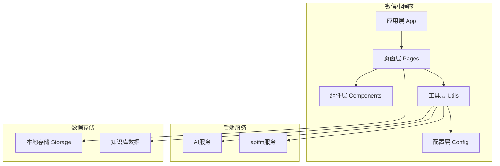
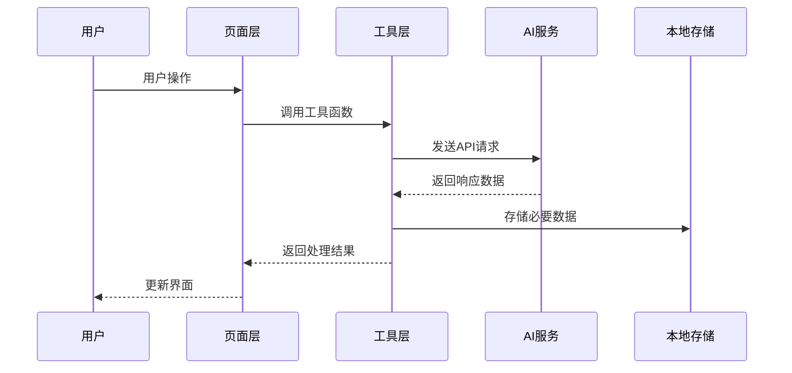
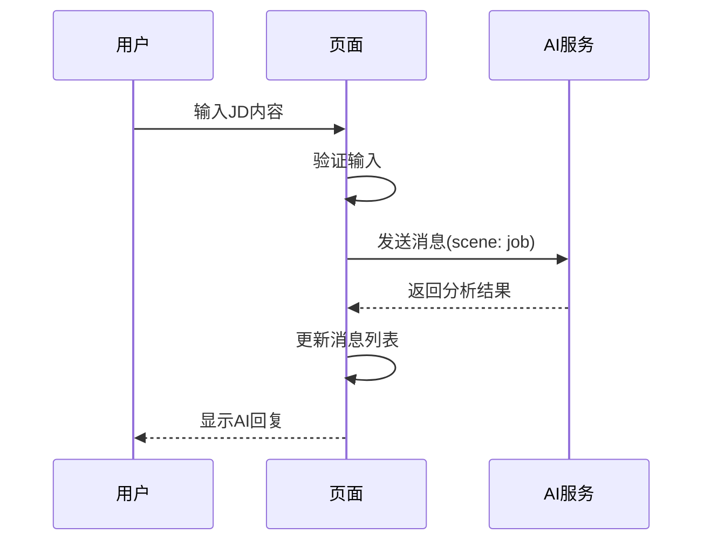
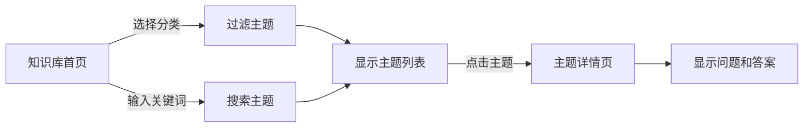
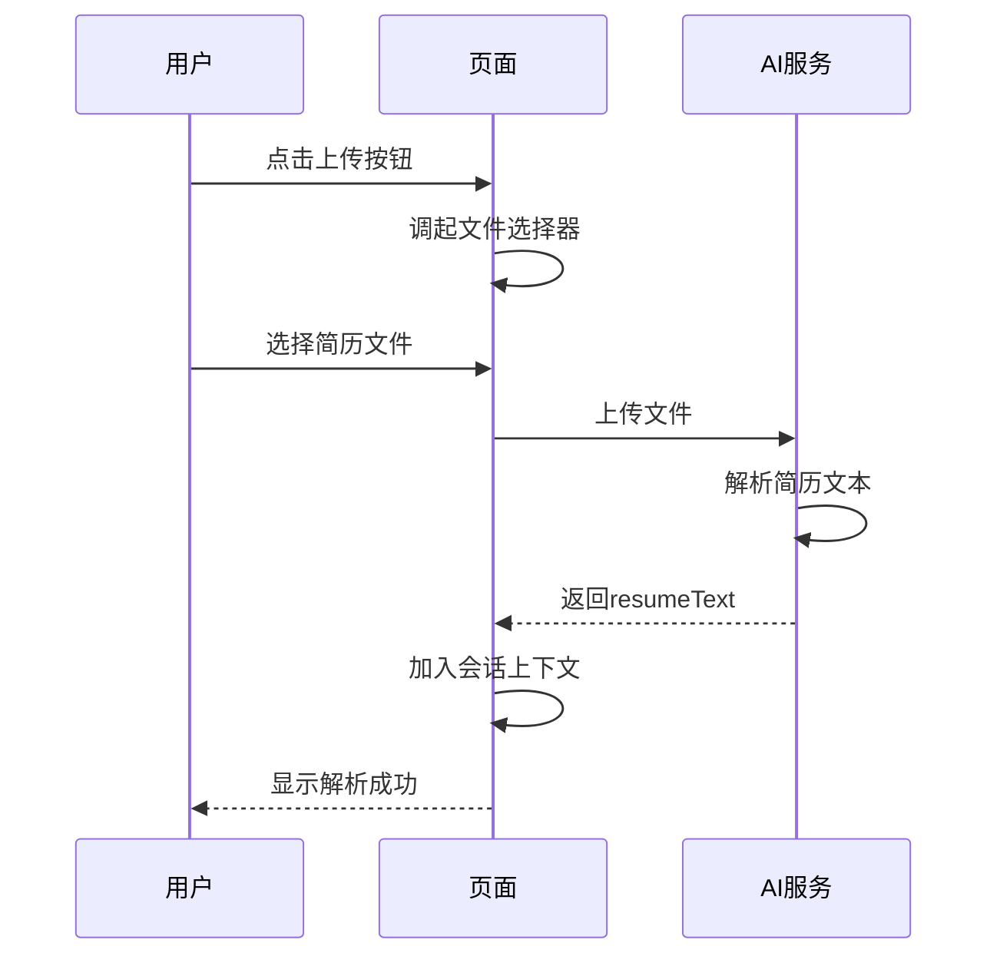
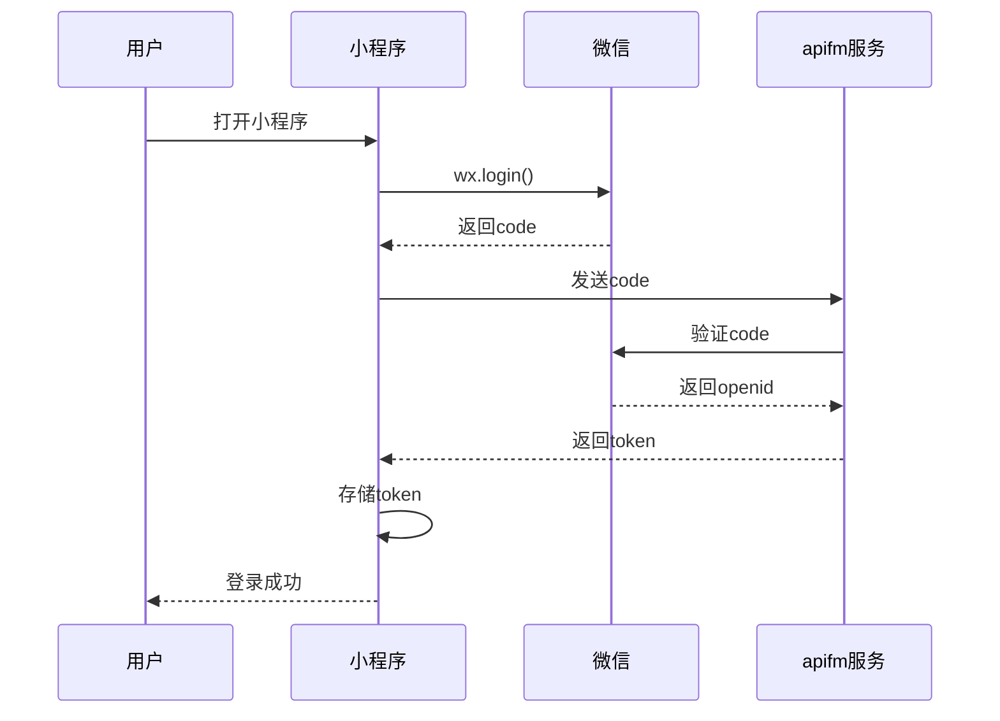
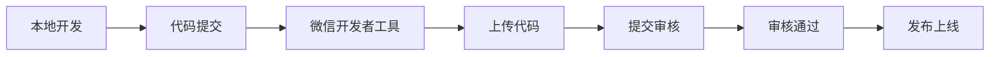

# AI面试助手小程序 - 设计文档

## 1. 系统概述

### 1.1 项目简介

AI面试助手是一款基于微信小程序的职业发展工具，通过AI技术和精选知识库，为求职者提供全方位的面试准备支持。

**核心价值**:
- 🎯 智能岗位分析，精准把握面试要点
- 📚 大数据技术知识库，系统化学习
- 📄 AI简历优化，提升竞争力
- 💭 情绪支持，缓解面试压力

### 1.2 技术栈

| 类别 | 技术 | 版本 | 用途 |
|------|------|------|------|
| **框架** | 微信小程序原生 | - | 应用框架 |
| **UI组件** | Vant Weapp | 1.11.6 | UI组件库 |
| **API SDK** | apifm-wxapi | 24.06.19 | 用户管理 |
| **日期处理** | dayjs | 1.11.6 | 时间格式化 |
| **富文本** | mp-html | 2.3.1 | HTML渲染 |
| **后端服务** | 自定义AI服务 | - | AI对话和分析 |

---

## 2. 系统架构

### 2.1 整体架构



### 2.2 目录结构

```
wechat-app-mall/
├── pages/                      # 页面目录
│   ├── ai/                     # AI功能页面
│   │   ├── job/               # 岗位分析
│   │   ├── resume/            # 简历解读
│   │   └── mood/              # 情绪小屋
│   ├── knowledge/             # 知识库页面
│   │   ├── index/             # 知识列表
│   │   └── detail/            # 知识详情
│   ├── my/                    # 个人中心
│   ├── login/                 # 登录页面
│   └── about/                 # 关于页面
├── components/                # 组件目录
│   ├── login/                 # 登录组件
│   └── bind-mobile/           # 绑定手机组件
├── utils/                     # 工具目录
│   ├── ai.js                  # AI服务接口
│   ├── auth.js                # 认证工具
│   ├── knowledge.js           # 知识库数据
│   └── tools.js               # 通用工具
├── images/                    # 图片资源
├── miniprogram_npm/           # npm包
├── app.js                     # 应用入口
├── app.json                   # 全局配置
├── app.wxss                   # 全局样式
└── config.js                  # 应用配置
```

### 2.3 数据流设计



---

## 3. 核心模块设计

### 3.1 岗位分析模块

**功能描述**: 用户输入JD，AI分析岗位要求并提供面试准备建议

**页面结构**:
```
pages/ai/job/
├── index.js       # 页面逻辑
├── index.wxml     # 页面结构
├── index.wxss     # 页面样式
└── index.json     # 页面配置
```

**核心逻辑**:
```javascript
// 数据结构
data: {
  sessionId: string,        // 会话ID
  inputVal: string,         // 输入内容
  messages: Message[],      // 消息历史
  sending: boolean          // 发送状态
}

// 关键方法
- onLoad(): 初始化会话
- bindinput(e): 处理输入
- send(): 发送消息到AI
- quick(e): 快捷问题填充
```

**AI交互流程**:


### 3.2 知识库模块

**功能描述**: 提供大数据技术面试题库，支持分类浏览和搜索

**数据结构**:
```javascript
// 分类数据
categories: [
  { key: 'hdfs', name: 'HDFS' },
  { key: 'spark', name: 'Spark' },
  // ... 共10个分类
]

// 主题数据
topics: [
  {
    id: 'hdfs-topic-1',
    title: 'HDFS 常见问题 1',
    summary: 'HDFS的架构',
    tags: ['HDFS', '面试'],
    categoryKey: 'hdfs',
    faqs: ['问题1', '问题2', ...],
    answers: ['答案1', '答案2', ...],
    examples: []
  },
  // ... 共43个主题
]
```

**页面交互**:


**核心算法**:
```javascript
// 过滤算法
applyFilter() {
  const q = this.data.q.trim().toLowerCase()
  const active = this.data.activeCategoryKey
  const topics = this.data.topics
  
  // 匹配逻辑：标题、摘要、标签
  const match = (t) => {
    const blob = [t.title, t.summary, ...t.tags]
      .join(' ')
      .toLowerCase()
    return !q || blob.indexOf(q) >= 0
  }
  
  // 过滤：分类匹配 + 关键词匹配
  const filtered = topics.filter(t => 
    t.categoryKey === active && match(t)
  )
  
  this.setData({ filteredTopics: filtered })
}
```

### 3.3 简历解读模块

**功能描述**: 上传简历文件，AI解析并提供优化建议

**文件上传流程**:


**核心代码**:
```javascript
async uploadResume() {
  wx.chooseMessageFile({
    count: 1,
    type: 'file',
    success: async (res) => {
      const file = res.tempFiles[0]
      wx.showLoading({ title: '上传解析中' })
      
      try {
        const parsed = await AI.uploadResume(file.path)
        const txt = parsed.resumeText || ''
        
        // 将简历内容加入系统提示
        const sysPrompt = { 
          role: 'system', 
          content: '候选人简历内容如下：\n' + txt 
        }
        this.setData({ 
          messages: [this.data.messages[0], sysPrompt] 
        })
        
        wx.showToast({ title: '解析成功', icon: 'success' })
      } catch (e) {
        wx.showToast({ title: '上传失败', icon: 'none' })
      }
    }
  })
}
```

### 3.4 情绪小屋模块

**功能描述**: 提供情绪支持和面试压力管理建议

**设计特点**:
- 温暖、专业、不评判的对话风格
- 识别压力来源
- 提供具体的缓解策略（呼吸练习、认知重构等）
- 保持会话上下文

**系统提示词**:
```javascript
{
  role: 'system',
  content: '你是情绪支持与面试压力管理助手。请以温暖、专业、不评判的方式进行对话，帮助用户识别压力来源、提供呼吸/认知重构/准备策略等建议，并在适当时给出可执行的练习清单。'
}
```

### 3.5 个人中心模块

**功能描述**: 用户信息管理和系统设置

**核心功能**:
- 微信授权登录
- 用户信息展示（昵称、头像）
- 信息修改（头像、昵称）
- 订单统计（继承自原商城系统）

**登录流程**:


---

## 4. 数据模型设计

### 4.1 知识库数据模型

**Category (分类)**
```typescript
interface Category {
  key: string;      // 唯一标识，如 'hdfs'
  name: string;     // 显示名称，如 'HDFS'
}
```

**Topic (主题)**
```typescript
interface Topic {
  id: string;           // 唯一标识，如 'hdfs-topic-1'
  title: string;        // 主题标题
  summary: string;      // 摘要（通常是第一个问题）
  tags: string[];       // 标签数组
  categoryKey: string;  // 所属分类key
  faqs: string[];       // 问题列表
  answers: string[];    // 答案列表（与faqs一一对应）
  examples: any[];      // 示例代码或案例
}
```

**当前数据统计**:
- 分类数: 10个
- 主题数: 43个
- 问题数: 195个
- 分类分布: HDFS(17), MapReduce(11), Yarn(7), Kafka(23), HBase(15), Hive(25), Spark(36), Flink(26), 数据仓库(30), 数据倾斜(5)

### 4.2 AI会话数据模型

**Message (消息)**
```typescript
interface Message {
  role: 'system' | 'user' | 'assistant';
  content: string;
}
```

**Session (会话)**
```typescript
interface Session {
  sessionId: string;      // 会话ID（时间戳）
  scene: string;          // 场景：job/resume/mood
  messages: Message[];    // 消息历史
  sending: boolean;       // 发送状态
}
```

### 4.3 用户数据模型

**User (用户)**
```typescript
interface User {
  uid: string;          // 用户ID
  token: string;        // 认证令牌
  nick: string;         // 昵称
  avatarUrl: string;    // 头像URL
  mobile: string;       // 手机号
}
```

---

## 5. 接口设计

### 5.1 AI服务接口

**聊天接口**

```http
POST {ai_api_base}/chat
Content-Type: application/json
Authorization: Bearer {ai_api_key}  # 可选

Request Body:
{
  "scene": "job" | "resume" | "mood",
  "sessionId": "1699999999999",
  "userId": "user123",
  "token": "token123",
  "messages": [
    { "role": "system", "content": "系统提示" },
    { "role": "user", "content": "用户问题" }
  ]
}

Response:
{
  "answer": "AI回复内容"
}
```

**简历上传接口**

```http
POST {ai_api_base}/resume/upload
Content-Type: multipart/form-data
Authorization: Bearer {ai_api_key}  # 可选

Request Body (FormData):
- file: File
- userId: string
- token: string

Response:
{
  "resumeText": "解析后的简历文本内容"
}
```

### 5.2 apifm服务接口

**用户详情**
```javascript
WXAPI.userDetail(token)
// 返回: { code: 0, data: { base, ext, ... } }
```

**配置查询**
```javascript
WXAPI.queryConfigBatch(keys)
// 返回: { code: 0, data: [{ key, value }, ...] }
```

---

## 6. 工具层设计

### 6.1 AI工具 (utils/ai.js)

**核心方法**:
```javascript
// AI对话
chat({ scene, messages, sessionId })
  -> Promise<{ answer: string }>

// 简历上传
uploadResume(filePath)
  -> Promise<{ resumeText: string }>
```

**实现要点**:
- 使用 wx.request 发送HTTP请求
- 支持可选的API密钥认证
- 统一错误处理
- 返回Promise便于async/await使用

### 6.2 认证工具 (utils/auth.js)

**核心方法**:
```javascript
// 检查登录状态
checkHasLogined() -> Promise<boolean>

// 授权登录
authorize() -> Promise

// 微信登录
login20241025() -> Promise

// 绑定推荐人
bindSeller() -> Promise
```

### 6.3 知识库工具 (utils/knowledge.js)

**数据导出**:
```javascript
module.exports = {
  categories: Category[],  // 分类数组
  topics: Topic[]          // 主题数组
}
```

**数据管理**:
- 使用Python脚本从Excel生成
- 脚本路径: `convert_excel_to_knowledge_v2.py`
- Excel路径: `doc/question and answer_with_answers.xlsx`

---

## 7. 配置管理

### 7.1 应用配置 (config.js)

```javascript
module.exports = {
  version: '25.09.06',              // 版本号
  subDomain: 'tz',                  // apifm专属域名
  merchantId: 951,                  // 商户ID
  sdkAppID: 1400450467,            // 腾讯云应用ID
  bindSeller: false,                // 三级分销开关
  customerServiceType: 'XCX',       // 客服类型
  openIdAutoRegister: true,         // 自动注册
  ai_api_base: 'https://...',      // AI服务地址
  ai_api_key: ''                    // AI服务密钥
}
```

### 7.2 全局配置 (app.json)

**关键配置**:
```json
{
  "pages": [...],                    // 页面路径
  "tabBar": {                        // 底部导航
    "list": [
      { "pagePath": "pages/ai/job/index", "text": "岗位分析" },
      { "pagePath": "pages/knowledge/index", "text": "面试知识" },
      { "pagePath": "pages/ai/resume/index", "text": "简历解读" },
      { "pagePath": "pages/ai/mood/index", "text": "情绪小屋" },
      { "pagePath": "pages/my/index", "text": "个人中心" }
    ]
  },
  "usingComponents": {               // 全局组件
    "van-button": "@vant/weapp/button/index",
    "mp-html": "mp-html",
    ...
  }
}
```

---

## 8. 错误处理设计

### 8.1 错误分类

| 错误类型 | 处理策略 | 用户提示 |
|---------|---------|---------|
| 网络错误 | 捕获并提示 | "网络连接失败，请检查网络" |
| AI服务异常 | 捕获并提示 | "AI服务异常" |
| 认证失败 | 引导登录 | "登录已过期，请重新登录" |
| 文件上传失败 | 允许重试 | "上传失败，请重试" |
| 数据解析错误 | 显示默认内容 | "数据加载失败" |

### 8.2 错误处理示例

```javascript
async send() {
  try {
    const res = await AI.chat({...})
    // 处理成功响应
  } catch (err) {
    // 统一错误处理
    wx.showToast({ 
      title: 'AI服务异常', 
      icon: 'none' 
    })
  } finally {
    // 清理状态
    this.setData({ sending: false })
  }
}
```

---

## 9. 性能优化设计

### 9.1 页面性能

**优化策略**:
- 使用 `setData` 时只更新必要的数据
- 长列表使用虚拟滚动或分页加载
- 图片使用懒加载和压缩
- 避免频繁的页面跳转

### 9.2 数据加载

**优化策略**:
- 知识库数据在页面加载时一次性读取
- AI对话保持会话历史，避免重复请求
- 用户信息缓存在本地storage
- 使用防抖处理搜索输入

### 9.3 网络请求

**优化策略**:
- 合并多个配置请求
- 使用请求缓存
- 设置合理的超时时间
- 失败自动重试（最多2次）

---

## 10. 安全设计

### 10.1 认证安全

- 使用微信官方登录流程
- Token存储在本地storage
- 每次请求携带Token
- Token过期自动刷新

### 10.2 数据安全

- 所有API请求使用HTTPS
- 敏感信息（简历）不长期存储
- 用户数据访问控制
- 日志脱敏处理

### 10.3 API安全

- 支持API密钥认证
- 请求频率限制
- 输入验证和过滤
- 错误信息不暴露敏感数据

---

## 11. 扩展性设计

### 11.1 知识库扩展

**添加新分类**:
1. 在Excel中添加新分类的问题
2. 运行 `python3 convert_excel_to_knowledge_v2.py`
3. 自动更新 `utils/knowledge.js`

**添加新主题**:
- 每5个问题自动生成一个主题
- 支持自定义分组大小
- 自动生成主题ID和标题

### 11.2 AI场景扩展

**添加新场景**:
1. 在页面中定义新的系统提示词
2. 调用 `AI.chat({ scene: 'new_scene', ... })`
3. 后端支持新的scene参数

### 11.3 功能模块扩展

**模块化设计**:
- 页面独立，低耦合
- 工具函数可复用
- 组件可组合
- 配置集中管理

---

## 12. 部署架构

### 12.1 部署流程



### 12.2 环境配置

| 环境 | ai_api_base | 用途 |
|------|-------------|------|
| 开发 | http://localhost:3000 | 本地调试 |
| 测试 | https://test-ai.example.com | 测试验证 |
| 生产 | https://ai.example.com | 正式环境 |

---

## 13. 监控和维护

### 13.1 监控指标

- 页面加载时间
- AI响应时间
- 接口成功率
- 用户活跃度
- 错误发生率

### 13.2 日志管理

- 使用 `console.log` 记录关键操作
- 使用 `console.error` 记录错误信息
- 微信开发者工具查看实时日志
- 微信公众平台查看线上日志

---

## 14. 设计原则

### 14.1 核心原则

1. **简洁性**: 界面简洁，操作直观
2. **一致性**: 交互模式统一，视觉风格一致
3. **可靠性**: 错误处理完善，状态反馈及时
4. **可扩展性**: 模块化设计，易于扩展
5. **可维护性**: 代码清晰，文档完善

### 14.2 设计模式

- **MVC模式**: 页面(View) - 逻辑(Controller) - 数据(Model)
- **单例模式**: 工具类使用单例
- **观察者模式**: 事件监听和回调
- **策略模式**: 不同场景的AI提示词

---

## 15. 变更历史

| 版本 | 日期 | 变更内容 | 作者 |
|------|------|----------|------|
| 1.0 | 2024-11-13 | 初始设计文档 | - |
| 1.1 | 2024-11-13 | 优化架构设计，增加实际代码示例和数据统计 | - |
