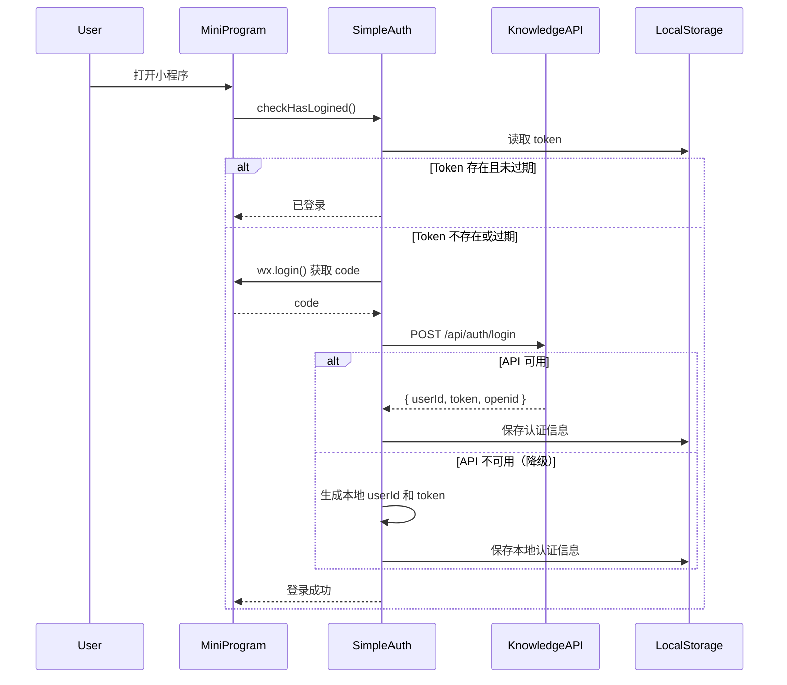
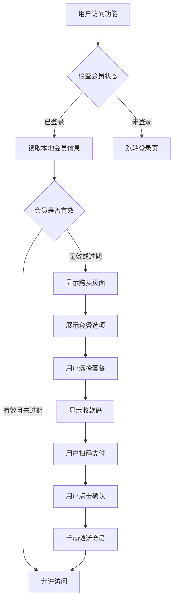

# Design Document

## Overview

本设计文档描述了如何将小程序从 API 工厂（apifm）迁移到自有后端服务的技术方案。核心目标是移除对第三方 SaaS 平台的依赖，解决域名访问错误，同时保持现有功能的完整性。

### 设计原则

1. **最小化改动** - 尽可能复用现有代码结构和逻辑
2. **向后兼容** - 保留配置字段以避免引用错误
3. **渐进式迁移** - 优先使用已有的 simpleAuth.js，逐步替换 auth.js
4. **简化支付** - 使用收款码方案替代复杂的在线支付流程

## Architecture

### 当前架构问题

```
小程序 → apifm-wxapi SDK → API工厂服务器 (api.it120.cc/tz/...)
                                ↓
                          需要专属域名，否则报错
```

### 目标架构

```
小程序 → 自有认证模块 → 知识库API (api.feelnow.cn:8443)
      → 本地会员管理 → 本地存储
      → 收款码支付 → 手动确认
```

## Components and Interfaces

### 1. 认证模块重构

#### 1.1 统一使用 simpleAuth.js

**当前状态：**
- `utils/auth.js` - 依赖 apifm-wxapi，复杂且难以维护
- `utils/simpleAuth.js` - 已实现自有认证逻辑，支持后端API和本地降级

**设计决策：**
- 保留 `simpleAuth.js` 作为主要认证模块
- 废弃 `auth.js`，但保留文件以避免引用错误
- 在 `auth.js` 中添加兼容层，转发调用到 `simpleAuth.js`

**接口设计：**

```javascript
// utils/simpleAuth.js (已存在，无需修改)
module.exports = {
  silentLogin(),        // 静默登录（支持后端API和本地降级）
  phoneLogin(code),     // 手机号登录
  checkLoginStatus(),   // 检查登录状态
  checkHasLogined(),    // 检查并自动登录
  getUserInfo(),        // 获取用户信息
  updateUserInfo(info), // 更新用户信息
  logout(),             // 退出登录
  getAuthHeaders()      // 获取请求头
}

// utils/auth.js (添加兼容层)
const SimpleAuth = require('./simpleAuth')

module.exports = {
  checkHasLogined: () => SimpleAuth.checkHasLogined(),
  loginOut: () => SimpleAuth.logout(),
  // 其他方法标记为废弃
  login: () => { throw new Error('已废弃，请使用 SimpleAuth.silentLogin') },
  authorize: () => { throw new Error('已废弃，请使用 SimpleAuth.silentLogin') }
}
```

#### 1.2 认证流程



### 2. 会员管理模块重构

#### 2.1 本地会员状态管理

**当前问题：**
- `utils/member.js` 依赖 apifm 的会员卡接口
- 需要在 apifm 后台配置会员卡

**设计方案：**
- 使用本地存储管理会员状态
- 支持手动设置会员到期时间
- 提供会员状态查询和验证接口

**数据模型：**

```javascript
// 本地存储的会员信息
{
  isValid: true,           // 是否有效会员
  expireDate: '2025-12-31', // 到期日期
  purchaseDate: '2025-01-01', // 购买日期
  packageType: 'yearly',   // 套餐类型
  price: 99.9,             // 支付金额
  paymentMethod: 'qrcode', // 支付方式
  orderId: 'local_xxx'     // 本地订单ID
}
```

**接口设计：**

```javascript
// utils/memberLocal.js (新建)
module.exports = {
  // 查询会员状态
  getMemberInfo(),
  
  // 手动激活会员（支付后调用）
  activateMember(packageType, days),
  
  // 检查会员是否有效
  checkMemberStatus(),
  
  // 刷新会员状态
  refreshMemberStatus(),
  
  // 清除会员缓存
  clearMemberCache(),
  
  // 获取套餐配置
  getPackageInfo(packageId),
  
  // 套餐配置
  MEMBER_PACKAGES: {
    monthly: { id: 'monthly', name: '月度会员', duration: 30, price: 19.9 },
    quarterly: { id: 'quarterly', name: '季度会员', duration: 90, price: 49.9 },
    yearly: { id: 'yearly', name: '年度会员', duration: 365, price: 99.9 }
  }
}
```

#### 2.2 会员验证流程



### 3. 支付模块重构

#### 3.1 收款码支付方案

**设计原因：**
- 避免复杂的微信支付接入流程
- 无需商户号和支付证书
- 适合个人开发者和小规模应用

**页面设计：**

```
┌─────────────────────────────┐
│      选择会员套餐            │
├─────────────────────────────┤
│  ○ 月度会员 - ¥19.9/月      │
│  ○ 季度会员 - ¥49.9/季      │
│  ● 年度会员 - ¥99.9/年      │
│                              │
│  [立即购买]                  │
└─────────────────────────────┘

         ↓ 点击购买

┌─────────────────────────────┐
│      扫码支付                │
├─────────────────────────────┤
│   [收款二维码图片]           │
│                              │
│   收款账户：XXX              │
│   支付金额：¥99.9            │
│                              │
│   请使用微信扫码支付          │
│   支付完成后点击下方按钮      │
│                              │
│   [我已完成支付]             │
│   [取消]                     │
└─────────────────────────────┘

         ↓ 点击确认

┌─────────────────────────────┐
│      支付成功                │
├─────────────────────────────┤
│   ✓ 会员已激活               │
│                              │
│   到期时间：2025-12-31       │
│                              │
│   [返回首页]                 │
└─────────────────────────────┘
```

**流程设计：**

```javascript
// pages/member/payment/index.js (重构)
Page({
  data: {
    selectedPackage: null,
    qrcodeUrl: '',
    accountName: '',
    amount: 0,
    showQrcode: false
  },
  
  // 选择套餐
  selectPackage(e) {
    const packageId = e.currentTarget.dataset.id
    const packageInfo = MemberLocal.getPackageInfo(packageId)
    this.setData({
      selectedPackage: packageInfo,
      amount: packageInfo.price
    })
  },
  
  // 显示收款码
  showPaymentQrcode() {
    this.setData({
      showQrcode: true,
      qrcodeUrl: CONFIG.paymentQrcode.url,
      accountName: CONFIG.paymentQrcode.accountName
    })
  },
  
  // 确认支付完成
  async confirmPayment() {
    const { selectedPackage } = this.data
    
    // 激活会员
    await MemberLocal.activateMember(
      selectedPackage.id,
      selectedPackage.duration
    )
    
    wx.showToast({
      title: '会员已激活',
      icon: 'success'
    })
    
    // 跳转到成功页面
    wx.redirectTo({
      url: '/pages/member/payment-result/index?status=success'
    })
  }
})
```

### 4. 配置管理

#### 4.1 config.js 更新

```javascript
module.exports = {
  // === 已废弃的 apifm 配置（保留以避免引用错误）===
  subDomain: 'deprecated', // 已废弃，不再使用
  merchantId: 0,           // 已废弃，不再使用
  
  // === 认证配置 ===
  knowledgeApiUrl: 'https://api.feelnow.cn:8443/api',
  
  // === 支付配置 ===
  paymentQrcode: {
    url: 'https://your-domain.com/qrcode.jpg', // 收款码图片URL
    accountName: '收款人姓名',                  // 收款账户名
    enabled: true                               // 是否启用
  },
  
  // === 功能开关 ===
  useLocalKnowledge: false,  // 是否使用本地知识库
  openIdAutoRegister: false  // 已废弃
}
```

### 5. 应用入口重构

#### 5.1 app.js 清理

**当前问题：**
- 引入了 apifm-wxapi
- 初始化了 apifm 配置

**重构方案：**

```javascript
// app.js
const SimpleAuth = require('utils/simpleAuth')
const CONFIG = require('config.js')

App({
  onLaunch: function () {
    console.log('小程序启动')
    
    // 自动登录
    this.autoLogin()
  },
  
  async autoLogin() {
    try {
      const isLogined = await SimpleAuth.checkHasLogined()
      if (isLogined) {
        console.log('自动登录成功')
      }
    } catch (error) {
      console.error('自动登录失败:', error)
    }
  },
  
  globalData: {
    version: CONFIG.version
  }
})
```

## Data Models

### 用户认证数据

```javascript
// 存储在 wx.storage
{
  userId: 'user_1234567890_abc123',
  token: 'token_1234567890_xyz789',
  openid: 'oXXXX-XXXXXXXXX',  // 可选，来自后端
  phone: '138****1234',        // 可选
  nickName: '用户昵称',        // 可选
  avatarUrl: 'https://...',    // 可选
  loginTime: 1700000000000     // 登录时间戳
}
```

### 会员信息数据

```javascript
// 存储在 wx.storage
{
  isValid: true,
  expireDate: '2025-12-31T23:59:59',
  purchaseDate: '2025-01-01T00:00:00',
  packageType: 'yearly',
  price: 99.9,
  paymentMethod: 'qrcode',
  orderId: 'local_1700000000000',
  daysRemaining: 365
}
```

## Error Handling

### 1. 认证错误处理

```javascript
// 登录失败降级策略
try {
  // 尝试后端API登录
  const result = await loginWithBackend(code)
} catch (error) {
  // 降级到本地登录
  console.warn('后端登录失败，使用本地登录:', error)
  const result = await loginLocally(code)
}
```

### 2. 会员验证错误处理

```javascript
// 会员状态检查
const memberInfo = await MemberLocal.getMemberInfo()

if (!memberInfo.isValid) {
  switch (memberInfo.reason) {
    case 'not_login':
      // 跳转登录
      wx.navigateTo({ url: '/pages/login/simple' })
      break
    case 'not_member':
    case 'expired':
      // 跳转购买页面
      wx.navigateTo({ url: '/pages/member/payment/index' })
      break
    default:
      wx.showToast({ title: '会员状态异常', icon: 'none' })
  }
  return false
}
```

### 3. 支付错误处理

```javascript
// 支付确认
try {
  await MemberLocal.activateMember(packageId, duration)
  wx.showToast({ title: '会员已激活', icon: 'success' })
} catch (error) {
  wx.showModal({
    title: '激活失败',
    content: '请联系客服处理',
    showCancel: false
  })
}
```

## Testing Strategy

### 1. 单元测试（可选）

- 测试 `simpleAuth.js` 的登录逻辑
- 测试 `memberLocal.js` 的会员状态计算
- 测试日期计算函数

### 2. 集成测试

**测试场景：**

1. **首次启动**
   - 验证自动登录流程
   - 验证本地降级逻辑

2. **会员购买流程**
   - 选择套餐 → 显示收款码 → 确认支付 → 激活成功

3. **会员验证**
   - 有效会员可访问功能
   - 无效会员跳转购买页面
   - 过期会员提示续费

4. **错误场景**
   - 网络断开时的降级处理
   - Token 过期时的自动重登录
   - 会员过期时的提示

### 3. 手动测试清单

- [ ] 删除本地存储，测试首次登录
- [ ] 测试会员购买完整流程
- [ ] 测试会员过期后的提示
- [ ] 测试网络断开时的降级
- [ ] 测试所有 AI 功能的会员验证
- [ ] 测试知识库功能的正常访问
- [ ] 验证不再出现域名错误

## Migration Steps

### 阶段1：准备工作
1. 备份当前代码
2. 更新 config.js 配置
3. 准备收款码图片

### 阶段2：核心模块重构
1. 创建 `utils/memberLocal.js`
2. 重构 `utils/auth.js` 添加兼容层
3. 更新 `app.js` 移除 apifm 引用

### 阶段3：页面更新
1. 重构 `pages/member/payment/index.*`
2. 更新所有使用 `AUTH.checkHasLogined()` 的页面
3. 更新会员验证逻辑

### 阶段4：清理工作
1. 移除 apifm-wxapi 依赖
2. 清理未使用的代码
3. 更新 app.json 路由配置

### 阶段5：测试验证
1. 完整功能测试
2. 边界情况测试
3. 性能验证

## Performance Considerations

1. **减少包体积**
   - 移除 apifm-wxapi SDK（约 100KB）
   - 清理未使用的页面和组件

2. **优化启动速度**
   - 简化登录流程
   - 减少不必要的 API 调用

3. **本地缓存策略**
   - 会员信息缓存 1 小时
   - 用户信息缓存 30 天

## Security Considerations

1. **Token 安全**
   - Token 存储在本地，30 天过期
   - 每次请求携带 Authorization header

2. **会员验证**
   - 关键功能前验证会员状态
   - 本地时间戳防止篡改（基础防护）

3. **支付安全**
   - 收款码方式，资金直接到账
   - 手动确认机制，防止误操作

## Future Enhancements

1. **后端会员管理**
   - 在知识库 API 中添加会员管理接口
   - 支持服务端验证会员状态

2. **自动支付回调**
   - 接入微信支付（需要商户号）
   - 自动激活会员

3. **会员权益扩展**
   - 不同等级的会员权益
   - 使用次数限制
   - 功能访问控制
