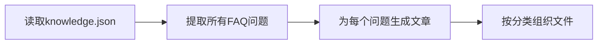

# 设计文档

## 概述

微信公众号文章生成系统是一个内容创作工具，通过分析knowledge.json中的面试问题，为每个问题生成适合微信公众号发布的结构化文章。系统采用简单直接的方式，由AI助手根据问题内容和要求直接生成文章。

## 架构

系统采用简单的三步处理流程：



### 处理流程

1. **数据读取**: 从knowledge.json文件中提取所有faqs数组中的问题
2. **文章生成**: 为每个问题生成包含【问题】【答案】【引流引导】的完整文章
3. **文件组织**: 按技术分类创建目录结构，生成规范命名的文件

## 组件和接口

### 数据提取组件

**功能**: 从knowledge.json中提取所有面试问题
**输入**: knowledge.json文件路径
**输出**: 问题列表，包含问题文本和分类信息

### 文章生成组件

**功能**: 为每个面试问题生成结构化文章
**输入**: 单个面试问题
**输出**: 包含三个部分的完整Markdown文章

**文章结构**:
- **【问题】**: 原始面试问题文本
- **【答案】**: 
  - 3-5分钟快速总结（帮助面试者快速回答）
  - 详细技术解释（帮助深入理解）
- **【引流引导】**: 友好推广AI面试助手小程序

### 文件管理组件

**功能**: 组织生成的文章文件
**输入**: 生成的文章内容
**输出**: 分类文件夹和索引文件

**文件组织**:
- 按技术分类创建目录（HDFS、MapReduce、Yarn等）
- 文件命名格式：[分类名]_[关键词].md
- 生成分类索引.md文件

## 数据模型

### 技术分类映射
```
hdfs -> HDFS
mr -> MapReduce  
yarn -> Yarn
kafka -> Kafka
hbase -> HBase
hive -> Hive
spark -> Spark
flink -> Flink
数据仓库 -> 数据仓库
skew -> 数据倾斜
```

### 文章模板结构
```markdown
# [问题标题]

## 【问题】
[原始面试问题]

## 【答案】

### 快速回答（3-5分钟总结）
[核心要点总结，帮助面试者快速回答面试官]

### 详细解释
[深入的技术解释和示例]

## 【引流引导】
[友好的小程序推广内容]
```

## 正确性属性

属性是一个特征或行为，应该在系统的所有有效执行中保持为真——本质上是关于系统应该做什么的正式声明。属性作为人类可读规范和机器可验证正确性保证之间的桥梁。

### 属性1: 问题提取完整性
*对于任何*有效的knowledge.json文件，提取的问题数量应该等于所有faqs数组中问题的总数
**验证: 需求1.2, 1.3**

### 属性2: 文章生成一致性  
*对于任何*面试问题，都应该生成一篇包含【问题】【答案】【引流引导】三部分的文章
**验证: 需求2.2**

### 属性3: 问题文本保真度
*对于任何*生成的文章，【问题】部分应该与原始问题文本完全一致
**验证: 需求2.3**

### 属性4: 答案结构完整性
*对于任何*生成的文章，【答案】部分应该包含快速总结和详细解释两个子部分
**验证: 需求2.4, 2.5**

### 属性5: 分类组织正确性
*对于任何*具有相同categoryKey的问题，生成的文章应该被放在同一个分类目录中
**验证: 需求3.1**

### 属性6: 文件命名规范性
*对于任何*生成的文章，文件名应该遵循[分类名]_[关键词].md的格式
**验证: 需求3.2**

### 属性7: 索引文件完整性
*对于任何*生成的文章集合，索引文件应该包含所有分类和对应的文章列表
**验证: 需求3.4**

## 错误处理

### 文件读取错误
- knowledge.json文件不存在或无法读取
- JSON格式错误或结构不正确
- 缺少必要的字段（faqs、categoryKey等）

### 内容生成错误
- 问题文本为空或格式异常
- 无法生成合适的答案内容
- 分类信息缺失或无效

### 文件输出错误
- 目录创建失败
- 文件写入权限不足
- 文件编码问题

## 测试策略

### 单元测试
- 测试knowledge.json文件读取功能
- 验证问题提取的完整性和准确性
- 测试文章生成的结构和内容
- 验证文件命名和目录组织

### 属性测试
- 使用不同的knowledge.json文件验证提取完整性
- 测试各种问题类型的文章生成质量
- 验证分类和文件组织的正确性
- 每个属性测试运行最少100次迭代
- 测试标签格式: **功能: wechat-article-generator, 属性 {编号}: {属性文本}**

### 集成测试
- 使用真实的knowledge.json文件进行端到端测试
- 验证生成的文章质量和格式
- 确认输出文件的完整性和可用性