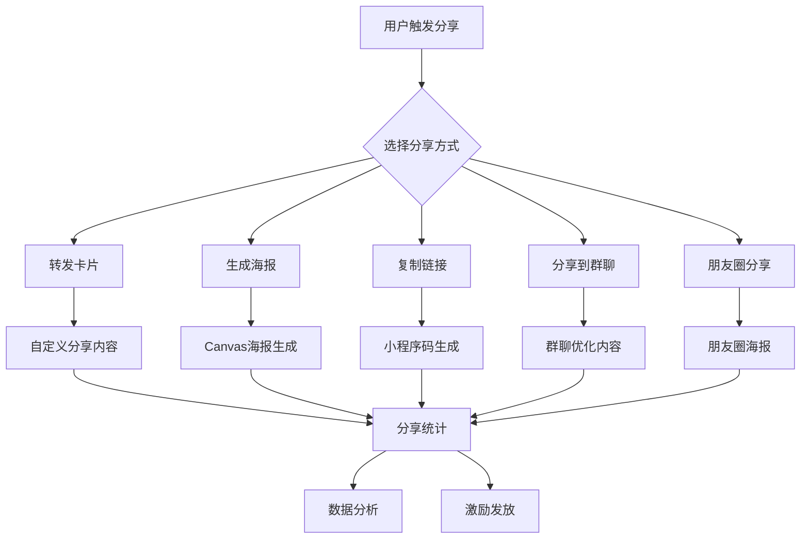

# 微信小程序分享功能优化设计文档

## 概述

本设计文档基于微信小程序的5种主要分享方式，为AI面试助手小程序设计完整的分享功能优化方案。通过多样化的分享方式和精准的内容策略，实现用户裂变增长和品牌传播。

## 架构设计

### 分享功能架构图



### 技术架构

```
分享功能模块
├── 分享触发层
│   ├── 分享按钮组件
│   ├── 右上角菜单
│   └── 长按分享
├── 分享内容层
│   ├── 转发卡片配置
│   ├── 海报生成引擎
│   └── 内容个性化
├── 分享渠道层
│   ├── 好友私聊
│   ├── 微信群聊
│   ├── 朋友圈海报
│   └── 外部平台
└── 数据统计层
    ├── 分享行为追踪
    ├── 回流用户统计
    └── 转化效果分析
```

## 组件设计

### 1. 分享按钮组件 (ShareButton)

**功能**: 统一的分享触发入口，支持多种分享方式选择

**属性**:
```javascript
{
  shareType: 'card|poster|link|all', // 分享类型
  shareData: Object,                 // 分享数据
  customStyle: String,               // 自定义样式
  showReward: Boolean,               // 是否显示奖励提示
  position: 'fixed|inline'           // 按钮位置
}
```

**使用示例**:
```xml
<share-button 
  share-type="all"
  share-data="{{shareData}}"
  show-reward="{{true}}"
  bind:share-success="onShareSuccess">
</share-button>
```

### 2. 海报生成组件 (PosterGenerator)

**功能**: 基于Canvas生成包含小程序码的分享海报

**核心方法**:
```javascript
// 生成海报
generatePoster(config) {
  // 1. 创建Canvas上下文
  // 2. 绘制背景和布局
  // 3. 添加内容文字
  // 4. 插入小程序码
  // 5. 生成图片并保存
}

// 海报模板配置
posterTemplates: {
  knowledge: {}, // 知识库题目海报
  resume: {},    // 简历解读海报
  favorite: {},  // 收藏内容海报
  member: {}     // 会员推广海报
}
```

### 3. 分享统计组件 (ShareAnalytics)

**功能**: 分享行为数据收集和分析

**核心方法**:
```javascript
// 记录分享行为
recordShare(shareData) {
  // 记录分享时间、页面、用户、方式
}

// 追踪分享回流
trackShareCallback(scene, query) {
  // 识别分享来源，记录新用户
}

// 分享效果统计
getShareStats(timeRange) {
  // 返回分享次数、回流用户、转化率
}
```

## 分享方式详细设计

### 方式1: 转发卡片分享

**场景**: 私聊/微信群
**触发**: 用户主动点击分享按钮或右上角菜单

**技术实现**:
```javascript
// 页面分享配置
onShareAppMessage(options) {
  const shareConfig = this.getShareConfig();
  
  return {
    title: shareConfig.title,
    path: shareConfig.path,
    imageUrl: shareConfig.imageUrl,
    success: (res) => {
      this.recordShareSuccess('card', res);
    },
    fail: (err) => {
      this.recordShareFail('card', err);
    }
  };
}

// 个性化分享内容
getShareConfig() {
  const pageType = this.data.pageType;
  const shareTemplates = {
    knowledge: {
      title: `${this.data.question} - 大数据面试必考题`,
      path: `/pages/knowledge/detail?id=${this.data.questionId}&from=share`,
      imageUrl: '/images/share/knowledge-card.png'
    },
    resume: {
      title: 'AI简历解读 - 发现简历亮点，提升面试成功率',
      path: '/pages/ai/resume/index?from=share',
      imageUrl: '/images/share/resume-card.png'
    },
    favorite: {
      title: `我收藏了这个面试题，一起来学习吧！`,
      path: `/pages/favorites/detail?id=${this.data.favoriteId}&from=share`,
      imageUrl: '/images/share/favorite-card.png'
    }
  };
  
  return shareTemplates[pageType] || shareTemplates.default;
}
```

### 方式2: 生成分享海报

**场景**: 朋友圈分享、外部平台
**触发**: 用户点击"生成海报"按钮

**技术实现**:
```javascript
// 海报生成方法
async generateSharePoster() {
  wx.showLoading({ title: '生成中...' });
  
  try {
    // 1. 获取小程序码
    const qrCode = await this.getQRCode();
    
    // 2. 创建Canvas
    const canvas = await this.createCanvas();
    const ctx = canvas.getContext('2d');
    
    // 3. 绘制海报内容
    await this.drawPosterContent(ctx, qrCode);
    
    // 4. 生成图片
    const tempFilePath = await this.canvasToImage(canvas);
    
    // 5. 保存到相册
    await this.saveImageToAlbum(tempFilePath);
    
    // 6. 记录分享行为
    this.recordShare('poster');
    
    wx.hideLoading();
    wx.showToast({ title: '海报已保存到相册' });
    
  } catch (error) {
    wx.hideLoading();
    wx.showToast({ title: '生成失败，请重试', icon: 'error' });
  }
}

// 海报内容绘制
async drawPosterContent(ctx, qrCode) {
  const { width, height } = this.data.posterConfig;
  
  // 绘制背景
  ctx.fillStyle = '#ffffff';
  ctx.fillRect(0, 0, width, height);
  
  // 绘制标题
  ctx.fillStyle = '#333333';
  ctx.font = 'bold 32px sans-serif';
  ctx.fillText(this.data.shareTitle, 40, 80);
  
  // 绘制内容摘要
  ctx.fillStyle = '#666666';
  ctx.font = '24px sans-serif';
  this.drawMultilineText(ctx, this.data.shareContent, 40, 140, width - 80, 32);
  
  // 绘制小程序码
  const qrSize = 120;
  ctx.drawImage(qrCode, width - qrSize - 40, height - qrSize - 40, qrSize, qrSize);
  
  // 绘制品牌信息
  ctx.fillStyle = '#1989fa';
  ctx.font = '20px sans-serif';
  ctx.fillText('AI面试助手', 40, height - 40);
}
```

### 方式3: 小程序码分享

**场景**: 线下推广、外部平台
**触发**: 用户点击"获取小程序码"

**技术实现**:
```javascript
// 获取小程序码
async getQRCode(page, scene) {
  return new Promise((resolve, reject) => {
    wx.request({
      url: `${CONFIG.API_BASE}/api/wechat/qrcode`,
      method: 'POST',
      data: {
        page: page || 'pages/knowledge/index',
        scene: scene || `from=qrcode&user=${this.data.userId}`,
        width: 280
      },
      success: (res) => {
        if (res.data.code === 0) {
          resolve(res.data.data.qrCodeUrl);
        } else {
          reject(res.data.message);
        }
      },
      fail: reject
    });
  });
}

// 小程序码页面处理
onLoad(options) {
  // 解析scene参数
  if (options.scene) {
    const sceneData = this.decodeScene(options.scene);
    this.handleQRCodeEntry(sceneData);
  }
}

// Scene参数解码
decodeScene(scene) {
  const params = {};
  const pairs = decodeURIComponent(scene).split('&');
  
  pairs.forEach(pair => {
    const [key, value] = pair.split('=');
    params[key] = value;
  });
  
  return params;
}
```

### 方式4: 群聊优化分享

**场景**: 微信群聊
**特点**: 针对群聊场景优化内容

**技术实现**:
```javascript
// 群聊分享优化
onShareAppMessage(options) {
  const { from, target } = options;
  
  // 检测分享目标
  const isGroupShare = target && target.includes('group');
  
  if (isGroupShare) {
    return this.getGroupShareConfig();
  } else {
    return this.getPrivateShareConfig();
  }
}

// 群聊分享配置
getGroupShareConfig() {
  return {
    title: '大数据面试题库 - 群友一起刷题，共同进步！',
    path: '/pages/knowledge/index?from=group_share',
    imageUrl: '/images/share/group-share.png'
  };
}

// 私聊分享配置
getPrivateShareConfig() {
  return {
    title: '推荐一个大数据面试神器，助你拿到心仪offer！',
    path: '/pages/knowledge/index?from=private_share',
    imageUrl: '/images/share/private-share.png'
  };
}
```

### 方式5: 朋友圈分享 (通过海报)

**场景**: 朋友圈展示
**实现**: 生成海报保存到相册

**海报模板设计**:
```javascript
// 朋友圈海报模板
const momentsPosterTemplates = {
  // 学习成果展示
  achievement: {
    background: '/images/poster/achievement-bg.png',
    title: '我在AI面试助手学习了{days}天',
    subtitle: '已掌握{count}个大数据知识点',
    qrPosition: { x: 520, y: 680 }
  },
  
  // 知识分享
  knowledge: {
    background: '/images/poster/knowledge-bg.png',
    title: '{question}',
    subtitle: '大数据面试必考题，快来学习吧！',
    qrPosition: { x: 520, y: 680 }
  },
  
  // 会员推广
  member: {
    background: '/images/poster/member-bg.png',
    title: 'AI面试助手会员限时优惠',
    subtitle: '200+精选题目，AI智能解读',
    qrPosition: { x: 520, y: 680 }
  }
};
```

## 数据模型

### 分享记录表 (share_records)

```sql
CREATE TABLE share_records (
  id INT PRIMARY KEY AUTO_INCREMENT,
  user_id VARCHAR(50) NOT NULL,
  page_path VARCHAR(200) NOT NULL,
  share_type ENUM('card', 'poster', 'qrcode', 'group', 'moments') NOT NULL,
  share_title VARCHAR(200),
  share_content TEXT,
  created_at TIMESTAMP DEFAULT CURRENT_TIMESTAMP,
  INDEX idx_user_id (user_id),
  INDEX idx_created_at (created_at)
);
```

### 分享回流表 (share_callbacks)

```sql
CREATE TABLE share_callbacks (
  id INT PRIMARY KEY AUTO_INCREMENT,
  share_id INT,
  new_user_id VARCHAR(50),
  entry_page VARCHAR(200),
  scene_data TEXT,
  converted BOOLEAN DEFAULT FALSE,
  created_at TIMESTAMP DEFAULT CURRENT_TIMESTAMP,
  FOREIGN KEY (share_id) REFERENCES share_records(id)
);
```

### 分享奖励表 (share_rewards)

```sql
CREATE TABLE share_rewards (
  id INT PRIMARY KEY AUTO_INCREMENT,
  user_id VARCHAR(50) NOT NULL,
  share_id INT,
  reward_type ENUM('points', 'member_days', 'coupon') NOT NULL,
  reward_value INT NOT NULL,
  status ENUM('pending', 'granted', 'expired') DEFAULT 'pending',
  created_at TIMESTAMP DEFAULT CURRENT_TIMESTAMP,
  FOREIGN KEY (share_id) REFERENCES share_records(id)
);
```

## 错误处理

### 分享失败处理

```javascript
// 分享错误处理
handleShareError(error, shareType) {
  const errorMessages = {
    'canvas_error': '海报生成失败，请重试',
    'save_error': '保存图片失败，请检查相册权限',
    'network_error': '网络异常，请检查网络连接',
    'qrcode_error': '小程序码获取失败，请重试'
  };
  
  const message = errorMessages[error.type] || '分享失败，请重试';
  
  wx.showToast({
    title: message,
    icon: 'error',
    duration: 2000
  });
  
  // 记录错误日志
  this.recordShareError(shareType, error);
}

// 权限处理
async checkPermissions() {
  // 检查相册权限
  const albumAuth = await this.checkAlbumPermission();
  if (!albumAuth) {
    await this.requestAlbumPermission();
  }
  
  // 检查网络状态
  const networkType = await this.getNetworkType();
  if (networkType === 'none') {
    throw new Error('network_error');
  }
}
```

## 测试策略

### 单元测试

```javascript
// 分享功能单元测试
describe('ShareButton Component', () => {
  test('should generate correct share config', () => {
    const shareButton = new ShareButton();
    const config = shareButton.getShareConfig('knowledge');
    
    expect(config.title).toContain('大数据面试');
    expect(config.path).toContain('/pages/knowledge/');
  });
  
  test('should handle share success callback', () => {
    const shareButton = new ShareButton();
    const mockCallback = jest.fn();
    
    shareButton.onShareSuccess(mockCallback);
    expect(mockCallback).toHaveBeenCalled();
  });
});

// 海报生成测试
describe('PosterGenerator', () => {
  test('should generate poster with correct dimensions', async () => {
    const generator = new PosterGenerator();
    const poster = await generator.generatePoster({
      width: 750,
      height: 1334,
      template: 'knowledge'
    });
    
    expect(poster.width).toBe(750);
    expect(poster.height).toBe(1334);
  });
});
```

### 集成测试

```javascript
// 分享流程集成测试
describe('Share Flow Integration', () => {
  test('complete share flow should work', async () => {
    // 1. 触发分享
    const shareResult = await triggerShare('card');
    expect(shareResult.success).toBe(true);
    
    // 2. 记录分享数据
    const shareRecord = await getShareRecord(shareResult.id);
    expect(shareRecord).toBeDefined();
    
    // 3. 模拟用户通过分享进入
    const callbackResult = await simulateShareCallback(shareResult.id);
    expect(callbackResult.newUser).toBe(true);
    
    // 4. 验证奖励发放
    const reward = await getShareReward(shareResult.userId);
    expect(reward.status).toBe('granted');
  });
});
```

## 性能优化

### 海报生成优化

```javascript
// 海报缓存机制
class PosterCache {
  constructor() {
    this.cache = new Map();
    this.maxSize = 50;
  }
  
  getCacheKey(config) {
    return `${config.template}_${config.userId}_${config.contentId}`;
  }
  
  get(config) {
    const key = this.getCacheKey(config);
    return this.cache.get(key);
  }
  
  set(config, posterUrl) {
    const key = this.getCacheKey(config);
    
    if (this.cache.size >= this.maxSize) {
      const firstKey = this.cache.keys().next().value;
      this.cache.delete(firstKey);
    }
    
    this.cache.set(key, posterUrl);
  }
}

// 异步海报生成
async generatePosterAsync(config) {
  // 检查缓存
  const cached = this.posterCache.get(config);
  if (cached) {
    return cached;
  }
  
  // 异步生成
  const poster = await this.generatePoster(config);
  
  // 缓存结果
  this.posterCache.set(config, poster);
  
  return poster;
}
```

### 分享数据优化

```javascript
// 批量数据上报
class ShareAnalytics {
  constructor() {
    this.buffer = [];
    this.batchSize = 10;
    this.flushInterval = 5000;
    
    this.startBatchFlush();
  }
  
  record(shareData) {
    this.buffer.push({
      ...shareData,
      timestamp: Date.now()
    });
    
    if (this.buffer.length >= this.batchSize) {
      this.flush();
    }
  }
  
  async flush() {
    if (this.buffer.length === 0) return;
    
    const data = [...this.buffer];
    this.buffer = [];
    
    try {
      await this.uploadBatch(data);
    } catch (error) {
      // 失败时重新加入缓冲区
      this.buffer.unshift(...data);
    }
  }
  
  startBatchFlush() {
    setInterval(() => {
      this.flush();
    }, this.flushInterval);
  }
}
```

## 总结

本设计文档提供了完整的微信小程序分享功能优化方案，包括：

1. **多样化分享方式**: 转发卡片、海报生成、小程序码、群聊优化、朋友圈分享
2. **个性化分享内容**: 针对不同页面和场景的定制化分享内容
3. **完整的技术实现**: 从组件设计到数据模型的全栈解决方案
4. **数据驱动优化**: 分享行为追踪和效果分析
5. **用户激励机制**: 分享奖励和用户增长策略

通过实施这套分享功能优化方案，预期能够显著提升AI面试助手小程序的用户传播效果和增长速度。