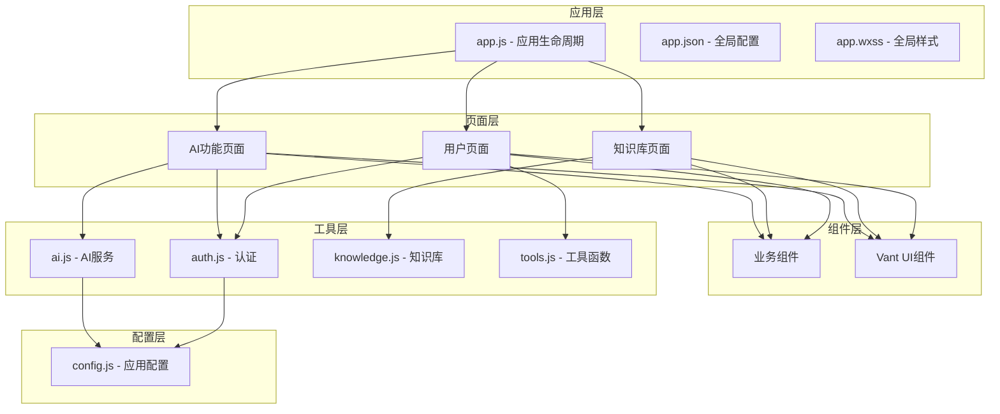
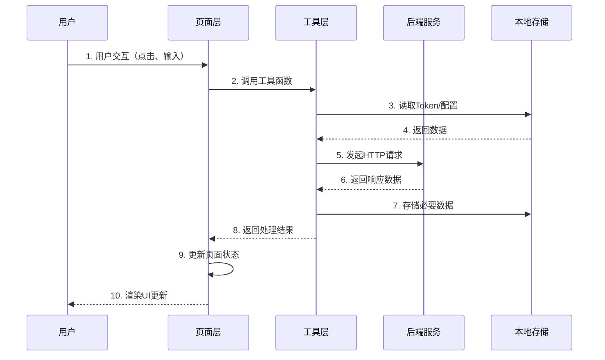
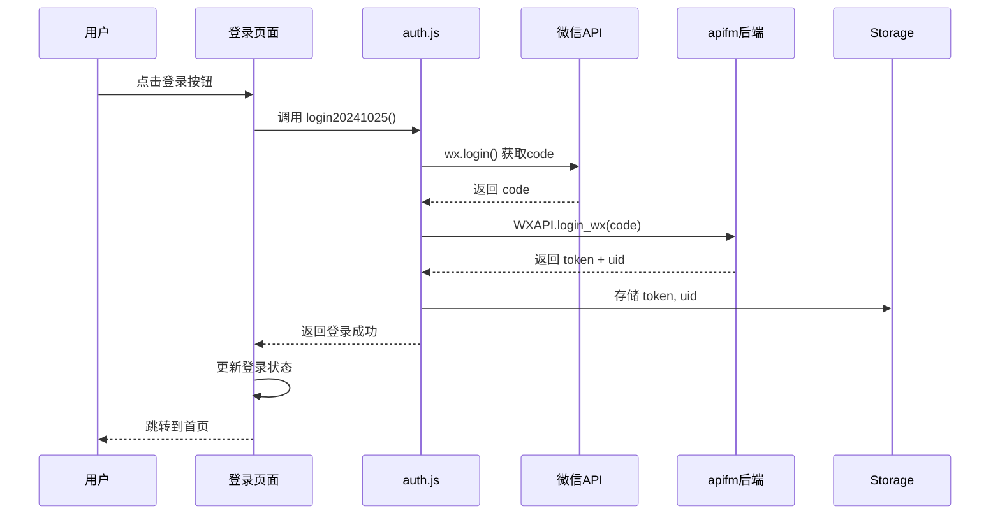
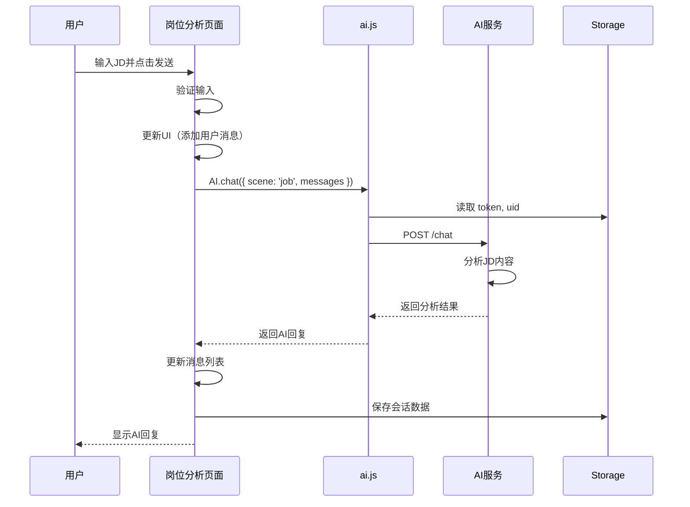
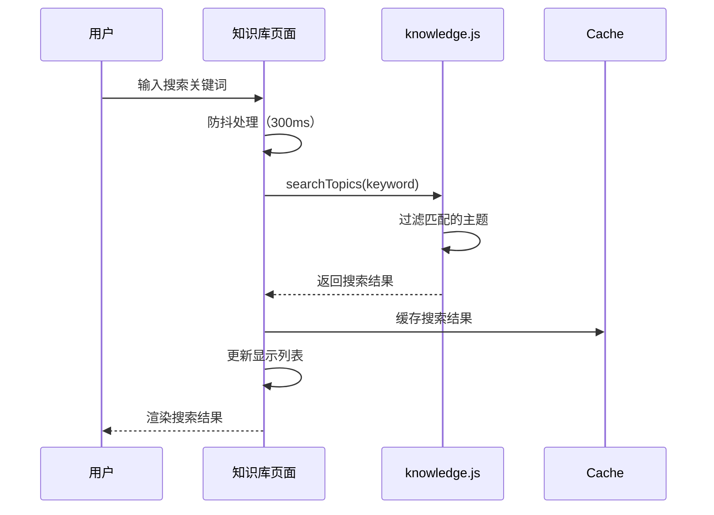
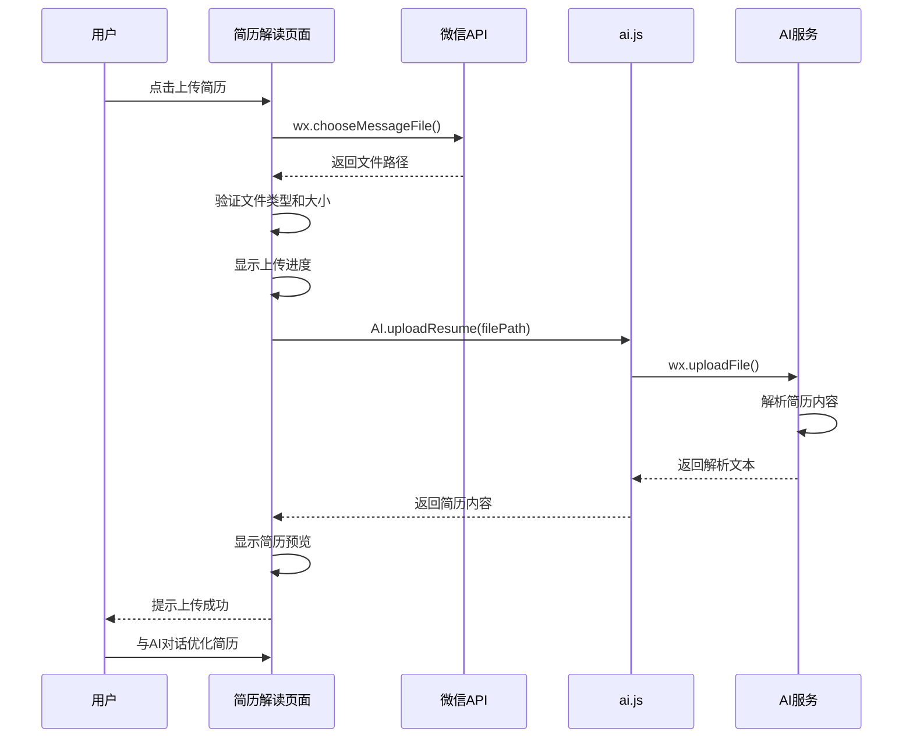

# AI面试助手 - 系统架构文档

## 文档版本

| 版本 | 日期 | 作者 | 变更说明 |
|------|------|------|----------|
| v1.0 | 2024-11-13 | 系统架构师 | 初始版本 |
| v2.0 | 2024-11-13 | 系统架构师 | 基于需求和设计文档全面优化 |

## 1. 系统概述

### 1.1 项目背景

AI面试助手是一个基于微信小程序的智能职业发展工具，旨在帮助求职者更好地准备面试、分析岗位需求、优化简历并管理面试压力。系统通过集成先进的AI服务和精选的技术知识库，为用户提供全方位的智能化面试辅导体验。

### 1.2 核心价值

- **智能化**: 利用AI技术提供个性化的岗位分析和简历优化建议
- **专业性**: 提供大数据领域的专业面试知识库，覆盖主流技术栈
- **便捷性**: 基于微信小程序，无需安装，随时随地使用
- **全面性**: 从岗位分析、知识学习、简历优化到情绪管理的全流程支持

### 1.3 目标用户

- 大数据/数据工程领域的求职者
- 准备技术面试的应届毕业生和在职人员
- 需要简历优化和面试辅导的技术人员
- 面临面试压力需要情绪支持的求职者

### 1.4 核心功能模块

#### 1.4.1 岗位分析模块
通过AI分析职位描述（JD）或岗位链接，为用户提供：
- **岗位职责概述**: 自动提取和总结岗位核心职责
- **核心技能清单**: 按优先级排序的技能要求分析
- **面试问题预测**: 基于岗位要求生成可能的面试问题
- **能力差距分析**: 对比候选人能力与岗位要求的差距
- **补齐建议**: 提供针对性的学习和提升建议
- **快捷问题**: 预设常见问题，提升交互效率

#### 1.4.2 面试知识库模块
提供大数据技术领域的结构化面试题库：
- **技术分类**: 10+个主流技术分类（HDFS、Spark、Flink、Kafka等）
- **问题覆盖**: 200+精选面试问题和详细答案
- **分类浏览**: 按技术栈快速定位相关问题
- **关键词搜索**: 支持模糊搜索和精确匹配
- **详细解答**: 包含原理说明、代码示例、应用场景
- **离线访问**: 支持本地缓存，无网络也可浏览

#### 1.4.3 简历解读模块
AI驱动的智能简历分析功能：
- **文件上传**: 支持PDF、Word、图片等多种格式
- **内容解析**: 自动提取简历关键信息
- **优化建议**: 提供简历结构、内容、表达的优化建议
- **匹配度分析**: 分析简历与目标岗位的匹配程度
- **对话交互**: 支持与AI对话获取个性化建议
- **模板下载**: 提供优质简历模板参考

#### 1.4.4 情绪小屋模块
面试压力管理和心理支持：
- **情绪倾诉**: 提供安全的情绪表达空间
- **AI支持**: 专业温暖的心理支持和建议
- **焦虑缓解**: 帮助缓解面试前的紧张和焦虑
- **放松技巧**: 提供呼吸练习、冥想等放松方法
- **应对策略**: 提供面试压力的应对技巧
- **情绪记录**: 记录情绪变化，追踪心理状态

#### 1.4.5 个人中心模块
用户信息管理和系统设置：
- **微信登录**: 快速授权登录，无需注册
- **信息管理**: 个人信息展示和编辑
- **使用统计**: 查看功能使用情况和历史记录
- **系统设置**: 主题、字体大小等个性化设置
- **意见反馈**: 提交问题和建议
- **数据导出**: 导出个人使用数据

## 2. 技术栈

### 2.1 前端技术栈

#### 2.1.1 核心框架
| 技术 | 版本 | 用途 | 选型理由 |
|------|------|------|----------|
| 微信小程序 | 8.4.0 | 应用框架 | 基于微信生态，用户基数大，无需安装 |
| JavaScript | ES6+ | 开发语言 | 小程序标准开发语言 |
| WXML | - | 页面结构 | 小程序模板语言 |
| WXSS | - | 样式语言 | 小程序样式语言，支持rpx单位 |

#### 2.1.2 UI组件库
| 组件库 | 版本 | 用途 | 特点 |
|--------|------|------|------|
| @vant/weapp | 1.11.6 | UI组件 | 轻量、可靠、组件丰富、文档完善 |

**Vant Weapp 核心组件**:
- **表单组件**: Field、Button、Radio、Checkbox、Switch、Stepper
- **展示组件**: Card、Tag、Empty、Image、Progress、Skeleton
- **反馈组件**: Dialog、Popup、Toast、Overlay、Loading
- **导航组件**: Tab、Tabs、Sidebar、TreeSelect
- **业务组件**: Search、Picker、Calendar、DatetimePicker

#### 2.1.3 核心依赖库
| 依赖库 | 版本 | 用途 | 说明 |
|--------|------|------|------|
| apifm-wxapi | 24.06.19 | 后端接口SDK | 封装用户认证、订单管理等接口 |
| dayjs | 1.11.6 | 日期处理 | 轻量级日期库，体积小性能优 |
| mp-html | 2.3.1 | 富文本渲染 | 支持HTML在小程序中展示 |
| wxa-plugin-canvas | 1.1.12 | 海报生成 | 用于生成分享海报 |
| wxbarcode | 1.0.2 | 二维码生成 | 生成用户二维码 |

### 2.2 后端服务架构

#### 2.2.1 AI服务
- **服务类型**: 自定义AI后端服务
- **主要功能**:
  - 岗位分析（JD解析、技能提取、问题预测）
  - 简历解读（文件解析、内容分析、优化建议）
  - 情绪支持（心理咨询、压力缓解、情绪管理）
- **认证方式**: Bearer Token
- **通信协议**: HTTPS + RESTful API
- **数据格式**: JSON

#### 2.2.2 业务后端服务
- **服务提供商**: API工厂（apifm）
- **主要功能**:
  - 用户管理（注册、登录、信息管理）
  - 订单管理（订单创建、支付、查询）
  - 配置管理（系统配置、商户配置）
  - 数据统计（用户行为、业务数据）
- **部署模式**: SaaS服务
- **商户标识**: subDomain + merchantId

### 2.3 开发工具链

| 工具 | 版本 | 用途 |
|------|------|------|
| 微信开发者工具 | 最新稳定版 | 小程序开发、调试、预览 |
| Node.js | 14+ | npm包管理、构建工具 |
| Git | 2.x | 版本控制 |
| VS Code | 最新版 | 代码编辑（可选） |

### 2.4 技术选型原则

1. **生态兼容**: 优先选择微信小程序生态内的成熟方案
2. **轻量高效**: 控制包体积，优化加载性能
3. **稳定可靠**: 选择经过验证的稳定版本
4. **易于维护**: 文档完善，社区活跃
5. **扩展性强**: 支持功能扩展和定制

## 3. 系统架构设计

### 3.1 整体架构

系统采用**分层架构**设计模式，将应用分为5个清晰的层次，每层职责明确，层与层之间通过定义良好的接口进行通信。

#### 3.1.1 架构层次图



### 3.2 架构层次详解

#### 3.2.1 应用层 (Application Layer)

应用层是小程序的入口和全局管理层，负责应用的生命周期管理和全局配置。

**核心职责**:
- 应用生命周期管理
- 全局状态管理
- SDK初始化
- 全局配置管理
- 全局事件监听

**主要文件**:

**app.js - 应用逻辑**
```javascript
// 核心功能
- onLaunch()          // 应用启动时初始化
  - SDK初始化（WXAPI）
  - 配置加载（config.js）
  - 自动登录逻辑
  - 版本检查
  
- onShow()            // 应用显示时处理
  - 网络状态检测
  - Token有效性验证
  - 更新检查
  
- globalData          // 全局数据存储
  - 用户信息
  - 系统配置
  - 临时状态
```

**app.json - 全局配置**
```json
{
  "pages": [],              // 页面路由配置
  "tabBar": {},            // 底部导航栏（5个功能入口）
  "usingComponents": {},   // 全局组件注册
  "permission": {},        // 权限声明
  "window": {}             // 窗口样式配置
}
```

**app.wxss - 全局样式**
```css
/* 核心内容 */
- 全局CSS变量定义
- 公共样式类（.container、.flex-row等）
- 主题色配置
- 字体和排版规范
```

**设计原则**:
- 保持应用层轻量，避免业务逻辑
- 全局状态最小化，优先使用本地存储
- 统一的错误处理和日志记录

#### 3.2.2 页面层 (Pages Layer)

页面层包含所有功能页面，每个页面由4个文件组成（.js、.json、.wxml、.wxss）。

**页面结构规范**:
```
pages/
├── [module]/
│   ├── [page]/
│   │   ├── index.js      # 页面逻辑
│   │   ├── index.json    # 页面配置
│   │   ├── index.wxml    # 页面结构
│   │   └── index.wxss    # 页面样式
```

**页面分类**:

**1. AI功能页面组**
| 页面 | 路径 | 核心功能 | 数据流 |
|------|------|----------|--------|
| 岗位分析 | pages/ai/job/ | JD分析、技能提取、问题预测 | 用户输入 → AI服务 → 结果展示 |
| 简历解读 | pages/ai/resume/ | 文件上传、内容解析、优化建议 | 文件选择 → 上传 → AI分析 → 对话 |
| 情绪小屋 | pages/ai/mood/ | 情绪倾诉、心理支持 | 对话输入 → AI回复 → 情绪记录 |

**2. 知识库页面组**
| 页面 | 路径 | 核心功能 | 数据源 |
|------|------|----------|--------|
| 知识列表 | pages/knowledge/index | 分类浏览、搜索、主题展示 | utils/knowledge.js |
| 知识详情 | pages/knowledge/detail | FAQ展示、答案渲染、代码高亮 | utils/knowledge.js |

**3. 用户中心页面组**
| 页面 | 路径 | 核心功能 | 依赖服务 |
|------|------|----------|----------|
| 个人中心 | pages/my/index | 信息展示、统计、功能入口 | apifm后端 |
| 个人信息 | pages/my/info | 信息编辑、头像上传 | apifm后端 |
| 系统设置 | pages/my/setting | 主题、字体、通知设置 | 本地存储 |
| 意见反馈 | pages/my/feedback | 问题提交、建议收集 | apifm后端 |
| 登录页面 | pages/login/index | 微信授权、手机号绑定 | 微信API + apifm |

**页面生命周期**:
```javascript
Page({
  onLoad(options)      // 页面加载，接收参数
  onShow()             // 页面显示，刷新数据
  onReady()            // 页面首次渲染完成
  onHide()             // 页面隐藏，保存状态
  onUnload()           // 页面卸载，清理资源
  onPullDownRefresh()  // 下拉刷新
  onReachBottom()      // 上拉加载
  onShareAppMessage()  // 分享配置
})
```

**页面设计原则**:
- 单一职责：每个页面专注一个核心功能
- 数据驱动：通过setData更新视图
- 性能优化：避免频繁setData，合并更新
- 错误处理：统一的加载和错误提示
- 用户体验：加载状态、空状态、错误状态

#### 3.2.3 组件层 (Components Layer)

组件层提供可复用的UI组件和业务组件，遵循组件化开发原则。

**组件结构规范**:
```
components/
├── [component-name]/
│   ├── index.js      # 组件逻辑
│   ├── index.json    # 组件配置
│   ├── index.wxml    # 组件结构
│   └── index.wxss    # 组件样式
```

**自定义业务组件**:

| 组件名 | 路径 | 功能描述 | 使用场景 |
|--------|------|----------|----------|
| login | components/login/ | 微信授权登录弹窗 | 需要登录的页面 |
| bind-mobile | components/bind-mobile/ | 手机号绑定 | 用户注册流程 |
| payment | components/payment/ | 支付功能封装 | 订单支付页面 |
| fuwuxieyi | components/fuwuxieyi/ | 服务协议展示 | 注册、支付页面 |
| goods-pop | components/goods-pop/ | 商品弹窗 | 商品详情页 |

**组件通信机制**:
```javascript
Component({
  // 1. 属性传递（父→子）
  properties: {
    title: String,
    visible: Boolean
  },
  
  // 2. 事件传递（子→父）
  methods: {
    handleConfirm() {
      this.triggerEvent('confirm', { data: 'xxx' })
    }
  },
  
  // 3. 组件关系（父子、兄弟）
  relations: {
    '../parent/index': {
      type: 'parent'
    }
  }
})
```

**Vant UI组件库**:

全局注册的Vant Weapp组件（在app.json中配置）：

**表单类组件**:
- van-field（输入框）
- van-button（按钮）
- van-radio（单选框）
- van-checkbox（复选框）
- van-switch（开关）
- van-stepper（步进器）

**展示类组件**:
- van-card（卡片）
- van-tag（标签）
- van-empty（空状态）
- van-image（图片）
- van-progress（进度条）
- van-skeleton（骨架屏）

**反馈类组件**:
- van-dialog（对话框）
- van-popup（弹出层）
- van-toast（轻提示）
- van-overlay（遮罩层）
- van-loading（加载）

**导航类组件**:
- van-tab / van-tabs（标签页）
- van-sidebar（侧边导航）
- van-tree-select（分类选择）

**业务类组件**:
- van-search（搜索）
- van-picker（选择器）
- van-calendar（日历）
- van-datetime-picker（时间选择）

**组件设计原则**:
- **高内聚低耦合**: 组件功能独立，依赖最小化
- **可复用性**: 通过属性配置支持多场景使用
- **可维护性**: 清晰的代码结构和注释
- **性能优化**: 避免不必要的渲染和计算
- **用户体验**: 统一的交互和视觉风格

#### 3.2.4 工具层 (Utils Layer)

工具层封装了通用的业务逻辑和服务接口，提供可复用的功能模块。

**工具模块分类**:

**1. AI服务模块 (ai.js)**

```javascript
/**
 * AI服务接口封装
 * 负责与AI后端服务的通信
 */

// 核心方法
export default {
  /**
   * AI对话接口
   * @param {Object} params
   * @param {String} params.scene - 场景标识（job/resume/mood）
   * @param {Array} params.messages - 消息历史
   * @param {String} params.sessionId - 会话ID（可选）
   * @returns {Promise} AI回复内容
   */
  chat({ scene, messages, sessionId }) {
    return new Promise((resolve, reject) => {
      wx.request({
        url: `${CONFIG.ai_api_base}/chat`,
        method: 'POST',
        header: this._headers(),
        data: { scene, messages, sessionId },
        success: (res) => resolve(res.data),
        fail: (err) => reject(err)
      })
    })
  },
  
  /**
   * 简历上传接口
   * @param {String} filePath - 本地文件路径
   * @returns {Promise} 解析后的简历文本
   */
  uploadResume(filePath) {
    return new Promise((resolve, reject) => {
      wx.uploadFile({
        url: `${CONFIG.ai_api_base}/resume/upload`,
        filePath: filePath,
        name: 'file',
        header: this._headers(),
        success: (res) => resolve(JSON.parse(res.data)),
        fail: (err) => reject(err)
      })
    })
  },
  
  /**
   * 构建请求头（包含认证信息）
   * @private
   */
  _headers() {
    return {
      'Authorization': `Bearer ${CONFIG.ai_api_key}`,
      'Content-Type': 'application/json'
    }
  }
}
```

**2. 认证模块 (auth.js)**

```javascript
/**
 * 用户认证工具
 * 负责登录、注册、权限管理
 */

// 核心方法
export default {
  /**
   * 检查登录状态
   * @returns {Boolean} 是否已登录
   */
  checkHasLogined() {
    const token = wx.getStorageSync('token')
    const uid = wx.getStorageSync('uid')
    return !!(token && uid)
  },
  
  /**
   * 微信登录（最新版本）
   * @returns {Promise} 登录结果
   */
  async login20241025() {
    // 1. 获取微信code
    const { code } = await wx.login()
    
    // 2. 调用后端登录接口
    const res = await WXAPI.login_wx({ code })
    
    // 3. 存储token和用户信息
    if (res.code === 0) {
      wx.setStorageSync('token', res.data.token)
      wx.setStorageSync('uid', res.data.uid)
      return res.data
    }
    throw new Error(res.msg)
  },
  
  /**
   * 授权注册
   * @param {Object} userInfo - 用户信息
   */
  async authorize(userInfo) {
    const res = await WXAPI.authorize(userInfo)
    if (res.code === 0) {
      wx.setStorageSync('userInfo', res.data)
    }
    return res
  },
  
  /**
   * 退出登录
   */
  loginOut() {
    wx.removeStorageSync('token')
    wx.removeStorageSync('uid')
    wx.removeStorageSync('userInfo')
    wx.reLaunch({ url: '/pages/login/index' })
  },
  
  /**
   * 检查并请求权限
   * @param {String} scope - 权限范围
   */
  async checkAndAuthorize(scope) {
    const { authSetting } = await wx.getSetting()
    if (!authSetting[scope]) {
      await wx.authorize({ scope })
    }
  }
}
```

**3. 知识库模块 (knowledge.js)**

```javascript
/**
 * 知识库数据管理
 * 存储和管理面试题库数据
 */

// 数据结构
export default {
  // 技术分类
  categories: [
    { id: 'hdfs', name: 'HDFS', icon: 'xxx' },
    { id: 'spark', name: 'Spark', icon: 'xxx' },
    { id: 'flink', name: 'Flink', icon: 'xxx' },
    // ... 更多分类
  ],
  
  // 主题列表
  topics: [
    {
      id: 1,
      category: 'hdfs',
      title: 'HDFS架构原理',
      tags: ['架构', '原理'],
      faqs: [
        {
          question: 'HDFS的核心组件有哪些？',
          answer: '详细答案内容...',
          code: '代码示例...'
        }
      ]
    }
    // ... 更多主题
  ],
  
  // 工具方法
  getTopicsByCategory(categoryId) {
    return this.topics.filter(t => t.category === categoryId)
  },
  
  searchTopics(keyword) {
    return this.topics.filter(t => 
      t.title.includes(keyword) || 
      t.faqs.some(f => f.question.includes(keyword))
    )
  }
}
```

**4. 通用工具模块 (tools.js)**

```javascript
/**
 * 通用工具函数
 * 提供跨模块使用的工具方法
 */

export default {
  /**
   * 显示TabBar角标
   * @param {Number} count - 角标数量
   */
  showTabBarBadge(count) {
    if (count > 0) {
      wx.setTabBarBadge({
        index: 2, // 购物车Tab索引
        text: count > 99 ? '99+' : String(count)
      })
    } else {
      wx.removeTabBarBadge({ index: 2 })
    }
  },
  
  /**
   * 格式化日期
   * @param {Date|String} date
   * @param {String} format
   */
  formatDate(date, format = 'YYYY-MM-DD HH:mm:ss') {
    return dayjs(date).format(format)
  },
  
  /**
   * 防抖函数
   * @param {Function} fn
   * @param {Number} delay
   */
  debounce(fn, delay = 300) {
    let timer = null
    return function(...args) {
      clearTimeout(timer)
      timer = setTimeout(() => fn.apply(this, args), delay)
    }
  },
  
  /**
   * 节流函数
   * @param {Function} fn
   * @param {Number} interval
   */
  throttle(fn, interval = 300) {
    let lastTime = 0
    return function(...args) {
      const now = Date.now()
      if (now - lastTime >= interval) {
        fn.apply(this, args)
        lastTime = now
      }
    }
  }
}
```

**工具层设计原则**:
- **单一职责**: 每个工具模块专注特定领域
- **无状态**: 工具函数尽量保持无状态，便于测试
- **错误处理**: 统一的错误处理和日志记录
- **文档完善**: 清晰的注释和使用示例
- **易于扩展**: 支持新增工具方法

#### 3.2.5 配置层 (Config Layer)

配置层集中管理应用的所有配置参数，支持多环境部署。

**配置文件结构 (config.js)**:

```javascript
/**
 * 应用配置文件
 * 集中管理所有配置参数
 */

module.exports = {
  // ========== 基础配置 ==========
  version: '25.09.06',              // 配置版本号
  appName: 'AI面试助手',            // 应用名称
  
  // ========== 商户配置 ==========
  subDomain: 'tz',                  // API工厂专属域名
  merchantId: 951,                  // 商户ID
  
  // ========== 功能开关 ==========
  bindSeller: false,                // 三级分销开关
  openIdAutoRegister: true,         // OpenID自动注册
  enableShare: true,                // 分享功能开关
  enableFeedback: true,             // 反馈功能开关
  
  // ========== AI服务配置 ==========
  ai_api_base: 'https://api.example.com',  // AI服务基础URL
  ai_api_key: '',                   // AI服务API密钥（生产环境从环境变量读取）
  ai_timeout: 30000,                // AI请求超时时间（毫秒）
  ai_retry: 2,                      // AI请求重试次数
  
  // ========== 第三方服务配置 ==========
  sdkAppID: 1400450467,             // 腾讯云IM应用ID
  customerServiceType: 'XCX',       // 客服类型（XCX/H5/TEL）
  
  // ========== 业务配置 ==========
  maxUploadSize: 10 * 1024 * 1024,  // 最大上传文件大小（10MB）
  allowedFileTypes: ['pdf', 'doc', 'docx', 'jpg', 'png'],  // 允许的文件类型
  cacheExpireTime: 7 * 24 * 60 * 60 * 1000,  // 缓存过期时间（7天）
  
  // ========== 性能配置 ==========
  enableCache: true,                // 启用缓存
  enableLog: true,                  // 启用日志
  logLevel: 'info',                 // 日志级别（debug/info/warn/error）
  
  // ========== 环境配置 ==========
  env: 'production',                // 环境标识（development/test/production）
}
```

**配置管理最佳实践**:

**1. 环境分离**
```javascript
// config.js
const ENV = 'production' // 可通过构建工具动态设置

const configs = {
  development: {
    ai_api_base: 'http://localhost:3000',
    enableLog: true,
    logLevel: 'debug'
  },
  test: {
    ai_api_base: 'https://test-api.example.com',
    enableLog: true,
    logLevel: 'info'
  },
  production: {
    ai_api_base: 'https://api.example.com',
    enableLog: false,
    logLevel: 'error'
  }
}

module.exports = {
  ...baseConfig,
  ...configs[ENV]
}
```

**2. 敏感信息保护**
```javascript
// 敏感配置不提交到代码仓库
// 使用 config.example.js 作为模板

// config.example.js
module.exports = {
  ai_api_key: 'YOUR_API_KEY_HERE',
  merchantId: 'YOUR_MERCHANT_ID'
}

// .gitignore
config.js
```

**3. 配置验证**
```javascript
// app.js 启动时验证配置
function validateConfig() {
  const required = ['ai_api_base', 'ai_api_key', 'merchantId']
  const missing = required.filter(key => !CONFIG[key])
  
  if (missing.length > 0) {
    console.error('缺少必要配置:', missing)
    wx.showModal({
      title: '配置错误',
      content: '应用配置不完整，请联系管理员',
      showCancel: false
    })
    return false
  }
  return true
}
```

**配置层设计原则**:
- **集中管理**: 所有配置集中在一个文件
- **环境分离**: 支持开发、测试、生产环境
- **安全性**: 敏感信息不提交代码仓库
- **可维护性**: 清晰的注释和分组
- **灵活性**: 支持动态配置和功能开关

## 4. 项目目录结构

### 4.1 完整目录树

```
wechat-app-mall/
├── .kiro/                          # Kiro配置目录
│   └── specs/                      # 项目规范文档
│       └── project-documentation/
│           ├── requirements.md     # 需求文档
│           ├── design.md          # 设计文档
│           └── tasks.md           # 任务清单
│
├── docs/                           # 项目文档目录
│   ├── technical/                  # 技术文档
│   │   ├── ARCHITECTURE.md        # 架构文档（本文档）
│   │   ├── API.md                 # API文档
│   │   └── DEPLOYMENT.md          # 部署文档
│   └── user/                       # 用户文档
│       ├── USER_GUIDE.md          # 用户指南
│       └── FAQ.md                 # 常见问题
│
├── pages/                          # 页面目录
│   ├── ai/                         # AI功能页面组
│   │   ├── job/                   # 岗位分析页面
│   │   │   ├── index.js
│   │   │   ├── index.json
│   │   │   ├── index.wxml
│   │   │   └── index.wxss
│   │   ├── resume/                # 简历解读页面
│   │   │   ├── index.js
│   │   │   ├── index.json
│   │   │   ├── index.wxml
│   │   │   └── index.wxss
│   │   └── mood/                  # 情绪小屋页面
│   │       ├── index.js
│   │       ├── index.json
│   │       ├── index.wxml
│   │       └── index.wxss
│   │
│   ├── knowledge/                  # 知识库页面组
│   │   ├── index/                 # 知识列表页
│   │   │   ├── index.js
│   │   │   ├── index.json
│   │   │   ├── index.wxml
│   │   │   └── index.wxss
│   │   └── detail/                # 知识详情页
│   │       ├── index.js
│   │       ├── index.json
│   │       ├── index.wxml
│   │       └── index.wxss
│   │
│   ├── my/                         # 个人中心页面组
│   │   ├── index/                 # 个人中心首页
│   │   ├── info/                  # 个人信息编辑
│   │   ├── setting/               # 系统设置
│   │   └── feedback/              # 意见反馈
│   │
│   └── login/                      # 登录页面
│       └── index/
│
├── components/                     # 自定义组件目录
│   ├── login/                     # 登录弹窗组件
│   │   ├── index.js
│   │   ├── index.json
│   │   ├── index.wxml
│   │   └── index.wxss
│   ├── bind-mobile/               # 手机号绑定组件
│   ├── payment/                   # 支付组件
│   ├── fuwuxieyi/                 # 服务协议组件
│   └── goods-pop/                 # 商品弹窗组件
│
├── utils/                          # 工具函数目录
│   ├── ai.js                      # AI服务接口封装
│   ├── auth.js                    # 用户认证工具
│   ├── knowledge.js               # 知识库数据管理
│   ├── tools.js                   # 通用工具函数
│   ├── tools.wxs                  # WXS工具函数
│   ├── request.js                 # HTTP请求封装（可选）
│   └── storage.js                 # 本地存储封装（可选）
│
├── images/                         # 图片资源目录
│   ├── nav/                       # 导航图标
│   │   ├── home.png              # 首页图标
│   │   ├── home-active.png       # 首页图标（选中）
│   │   ├── knowledge.png         # 知识库图标
│   │   └── ...
│   ├── icon/                      # 功能图标
│   │   ├── ai.png                # AI图标
│   │   ├── upload.png            # 上传图标
│   │   └── ...
│   ├── home/                      # 首页相关图片
│   └── common/                    # 公共图片
│       ├── logo.png              # 应用Logo
│       ├── avatar-default.png    # 默认头像
│       └── empty.png             # 空状态图片
│
├── styles/                         # 公共样式目录（可选）
│   ├── variables.wxss             # CSS变量定义
│   ├── mixins.wxss                # 样式混入
│   └── common.wxss                # 公共样式类
│
├── data/                           # 静态数据目录（可选）
│   ├── knowledge/                 # 知识库数据
│   │   ├── hdfs.json             # HDFS相关问题
│   │   ├── spark.json            # Spark相关问题
│   │   └── ...
│   └── config/                    # 配置数据
│
├── miniprogram_npm/               # npm依赖编译目录
│   ├── @vant/weapp/              # Vant UI组件库
│   ├── apifm-wxapi/              # API工厂SDK
│   ├── dayjs/                    # 日期处理库
│   ├── mp-html/                  # 富文本渲染组件
│   ├── wxa-plugin-canvas/        # 海报生成插件
│   └── wxbarcode/                # 二维码生成库
│
├── app.js                         # 应用入口文件
├── app.json                       # 全局配置文件
├── app.wxss                       # 全局样式文件
├── config.js                      # 应用配置文件
├── config.example.js              # 配置文件模板
│
├── package.json                   # npm配置文件
├── package-lock.json              # npm依赖锁定文件
├── project.config.json            # 项目配置文件
├── project.private.config.json    # 项目私有配置
├── sitemap.json                   # 搜索配置文件
│
├── .gitignore                     # Git忽略文件配置
├── .eslintrc.js                   # ESLint配置（可选）
├── README.md                      # 项目说明文档
└── CHANGELOG.md                   # 变更日志
```

### 4.2 目录详细说明

#### 4.2.1 核心目录

**pages/ - 页面目录**
- 存放所有小程序页面
- 每个页面包含4个文件：.js（逻辑）、.json（配置）、.wxml（结构）、.wxss（样式）
- 按功能模块组织（ai/、knowledge/、my/）
- 页面路径需在app.json中注册

**components/ - 组件目录**
- 存放可复用的自定义组件
- 组件结构与页面类似，使用Component()构造器
- 每个组件独立封装，可在多个页面中引用
- 组件可全局注册或页面级注册

**utils/ - 工具函数目录**
- 封装通用的业务逻辑和服务接口
- `ai.js` - AI服务HTTP请求封装
- `auth.js` - 用户认证流程管理
- `knowledge.js` - 知识库数据存储
- `tools.js` - 通用工具函数集合

#### 4.2.2 资源目录

**images/ - 图片资源目录**
- 存放所有静态图片资源
- 按功能分类组织（nav/、icon/、home/）
- 建议使用压缩后的图片，控制包体积
- TabBar图标需要提供选中和未选中两种状态

**styles/ - 公共样式目录（可选）**
- 存放可复用的样式文件
- `variables.wxss` - CSS变量（颜色、字体、间距等）
- `mixins.wxss` - 样式混入
- `common.wxss` - 公共样式类

**data/ - 静态数据目录（可选）**
- 存放静态JSON数据
- 知识库数据可按分类拆分为多个文件
- 便于数据管理和版本控制

#### 4.2.3 配置文件

**app.js / app.json / app.wxss**
- 应用入口和全局配置
- 详见"3.2.1 应用层"说明

**config.js**
- 应用配置参数集中管理
- 详见"3.2.5 配置层"说明

**package.json**
- npm依赖管理
- 脚本命令定义
- 项目元信息

**project.config.json**
- 微信开发者工具项目配置
- appid、项目名称、编译设置等

**sitemap.json**
- 小程序搜索配置
- 控制页面是否允许被索引

#### 4.2.4 文档目录

**docs/ - 项目文档**
- `technical/` - 技术文档（架构、API、部署）
- `user/` - 用户文档（使用指南、FAQ）

**.kiro/specs/ - 项目规范**
- 需求文档、设计文档、任务清单
- 用于项目管理和开发指导

### 4.3 目录组织原则

1. **模块化**: 按功能模块组织目录结构
2. **清晰性**: 目录命名清晰，层次分明
3. **可扩展**: 便于添加新功能和模块
4. **可维护**: 相关文件集中管理
5. **规范性**: 遵循小程序开发规范

## 5. 数据流设计

### 5.1 数据流架构概述

系统采用**单向数据流**设计模式，数据从用户交互开始，经过页面层、工具层、后端服务，最终返回并更新UI。这种设计保证了数据流向的可预测性和可追踪性。

### 5.2 数据流架构图



### 5.3 数据流详细说明

#### 5.3.1 用户交互层

用户在页面上进行各种操作，触发数据流的起点：

**交互类型**:
- **点击操作**: 按钮点击、卡片选择、Tab切换
- **输入操作**: 文本输入、文件选择、表单填写
- **滚动操作**: 下拉刷新、上拉加载、页面滚动
- **手势操作**: 长按、滑动、双击

**事件绑定**:
```xml
<!-- WXML 事件绑定示例 -->
<button bindtap="handleClick">点击</button>
<input bindinput="handleInput" />
<scroll-view bindscrolltolower="loadMore">
  <!-- 内容 -->
</scroll-view>
```

#### 5.3.2 页面层处理

页面接收用户事件，进行数据处理和状态管理：

**完整示例 - 岗位分析页面发送消息**:
```javascript
Page({
  data: {
    inputVal: '',           // 输入框内容
    messages: [],           // 消息列表
    sending: false,         // 发送状态
    scrollToView: ''        // 滚动位置
  },
  
  /**
   * 发送消息
   */
  async send() {
    // 1. 数据验证
    const text = this.data.inputVal.trim()
    if (!text) {
      wx.showToast({ title: '请输入内容', icon: 'none' })
      return
    }
    
    // 2. 检查登录状态
    if (!AUTH.checkHasLogined()) {
      wx.navigateTo({ url: '/pages/login/index' })
      return
    }
    
    // 3. 构建用户消息
    const userMessage = {
      role: 'user',
      content: text,
      timestamp: Date.now()
    }
    
    // 4. 更新UI状态（乐观更新）
    this.setData({ 
      messages: [...this.data.messages, userMessage],
      inputVal: '',
      sending: true,
      scrollToView: `msg-${this.data.messages.length}`
    })
    
    try {
      // 5. 调用工具层API
      const res = await AI.chat({
        scene: 'job',
        messages: this.data.messages,
        sessionId: this.data.sessionId
      })
      
      // 6. 构建AI回复消息
      const aiMessage = {
        role: 'assistant',
        content: res.content,
        timestamp: Date.now()
      }
      
      // 7. 更新消息列表
      this.setData({ 
        messages: [...this.data.messages, aiMessage],
        sending: false,
        sessionId: res.sessionId
      })
      
      // 8. 保存会话到本地
      this.saveSession()
      
    } catch (error) {
      // 9. 错误处理
      console.error('发送消息失败:', error)
      wx.showToast({ 
        title: error.message || '发送失败，请重试', 
        icon: 'none' 
      })
      
      // 10. 恢复UI状态
      this.setData({ sending: false })
    }
  },
  
  /**
   * 保存会话到本地
   */
  saveSession() {
    wx.setStorageSync('job_session', {
      messages: this.data.messages,
      sessionId: this.data.sessionId,
      updateTime: Date.now()
    })
  }
})
```

**页面层职责**:
- 接收和验证用户输入
- 管理页面状态（loading、error、empty）
- 调用工具层API
- 更新UI渲染
- 处理错误和异常
- 本地数据缓存

#### 5.3.3 工具层处理

工具层封装业务逻辑和API调用，提供统一的服务接口：

**完整示例 - AI服务封装**:
```javascript
// utils/ai.js
const CONFIG = require('../config.js')

/**
 * AI服务接口封装
 */
const AI = {
  /**
   * AI对话接口
   * @param {Object} params
   * @param {String} params.scene - 场景（job/resume/mood）
   * @param {Array} params.messages - 消息历史
   * @param {String} params.sessionId - 会话ID
   * @returns {Promise<Object>} AI回复
   */
  async chat({ scene, messages, sessionId }) {
    // 1. 参数验证
    if (!scene || !messages) {
      throw new Error('缺少必要参数')
    }
    
    // 2. 读取用户信息
    const uid = wx.getStorageSync('uid')
    const token = wx.getStorageSync('token')
    
    if (!uid || !token) {
      throw new Error('用户未登录')
    }
    
    // 3. 构建请求数据
    const requestData = {
      scene,
      messages: messages.map(m => ({
        role: m.role,
        content: m.content
      })),
      userId: uid,
      sessionId: sessionId || this._generateSessionId()
    }
    
    // 4. 发起HTTP请求
    return new Promise((resolve, reject) => {
      wx.request({
        url: `${CONFIG.ai_api_base}/chat`,
        method: 'POST',
        header: this._headers(),
        data: requestData,
        timeout: CONFIG.ai_timeout || 30000,
        
        success: (res) => {
          // 5. 响应处理
          if (res.statusCode === 200 && res.data.code === 0) {
            resolve(res.data.data)
          } else {
            reject(new Error(res.data.message || '请求失败'))
          }
        },
        
        fail: (err) => {
          // 6. 错误处理
          console.error('AI请求失败:', err)
          
          // 网络错误
          if (err.errMsg.includes('timeout')) {
            reject(new Error('请求超时，请检查网络'))
          } else if (err.errMsg.includes('fail')) {
            reject(new Error('网络连接失败'))
          } else {
            reject(new Error('请求失败，请重试'))
          }
        }
      })
    })
  },
  
  /**
   * 简历上传接口
   * @param {String} filePath - 本地文件路径
   * @returns {Promise<Object>} 解析结果
   */
  async uploadResume(filePath) {
    const uid = wx.getStorageSync('uid')
    const token = wx.getStorageSync('token')
    
    return new Promise((resolve, reject) => {
      wx.uploadFile({
        url: `${CONFIG.ai_api_base}/resume/upload`,
        filePath: filePath,
        name: 'file',
        header: this._headers(),
        formData: { userId: uid },
        
        success: (res) => {
          const data = JSON.parse(res.data)
          if (data.code === 0) {
            resolve(data.data)
          } else {
            reject(new Error(data.message))
          }
        },
        
        fail: (err) => {
          reject(new Error('文件上传失败'))
        }
      })
    })
  },
  
  /**
   * 构建请求头
   * @private
   */
  _headers() {
    return {
      'Authorization': `Bearer ${CONFIG.ai_api_key}`,
      'Content-Type': 'application/json',
      'X-Client-Version': CONFIG.version
    }
  },
  
  /**
   * 生成会话ID
   * @private
   */
  _generateSessionId() {
    return `${Date.now()}_${Math.random().toString(36).substr(2, 9)}`
  }
}

module.exports = AI
```

**工具层职责**:
- 封装HTTP请求
- 处理认证和授权
- 参数验证和转换
- 错误处理和重试
- 响应数据格式化
- 日志记录

#### 5.3.4 后端服务

后端服务处理业务逻辑并返回数据：

**AI服务**:
- **岗位分析**: 解析JD，提取技能，生成问题
- **简历解读**: 解析文件，分析内容，提供建议
- **情绪支持**: 理解情绪，提供心理支持

**apifm服务**:
- **用户管理**: 注册、登录、信息管理
- **订单管理**: 创建、支付、查询
- **配置管理**: 系统配置、商户配置

**接口规范**:
```json
// 请求格式
{
  "scene": "job",
  "messages": [...],
  "userId": "xxx",
  "sessionId": "xxx"
}

// 响应格式
{
  "code": 0,
  "message": "success",
  "data": {
    "content": "AI回复内容",
    "sessionId": "xxx",
    "timestamp": 1234567890
  }
}
```

#### 5.3.5 本地存储

使用微信小程序的Storage API进行数据持久化：

**存储策略**:

| 数据类型 | 存储方式 | 过期策略 | 示例 |
|---------|---------|---------|------|
| 用户信息 | Sync | 登出时清除 | token, uid, userInfo |
| 会话数据 | Sync | 7天过期 | job_session, resume_session |
| 配置信息 | Sync | 24小时过期 | system_config |
| 缓存数据 | Async | 按需清除 | knowledge_cache |

**存储封装**:
```javascript
// utils/storage.js
const Storage = {
  /**
   * 设置数据（带过期时间）
   */
  set(key, value, expire = 0) {
    const data = {
      value,
      expire: expire > 0 ? Date.now() + expire : 0
    }
    wx.setStorageSync(key, data)
  },
  
  /**
   * 获取数据（自动检查过期）
   */
  get(key) {
    const data = wx.getStorageSync(key)
    if (!data) return null
    
    // 检查是否过期
    if (data.expire > 0 && Date.now() > data.expire) {
      this.remove(key)
      return null
    }
    
    return data.value
  },
  
  /**
   * 删除数据
   */
  remove(key) {
    wx.removeStorageSync(key)
  },
  
  /**
   * 清空所有数据
   */
  clear() {
    wx.clearStorageSync()
  }
}

module.exports = Storage
```

**存储最佳实践**:
- 敏感信息加密存储
- 定期清理过期数据
- 控制存储容量（小程序限制10MB）
- 重要数据做好备份

### 5.4 典型数据流场景

#### 5.4.1 场景1：用户登录流程



**详细步骤**:
1. 用户点击"微信登录"按钮
2. 页面调用 `auth.login20241025()`
3. 工具层调用 `wx.login()` 获取临时code
4. 工具层将code发送到apifm后端
5. 后端验证code，生成token和uid
6. 工具层将token和uid存储到本地
7. 页面更新登录状态，显示用户信息
8. 自动跳转到首页或返回上一页

**关键代码**:
```javascript
// pages/login/index.js
async handleLogin() {
  wx.showLoading({ title: '登录中...' })
  
  try {
    const res = await AUTH.login20241025()
    wx.hideLoading()
    wx.showToast({ title: '登录成功', icon: 'success' })
    
    // 跳转回上一页或首页
    setTimeout(() => {
      wx.navigateBack() || wx.switchTab({ url: '/pages/ai/job/index' })
    }, 1500)
  } catch (error) {
    wx.hideLoading()
    wx.showModal({
      title: '登录失败',
      content: error.message,
      showCancel: false
    })
  }
}
```

#### 5.4.2 场景2：AI岗位分析流程



**详细步骤**:
1. 用户输入岗位描述（JD）并点击发送
2. 页面验证输入内容是否为空
3. 页面添加用户消息到消息列表（乐观更新）
4. 页面调用 `AI.chat()` 发送请求
5. 工具层从本地读取token和uid
6. 工具层发起POST请求到AI服务
7. AI服务分析JD，提取技能和问题
8. AI服务返回分析结果
9. 页面添加AI回复到消息列表
10. 页面保存会话数据到本地
11. 页面滚动到最新消息

**性能优化**:
- 乐观更新：先显示用户消息，再等待AI回复
- 会话缓存：保存历史消息，刷新页面不丢失
- 流式响应：支持AI逐字返回（如果后端支持）

#### 5.4.3 场景3：知识库搜索流程



**详细步骤**:
1. 用户在搜索框输入关键词
2. 页面使用防抖函数延迟300ms执行搜索
3. 页面调用 `knowledge.searchTopics(keyword)`
4. 工具层在本地数据中过滤匹配的主题
5. 工具层返回搜索结果数组
6. 页面缓存搜索结果
7. 页面更新显示的主题列表
8. 渲染搜索结果（高亮关键词）

**关键代码**:
```javascript
// pages/knowledge/index.js
data: {
  searchKeyword: '',
  topics: [],
  filteredTopics: []
},

// 防抖搜索
handleSearch: TOOLS.debounce(function(e) {
  const keyword = e.detail.value.trim()
  this.setData({ searchKeyword: keyword })
  
  if (!keyword) {
    // 清空搜索，显示全部
    this.setData({ filteredTopics: this.data.topics })
    return
  }
  
  // 执行搜索
  const results = KNOWLEDGE.searchTopics(keyword)
  this.setData({ filteredTopics: results })
  
  // 记录搜索历史
  this.saveSearchHistory(keyword)
}, 300)
```

**优化策略**:
- 防抖处理：避免频繁搜索
- 本地搜索：无需网络请求，响应快速
- 搜索历史：记录常用搜索词
- 关键词高亮：提升用户体验

#### 5.4.4 场景4：简历上传流程



**详细步骤**:
1. 用户点击"上传简历"按钮
2. 页面调用 `wx.chooseMessageFile()` 选择文件
3. 页面验证文件类型（PDF、Word、图片）和大小（<10MB）
4. 页面显示上传进度条
5. 页面调用 `AI.uploadResume(filePath)`
6. 工具层调用 `wx.uploadFile()` 上传文件
7. AI服务解析简历内容（OCR、文本提取）
8. AI服务返回解析后的文本
9. 页面显示简历内容预览
10. 用户可以与AI对话获取优化建议

**关键代码**:
```javascript
// pages/ai/resume/index.js
async handleUpload() {
  try {
    // 1. 选择文件
    const res = await wx.chooseMessageFile({
      count: 1,
      type: 'file',
      extension: ['pdf', 'doc', 'docx', 'jpg', 'png']
    })
    
    const file = res.tempFiles[0]
    
    // 2. 验证文件
    if (file.size > CONFIG.maxUploadSize) {
      wx.showToast({ title: '文件过大，请选择小于10MB的文件', icon: 'none' })
      return
    }
    
    // 3. 显示上传进度
    wx.showLoading({ title: '上传中...', mask: true })
    
    // 4. 上传文件
    const result = await AI.uploadResume(file.path)
    
    wx.hideLoading()
    wx.showToast({ title: '上传成功', icon: 'success' })
    
    // 5. 显示简历内容
    this.setData({
      resumeText: result.text,
      resumeAnalysis: result.analysis
    })
    
    // 6. 自动开始对话
    this.startChat()
    
  } catch (error) {
    wx.hideLoading()
    wx.showModal({
      title: '上传失败',
      content: error.message,
      showCancel: false
    })
  }
}
```

**错误处理**:
- 文件类型不支持
- 文件大小超限
- 网络上传失败
- 解析失败（文件损坏）
- 服务器错误

## 6. 设计模式和最佳实践

### 6.1 架构设计模式

#### 6.1.1 分层架构模式 (Layered Architecture)

系统采用5层架构，每层职责明确：

```
应用层 (Application Layer)
    ↓
页面层 (Pages Layer)
    ↓
组件层 (Components Layer)
    ↓
工具层 (Utils Layer)
    ↓
配置层 (Config Layer)
```

**优势**:
- 关注点分离，便于维护
- 层与层之间低耦合
- 易于测试和扩展
- 团队协作效率高

#### 6.1.2 模块化设计 (Modular Design)

按功能划分独立模块：

| 模块 | 职责 | 依赖 |
|------|------|------|
| AI模块 | 岗位分析、简历解读、情绪支持 | ai.js, auth.js |
| 知识库模块 | 题库浏览、搜索、详情展示 | knowledge.js |
| 用户模块 | 登录、信息管理、设置 | auth.js, tools.js |

**模块设计原则**:
- **高内聚**: 模块内部功能紧密相关
- **低耦合**: 模块间依赖最小化
- **单一职责**: 每个模块专注一个领域
- **接口清晰**: 通过工具层提供统一接口

#### 6.1.3 组件化开发 (Component-Based Development)

提取可复用的UI组件和业务组件：

**组件分类**:
- **基础组件**: 按钮、输入框、卡片（使用Vant）
- **业务组件**: 登录弹窗、支付组件、协议组件
- **布局组件**: 页面容器、导航栏、底部栏

**组件通信**:
```javascript
// 父组件 → 子组件（属性传递）
<login visible="{{showLogin}}" />

// 子组件 → 父组件（事件传递）
this.triggerEvent('success', { userInfo })

// 兄弟组件（通过父组件中转）
Parent → Child A → Parent → Child B
```

#### 6.1.4 单向数据流 (Unidirectional Data Flow)

数据流向单一且可预测：

```
用户操作 → 页面事件 → 工具层API → 后端服务
                                    ↓
用户界面 ← 页面更新 ← 数据返回 ← 响应处理
```

**优势**:
- 数据流向清晰，易于追踪
- 状态管理简单，减少bug
- 便于调试和日志记录

### 6.2 编码最佳实践

#### 6.2.1 配置集中管理

**原则**:
- 所有配置集中在 `config.js`
- 环境相关配置可动态切换
- 敏感信息不提交到代码仓库
- 使用 `config.example.js` 作为模板

**示例**:
```javascript
// config.js
const ENV = process.env.NODE_ENV || 'production'

const baseConfig = {
  version: '1.0.0',
  appName: 'AI面试助手'
}

const envConfig = {
  development: {
    ai_api_base: 'http://localhost:3000',
    enableLog: true
  },
  production: {
    ai_api_base: 'https://api.example.com',
    enableLog: false
  }
}

module.exports = {
  ...baseConfig,
  ...envConfig[ENV]
}
```

#### 6.2.2 错误处理

**统一错误处理机制**:

```javascript
// utils/error-handler.js
const ErrorHandler = {
  /**
   * 处理API错误
   */
  handleApiError(error) {
    console.error('API Error:', error)
    
    let message = '操作失败，请重试'
    
    if (error.message) {
      message = error.message
    } else if (error.errMsg) {
      if (error.errMsg.includes('timeout')) {
        message = '请求超时，请检查网络'
      } else if (error.errMsg.includes('fail')) {
        message = '网络连接失败'
      }
    }
    
    wx.showToast({
      title: message,
      icon: 'none',
      duration: 2000
    })
  },
  
  /**
   * 处理业务错误
   */
  handleBusinessError(code, message) {
    const errorMap = {
      401: '请先登录',
      403: '没有权限',
      404: '资源不存在',
      500: '服务器错误'
    }
    
    wx.showModal({
      title: '提示',
      content: errorMap[code] || message,
      showCancel: false
    })
  }
}

module.exports = ErrorHandler
```

**使用示例**:
```javascript
try {
  const res = await AI.chat({ scene: 'job', messages })
  // 处理成功响应
} catch (error) {
  ErrorHandler.handleApiError(error)
}
```

#### 6.2.3 性能优化

**1. setData优化**

```javascript
// ❌ 错误：频繁setData
for (let i = 0; i < 100; i++) {
  this.setData({ [`list[${i}]`]: data[i] })
}

// ✅ 正确：批量setData
const updates = {}
for (let i = 0; i < 100; i++) {
  updates[`list[${i}]`] = data[i]
}
this.setData(updates)
```

**2. 图片优化**

```xml
<!-- 使用懒加载 -->
<image 
  src="{{item.image}}" 
  lazy-load="{{true}}"
  mode="aspectFill"
/>

<!-- 使用webp格式 -->
<image src="{{item.image}}.webp" />
```

**3. 列表渲染优化**

```xml
<!-- 使用wx:key提升性能 -->
<view wx:for="{{list}}" wx:key="id">
  {{item.name}}
</view>

<!-- 虚拟列表（长列表） -->
<recycle-view batch="{{batchSetRecycleData}}">
  <recycle-item wx:for="{{list}}" wx:key="id">
    {{item.name}}
  </recycle-item>
</recycle-view>
```

**4. 分包加载**

```json
// app.json
{
  "pages": ["pages/index/index"],
  "subPackages": [
    {
      "root": "packageAI",
      "pages": ["pages/job/index", "pages/resume/index"]
    }
  ],
  "preloadRule": {
    "pages/index/index": {
      "network": "all",
      "packages": ["packageAI"]
    }
  }
}
```

#### 6.2.4 用户体验优化

**1. 加载状态**

```javascript
// 统一的加载状态管理
Page({
  data: {
    loading: false,
    error: null,
    data: null
  },
  
  async fetchData() {
    this.setData({ loading: true, error: null })
    
    try {
      const data = await API.getData()
      this.setData({ data, loading: false })
    } catch (error) {
      this.setData({ error: error.message, loading: false })
    }
  }
})
```

```xml
<!-- 对应的WXML -->
<view wx:if="{{loading}}">
  <van-loading type="spinner">加载中...</van-loading>
</view>

<view wx:elif="{{error}}">
  <van-empty description="{{error}}">
    <van-button type="primary" bindtap="fetchData">重试</van-button>
  </van-empty>
</view>

<view wx:else>
  <!-- 正常内容 -->
</view>
```

**2. 操作反馈**

```javascript
// 按钮防抖
handleSubmit: TOOLS.debounce(async function() {
  wx.showLoading({ title: '提交中...', mask: true })
  
  try {
    await API.submit(this.data.formData)
    wx.hideLoading()
    wx.showToast({ title: '提交成功', icon: 'success' })
  } catch (error) {
    wx.hideLoading()
    wx.showToast({ title: error.message, icon: 'none' })
  }
}, 300)
```

**3. 离线支持**

```javascript
// 知识库离线缓存
Page({
  onLoad() {
    // 优先使用缓存
    const cache = wx.getStorageSync('knowledge_cache')
    if (cache) {
      this.setData({ topics: cache })
    }
    
    // 后台更新
    this.updateKnowledge()
  },
  
  async updateKnowledge() {
    try {
      const topics = await API.getKnowledge()
      this.setData({ topics })
      wx.setStorageSync('knowledge_cache', topics)
    } catch (error) {
      // 使用缓存，不提示错误
      console.log('更新失败，使用缓存数据')
    }
  }
})
```

### 6.3 代码规范

#### 6.3.1 命名规范

```javascript
// 文件命名：kebab-case
// user-info.js, knowledge-list.wxml

// 变量命名：camelCase
const userName = 'John'
const isLoggedIn = true

// 常量命名：UPPER_SNAKE_CASE
const MAX_UPLOAD_SIZE = 10 * 1024 * 1024
const API_BASE_URL = 'https://api.example.com'

// 类/组件命名：PascalCase
Component({ ... })
class UserService { ... }

// 私有方法：_开头
_handlePrivateMethod() { ... }
```

#### 6.3.2 注释规范

```javascript
/**
 * 发送AI对话消息
 * @param {Object} params - 参数对象
 * @param {String} params.scene - 场景标识（job/resume/mood）
 * @param {Array} params.messages - 消息历史
 * @param {String} [params.sessionId] - 会话ID（可选）
 * @returns {Promise<Object>} AI回复内容
 * @throws {Error} 参数错误或网络错误
 */
async chat({ scene, messages, sessionId }) {
  // 实现代码
}
```

#### 6.3.3 代码组织

```javascript
// 页面代码组织顺序
Page({
  // 1. 数据
  data: { ... },
  
  // 2. 生命周期
  onLoad() { ... },
  onShow() { ... },
  onReady() { ... },
  onHide() { ... },
  onUnload() { ... },
  
  // 3. 事件处理
  handleClick() { ... },
  handleInput() { ... },
  
  // 4. 业务方法
  fetchData() { ... },
  processData() { ... },
  
  // 5. 工具方法
  _formatDate() { ... },
  _validate() { ... }
})
```

### 6.4 安全最佳实践

#### 6.4.1 认证和授权

```javascript
// 统一的登录检查
function checkLogin() {
  if (!AUTH.checkHasLogined()) {
    wx.showModal({
      title: '提示',
      content: '请先登录',
      success: (res) => {
        if (res.confirm) {
          wx.navigateTo({ url: '/pages/login/index' })
        }
      }
    })
    return false
  }
  return true
}

// 页面使用
Page({
  onLoad() {
    if (!checkLogin()) return
    this.fetchData()
  }
})
```

#### 6.4.2 数据加密

```javascript
// 敏感数据加密存储
const CryptoJS = require('crypto-js')

function encryptData(data, key) {
  return CryptoJS.AES.encrypt(JSON.stringify(data), key).toString()
}

function decryptData(encrypted, key) {
  const bytes = CryptoJS.AES.decrypt(encrypted, key)
  return JSON.parse(bytes.toString(CryptoJS.enc.Utf8))
}

// 使用
const encrypted = encryptData({ token: 'xxx' }, SECRET_KEY)
wx.setStorageSync('secure_data', encrypted)
```

#### 6.4.3 输入验证

```javascript
// 表单验证
function validateForm(data) {
  const rules = {
    mobile: /^1[3-9]\d{9}$/,
    email: /^[\w-]+(\.[\w-]+)*@[\w-]+(\.[\w-]+)+$/,
    idCard: /^[1-9]\d{5}(18|19|20)\d{2}(0[1-9]|1[0-2])(0[1-9]|[12]\d|3[01])\d{3}[\dXx]$/
  }
  
  for (let key in rules) {
    if (data[key] && !rules[key].test(data[key])) {
      return { valid: false, message: `${key}格式不正确` }
    }
  }
  
  return { valid: true }
}
```

## 7. 扩展性设计

### 7.1 功能扩展

#### 7.1.1 新增AI功能

**扩展步骤**:
1. 在 `pages/ai/` 目录下创建新页面
2. 复用 `utils/ai.js` 的接口，指定新的scene参数
3. 在 `app.json` 中注册新页面
4. 在TabBar或导航中添加入口

**示例 - 添加"模拟面试"功能**:
```javascript
// pages/ai/interview/index.js
const AI = require('../../../utils/ai.js')

Page({
  data: {
    messages: [],
    questions: []
  },
  
  async startInterview() {
    const res = await AI.chat({
      scene: 'interview',  // 新的场景标识
      messages: this.data.messages
    })
    // 处理响应
  }
})
```

#### 7.1.2 扩展知识库

**方式1：添加新分类**
```javascript
// utils/knowledge.js
categories: [
  // 现有分类
  { id: 'hdfs', name: 'HDFS', icon: 'xxx' },
  { id: 'spark', name: 'Spark', icon: 'xxx' },
  
  // 新增分类
  { id: 'elasticsearch', name: 'Elasticsearch', icon: 'xxx' },
  { id: 'clickhouse', name: 'ClickHouse', icon: 'xxx' }
]
```

**方式2：动态加载数据**
```javascript
// 从服务器加载知识库数据
async loadKnowledge() {
  const res = await wx.request({
    url: `${CONFIG.api_base}/knowledge`,
    method: 'GET'
  })
  
  this.setData({
    categories: res.data.categories,
    topics: res.data.topics
  })
}
```

**方式3：支持用户自定义**
```javascript
// 用户可以收藏、标记、添加笔记
addNote(topicId, note) {
  const userNotes = wx.getStorageSync('user_notes') || {}
  userNotes[topicId] = note
  wx.setStorageSync('user_notes', userNotes)
}
```

#### 7.1.3 集成新的第三方服务

**示例 - 集成语音识别服务**:

```javascript
// utils/speech.js
const CONFIG = require('../config.js')

const Speech = {
  /**
   * 语音转文字
   */
  async recognize(filePath) {
    return new Promise((resolve, reject) => {
      wx.uploadFile({
        url: `${CONFIG.speech_api_base}/recognize`,
        filePath: filePath,
        name: 'audio',
        header: {
          'Authorization': `Bearer ${CONFIG.speech_api_key}`
        },
        success: (res) => {
          const data = JSON.parse(res.data)
          resolve(data.text)
        },
        fail: reject
      })
    })
  },
  
  /**
   * 文字转语音
   */
  async synthesize(text) {
    // 实现TTS功能
  }
}

module.exports = Speech
```

**在页面中使用**:
```javascript
const Speech = require('../../utils/speech.js')

Page({
  async handleVoiceInput() {
    // 录音
    const { tempFilePath } = await wx.startRecord()
    
    // 识别
    const text = await Speech.recognize(tempFilePath)
    
    // 使用识别结果
    this.setData({ inputVal: text })
  }
})
```

#### 7.1.4 自定义主题

**方式1：CSS变量**
```css
/* app.wxss */
page {
  /* 主题色 */
  --primary-color: #1989fa;
  --success-color: #07c160;
  --warning-color: #ff976a;
  --danger-color: #ee0a24;
  
  /* 文字色 */
  --text-color: #323233;
  --text-color-secondary: #969799;
  
  /* 背景色 */
  --background-color: #f7f8fa;
  --background-color-light: #fafafa;
}

/* 使用变量 */
.button {
  background-color: var(--primary-color);
  color: #fff;
}
```

**方式2：Vant主题定制**
```css
/* app.wxss */
page {
  --button-primary-background-color: #07c160;
  --button-primary-border-color: #07c160;
}
```

**方式3：动态切换主题**
```javascript
// 切换深色模式
Page({
  switchTheme(theme) {
    wx.setStorageSync('theme', theme)
    
    if (theme === 'dark') {
      wx.setBackgroundColor({
        backgroundColor: '#000000',
        backgroundColorTop: '#000000',
        backgroundColorBottom: '#000000'
      })
    }
    
    // 重新加载页面应用主题
    this.onLoad()
  }
})
```

### 7.2 性能扩展

#### 7.2.1 CDN加速

```javascript
// config.js
module.exports = {
  // 静态资源CDN
  cdn_base: 'https://cdn.example.com',
  
  // 图片CDN
  image_cdn: 'https://img.example.com'
}

// 使用
const imageUrl = `${CONFIG.image_cdn}/avatar/${uid}.jpg`
```

#### 7.2.2 分包加载

```json
// app.json
{
  "pages": [
    "pages/ai/job/index",
    "pages/knowledge/index/index"
  ],
  "subPackages": [
    {
      "root": "packageAI",
      "name": "ai",
      "pages": [
        "pages/resume/index",
        "pages/mood/index"
      ]
    },
    {
      "root": "packageUser",
      "name": "user",
      "pages": [
        "pages/info/index",
        "pages/setting/index"
      ]
    }
  ],
  "preloadRule": {
    "pages/ai/job/index": {
      "network": "all",
      "packages": ["ai"]
    }
  }
}
```

#### 7.2.3 数据缓存策略

```javascript
// utils/cache.js
const Cache = {
  /**
   * 带缓存的数据获取
   */
  async getWithCache(key, fetcher, expire = 3600000) {
    // 1. 尝试从缓存读取
    const cached = wx.getStorageSync(key)
    if (cached && Date.now() - cached.timestamp < expire) {
      return cached.data
    }
    
    // 2. 缓存失效，重新获取
    const data = await fetcher()
    
    // 3. 更新缓存
    wx.setStorageSync(key, {
      data,
      timestamp: Date.now()
    })
    
    return data
  }
}

// 使用
const knowledge = await Cache.getWithCache(
  'knowledge_data',
  () => API.getKnowledge(),
  24 * 60 * 60 * 1000  // 24小时
)
```

### 7.3 部署扩展

#### 7.3.1 多环境配置

```javascript
// config/env.js
const environments = {
  development: {
    ai_api_base: 'http://localhost:3000',
    api_base: 'http://localhost:8080',
    enableLog: true,
    enableMock: true
  },
  
  test: {
    ai_api_base: 'https://test-ai.example.com',
    api_base: 'https://test-api.example.com',
    enableLog: true,
    enableMock: false
  },
  
  production: {
    ai_api_base: 'https://ai.example.com',
    api_base: 'https://api.example.com',
    enableLog: false,
    enableMock: false
  }
}

const ENV = process.env.ENV || 'production'
module.exports = environments[ENV]
```

#### 7.3.2 灰度发布

```javascript
// 基于用户ID的灰度策略
function isGrayUser(uid) {
  const grayPercent = 10  // 10%灰度
  const hash = uid.split('').reduce((acc, char) => acc + char.charCodeAt(0), 0)
  return hash % 100 < grayPercent
}

// 使用新功能
if (isGrayUser(uid)) {
  // 使用新版本功能
  this.newFeature()
} else {
  // 使用旧版本功能
  this.oldFeature()
}
```

## 8. 安全性设计

### 8.1 认证和授权

#### 8.1.1 认证机制

```javascript
// 完整的认证流程
const AuthFlow = {
  /**
   * 登录流程
   */
  async login() {
    // 1. 获取微信code
    const { code } = await wx.login()
    
    // 2. 发送到后端换取token
    const res = await WXAPI.login_wx({ code })
    
    // 3. 存储token和用户信息
    wx.setStorageSync('token', res.data.token)
    wx.setStorageSync('uid', res.data.uid)
    wx.setStorageSync('token_expire', Date.now() + 7 * 24 * 60 * 60 * 1000)
    
    return res.data
  },
  
  /**
   * Token刷新
   */
  async refreshToken() {
    const oldToken = wx.getStorageSync('token')
    const res = await API.refreshToken({ token: oldToken })
    wx.setStorageSync('token', res.data.token)
  },
  
  /**
   * 检查Token有效性
   */
  async checkToken() {
    const expire = wx.getStorageSync('token_expire')
    
    // Token即将过期，自动刷新
    if (Date.now() > expire - 24 * 60 * 60 * 1000) {
      await this.refreshToken()
    }
  }
}
```

#### 8.1.2 权限控制

```javascript
// 权限管理
const Permission = {
  /**
   * 检查功能权限
   */
  checkFeature(feature) {
    const userLevel = wx.getStorageSync('user_level') || 'free'
    
    const permissions = {
      free: ['job', 'knowledge'],
      vip: ['job', 'knowledge', 'resume', 'mood'],
      premium: ['job', 'knowledge', 'resume', 'mood', 'interview']
    }
    
    return permissions[userLevel].includes(feature)
  },
  
  /**
   * 请求权限
   */
  async requestPermission(scope) {
    const { authSetting } = await wx.getSetting()
    
    if (!authSetting[scope]) {
      await wx.authorize({ scope })
    }
  }
}
```

### 8.2 数据安全

#### 8.2.1 数据传输安全

```javascript
// HTTPS + 请求签名
const SecureRequest = {
  async request(options) {
    const timestamp = Date.now()
    const nonce = Math.random().toString(36).substr(2)
    
    // 生成签名
    const sign = this._generateSign({
      ...options.data,
      timestamp,
      nonce
    })
    
    return wx.request({
      ...options,
      header: {
        ...options.header,
        'X-Timestamp': timestamp,
        'X-Nonce': nonce,
        'X-Sign': sign
      }
    })
  },
  
  _generateSign(data) {
    // 使用HMAC-SHA256生成签名
    const sorted = Object.keys(data).sort().map(k => `${k}=${data[k]}`).join('&')
    return CryptoJS.HmacSHA256(sorted, SECRET_KEY).toString()
  }
}
```

#### 8.2.2 敏感数据保护

```javascript
// 敏感数据加密
const DataProtection = {
  /**
   * 加密存储
   */
  setSecure(key, value) {
    const encrypted = CryptoJS.AES.encrypt(
      JSON.stringify(value),
      SECRET_KEY
    ).toString()
    
    wx.setStorageSync(key, encrypted)
  },
  
  /**
   * 解密读取
   */
  getSecure(key) {
    const encrypted = wx.getStorageSync(key)
    if (!encrypted) return null
    
    const bytes = CryptoJS.AES.decrypt(encrypted, SECRET_KEY)
    return JSON.parse(bytes.toString(CryptoJS.enc.Utf8))
  }
}
```

### 8.3 输入验证

```javascript
// 统一的输入验证
const Validator = {
  rules: {
    required: (value) => !!value,
    mobile: (value) => /^1[3-9]\d{9}$/.test(value),
    email: (value) => /^[\w-]+(\.[\w-]+)*@[\w-]+(\.[\w-]+)+$/.test(value),
    minLength: (min) => (value) => value.length >= min,
    maxLength: (max) => (value) => value.length <= max
  },
  
  validate(data, schema) {
    const errors = {}
    
    for (let field in schema) {
      const rules = schema[field]
      const value = data[field]
      
      for (let rule of rules) {
        if (!this.rules[rule](value)) {
          errors[field] = `${field} validation failed: ${rule}`
          break
        }
      }
    }
    
    return {
      valid: Object.keys(errors).length === 0,
      errors
    }
  }
}

// 使用
const result = Validator.validate(formData, {
  mobile: ['required', 'mobile'],
  email: ['required', 'email']
})
```

## 9. 监控和维护

### 9.1 日志系统

```javascript
// utils/logger.js
const Logger = {
  levels: {
    DEBUG: 0,
    INFO: 1,
    WARN: 2,
    ERROR: 3
  },
  
  currentLevel: 1,  // INFO
  
  log(level, message, data = {}) {
    if (this.levels[level] < this.currentLevel) return
    
    const log = {
      level,
      message,
      data,
      timestamp: new Date().toISOString(),
      page: getCurrentPages().pop().route
    }
    
    console.log(`[${level}]`, message, data)
    
    // 发送到日志服务器
    if (level === 'ERROR') {
      this._sendToServer(log)
    }
  },
  
  debug(message, data) {
    this.log('DEBUG', message, data)
  },
  
  info(message, data) {
    this.log('INFO', message, data)
  },
  
  warn(message, data) {
    this.log('WARN', message, data)
  },
  
  error(message, data) {
    this.log('ERROR', message, data)
  },
  
  _sendToServer(log) {
    wx.request({
      url: `${CONFIG.log_api}/report`,
      method: 'POST',
      data: log
    })
  }
}

module.exports = Logger
```

### 9.2 性能监控

```javascript
// utils/performance.js
const Performance = {
  /**
   * 页面加载性能
   */
  measurePageLoad(pageName) {
    const performance = wx.getPerformance()
    const observer = performance.createObserver((entryList) => {
      entryList.getEntries().forEach((entry) => {
        Logger.info('Page Performance', {
          page: pageName,
          duration: entry.duration,
          entryType: entry.entryType
        })
      })
    })
    
    observer.observe({ entryTypes: ['navigation', 'render'] })
  },
  
  /**
   * API请求性能
   */
  measureApiCall(apiName, startTime) {
    const duration = Date.now() - startTime
    
    Logger.info('API Performance', {
      api: apiName,
      duration
    })
    
    // 慢请求告警
    if (duration > 3000) {
      Logger.warn('Slow API', { api: apiName, duration })
    }
  }
}
```

### 9.3 错误监控

```javascript
// app.js
App({
  onError(error) {
    Logger.error('App Error', {
      message: error,
      stack: error.stack
    })
    
    // 上报到错误监控平台
    this.reportError(error)
  },
  
  onPageNotFound(res) {
    Logger.error('Page Not Found', {
      path: res.path,
      query: res.query
    })
    
    wx.redirectTo({ url: '/pages/index/index' })
  },
  
  reportError(error) {
    wx.request({
      url: `${CONFIG.error_api}/report`,
      method: 'POST',
      data: {
        error: error.message,
        stack: error.stack,
        userAgent: wx.getSystemInfoSync(),
        timestamp: Date.now()
      }
    })
  }
})
```

## 10. 总结

### 10.1 架构特点

AI面试助手采用清晰的**5层分层架构**设计，将应用、页面、组件、工具和配置分离，实现了高内聚、低耦合的代码组织。通过模块化和组件化的开发方式，系统具有良好的可维护性和可扩展性。

**核心优势**:

| 特点 | 说明 | 价值 |
|------|------|------|
| 分层清晰 | 5层架构，职责明确 | 易于理解和维护 |
| 模块独立 | AI、知识库、用户等模块独立开发 | 并行开发，降低耦合 |
| 组件复用 | 业务组件和UI组件可在多处使用 | 提高开发效率 |
| 配置集中 | 统一的配置管理 | 便于部署和维护 |
| 数据流简洁 | 单向数据流，流程清晰 | 易于调试和追踪 |
| 易于扩展 | 新增功能无需修改核心架构 | 支持快速迭代 |

### 10.2 技术亮点

1. **智能化**: 集成先进的AI服务，提供个性化的面试辅导
2. **专业性**: 精选的大数据技术知识库，覆盖主流技术栈
3. **高性能**: 分包加载、缓存策略、性能优化
4. **安全性**: 完善的认证授权、数据加密、输入验证
5. **可维护**: 清晰的代码结构、完善的文档、规范的编码
6. **可扩展**: 模块化设计、插件化架构、灵活的配置

### 10.3 未来规划

**短期目标** (1-3个月):
- 完善核心功能，优化用户体验
- 扩展知识库内容，增加技术分类
- 优化AI模型，提升回复质量
- 完善文档和测试

**中期目标** (3-6个月):
- 新增模拟面试功能
- 支持语音输入和输出
- 实现个性化推荐
- 开发数据分析功能

**长期目标** (6-12个月):
- 构建用户社区
- 开发企业版功能
- 支持多语言
- 拓展到其他技术领域

### 10.4 文档维护

本架构文档应随系统演进持续更新：

- **版本管理**: 每次重大架构变更更新版本号
- **变更记录**: 在文档头部记录变更历史
- **定期审查**: 每季度审查一次，确保文档准确性
- **团队协作**: 鼓励团队成员贡献和完善文档

---

**文档版本**: v2.0  
**最后更新**: 2024-11-13  
**维护团队**: AI面试助手开发团队  
**联系方式**: dev@example.com
