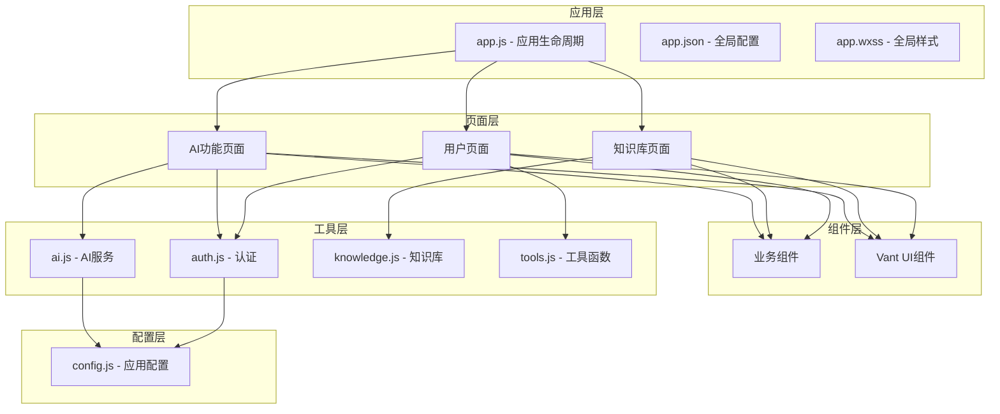
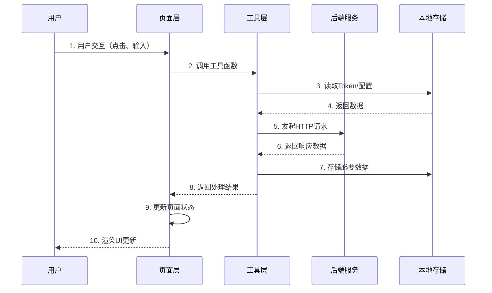

# 系统架构文档

## 系统概述

AI面试助手是一个基于微信小程序的职业发展工具，旨在帮助求职者更好地准备面试、分析岗位需求、优化简历并管理面试压力。系统通过集成AI服务和精选知识库，为用户提供智能化的面试辅导体验。

### 核心功能

#### 1. 岗位分析
通过AI分析职位描述（JD）或岗位链接，为用户提供：
- 岗位职责概述
- 核心技能清单（按优先级排序）
- 常见面试问题预测
- 与候选人能力的差距分析与补齐建议

#### 2. 面试知识库
提供大数据技术领域的结构化面试题库，涵盖：
- HDFS、MapReduce、Yarn等Hadoop生态组件
- Kafka、HBase、Hive等数据处理工具
- Spark、Flink等流式计算框架
- 数据仓库、数据倾斜等专题知识
- 支持分类浏览和关键词搜索

#### 3. 简历解读
AI驱动的简历分析功能：
- 支持上传简历文件（PDF、Word等格式）
- 自动解析简历内容
- 提供简历优化建议
- 分析简历与目标岗位的匹配度
- 支持与AI对话获取个性化建议

#### 4. 情绪小屋
面试压力管理和情绪支持：
- 提供情绪倾诉渠道
- AI提供心理支持和建议
- 帮助缓解面试焦虑
- 提供放松技巧和应对策略

#### 5. 个人中心
用户信息管理和系统设置：
- 微信授权登录
- 个人信息展示和编辑
- 头像和昵称修改
- 订单统计查看
- 系统设置和反馈

## 技术栈

### 前端框架
- **微信小程序**: 基于微信生态的轻量级应用框架
- **版本**: 8.4.0

### UI组件库
- **@vant/weapp**: 1.11.6 - 轻量、可靠的小程序UI组件库
  - 提供丰富的基础组件（Button、Field、Popup等）
  - 支持主题定制
  - 完善的文档和示例

### 核心依赖
- **apifm-wxapi**: 24.06.19 - API工厂微信小程序SDK
  - 提供用户认证、订单管理等后端接口封装
  - 支持服务商模式和独立部署模式
  
- **dayjs**: 1.11.6 - 轻量级日期处理库
  - 用于日期格式化和时间计算
  - 体积小，性能优
  
- **mp-html**: 2.3.1 - 富文本渲染组件
  - 支持HTML内容在小程序中展示
  - 用于知识库详情页面的内容渲染

### 辅助工具
- **wxa-plugin-canvas**: 1.1.12 - 小程序海报生成插件
  - 用于生成分享海报
  
- **wxbarcode**: 1.0.2 - 条形码/二维码生成库
  - 用于生成用户二维码

### 后端服务
- **AI服务**: 自定义AI后端服务
  - 提供岗位分析、简历解读、情绪支持等AI功能
  - 支持Bearer Token认证
  
- **apifm后端**: API工厂提供的商户后端服务
  - 用户管理、订单管理、配置管理等

## 系统架构

### 架构层次图



### 详细架构说明

#### 应用层 (App Layer)
应用层是小程序的入口和全局管理层，负责应用的生命周期管理和全局配置。

**app.js**
- 应用生命周期管理（onLaunch、onShow）
- SDK初始化（WXAPI、配置加载）
- 全局状态管理（globalData）
- 自动登录逻辑
- 网络状态监听
- 版本更新检测

**app.json**
- 页面路由配置
- TabBar配置（5个主要功能入口）
- 全局组件注册
- 权限声明
- 窗口样式配置

**app.wxss**
- 全局样式定义
- 公共CSS类
- 主题色配置

#### 页面层 (Pages Layer)
页面层包含所有功能页面，每个页面由4个文件组成（.js、.json、.wxml、.wxss）。

**AI功能页面**
- `pages/ai/job/` - 岗位分析页面
  - 接收用户输入的JD或岗位信息
  - 调用AI服务进行分析
  - 展示分析结果和快捷问题
  
- `pages/ai/resume/` - 简历解读页面
  - 文件选择和上传
  - 简历内容解析
  - AI对话交互
  
- `pages/ai/mood/` - 情绪小屋页面
  - 情绪倾诉对话界面
  - AI情绪支持和建议

**知识库页面**
- `pages/knowledge/index` - 知识列表页
  - 分类切换（HDFS、Spark、Flink等）
  - 搜索功能
  - 主题卡片展示
  
- `pages/knowledge/detail` - 知识详情页
  - FAQ列表展示
  - 答案详细内容
  - 代码示例渲染

**用户页面**
- `pages/my/index` - 个人中心首页
  - 用户信息展示
  - 订单统计
  - 功能入口
  
- `pages/my/info` - 个人信息编辑
- `pages/my/setting` - 系统设置
- `pages/my/feedback` - 意见反馈
- `pages/login/index` - 登录页面

#### 组件层 (Components Layer)
组件层提供可复用的UI组件和业务组件。

**业务组件**
- `login` - 登录弹窗组件
  - 微信授权登录
  - 手机号获取
  - 登录状态回调
  
- `bind-mobile` - 手机号绑定组件
  - 手机号输入
  - 验证码验证
  - 绑定成功回调
  
- `payment` - 支付组件
  - 支付方式选择
  - 微信支付调起
  - 支付结果处理
  
- `fuwuxieyi` - 服务协议组件
- `goods-pop` - 商品弹窗组件

**Vant UI组件**
全局注册的Vant Weapp组件，包括：
- 表单组件：van-field、van-button、van-radio、van-checkbox
- 展示组件：van-card、van-tag、van-empty、van-image
- 反馈组件：van-dialog、van-popup、van-overlay
- 导航组件：van-tab、van-tabs、van-sidebar
- 其他：van-search、van-picker、van-calendar等

#### 工具层 (Utils Layer)
工具层封装了通用的业务逻辑和服务接口。

**ai.js - AI服务接口**
```javascript
// 主要功能
- chat({ scene, messages, sessionId }) // AI对话接口
- uploadResume(filePath) // 简历上传接口
- _headers() // 请求头构建（包含认证）
```

**auth.js - 认证工具**
```javascript
// 主要功能
- checkHasLogined() // 检查登录状态
- login20241025() // 最新登录接口
- authorize() // 授权注册
- loginOut() // 退出登录
- bindSeller() // 绑定推荐人
- checkAndAuthorize(scope) // 权限检查
```

**knowledge.js - 知识库数据**
```javascript
// 数据结构
- categories[] // 分类列表
- topics[] // 主题列表（包含FAQ和答案）
```

**tools.js - 通用工具**
```javascript
// 主要功能
- showTabBarBadge() // 显示购物车角标
// 可扩展其他通用工具函数
```

#### 配置层 (Config Layer)
配置层管理应用的所有配置参数。

**config.js**
```javascript
{
  version: '25.09.06',           // 配置版本号
  subDomain: 'tz',               // 专属域名
  merchantId: 951,               // 商户ID
  sdkAppID: 1400450467,          // 腾讯云应用ID
  bindSeller: false,             // 三级分销开关
  customerServiceType: 'XCX',    // 客服类型
  openIdAutoRegister: true,      // 自动注册开关
  ai_api_base: 'https://...',    // AI服务地址
  ai_api_key: ''                 // AI服务密钥
}
```

## 目录结构

```
wechat-app-mall/
├── pages/                      # 页面目录
│   ├── ai/                     # AI功能页面
│   │   ├── job/               # 岗位分析
│   │   ├── resume/            # 简历解读
│   │   └── mood/              # 情绪小屋
│   ├── knowledge/             # 知识库页面
│   │   ├── index              # 知识列表
│   │   └── detail             # 知识详情
│   ├── my/                    # 个人中心页面
│   │   ├── index              # 个人中心首页
│   │   ├── info               # 个人信息
│   │   ├── setting            # 系统设置
│   │   └── feedback           # 意见反馈
│   └── login/                 # 登录页面
│
├── components/                 # 组件目录
│   ├── login/                 # 登录组件
│   ├── bind-mobile/           # 绑定手机组件
│   ├── payment/               # 支付组件
│   ├── fuwuxieyi/             # 服务协议组件
│   └── goods-pop/             # 商品弹窗组件
│
├── utils/                      # 工具函数目录
│   ├── ai.js                  # AI服务接口封装
│   ├── auth.js                # 认证相关工具
│   ├── knowledge.js           # 知识库数据
│   ├── tools.js               # 通用工具函数
│   └── tools.wxs              # WXS工具函数
│
├── images/                     # 图片资源目录
│   ├── nav/                   # 导航图标
│   ├── icon/                  # 功能图标
│   ├── home/                  # 首页图片
│   └── ...                    # 其他图片资源
│
├── miniprogram_npm/           # npm依赖编译目录
│   ├── @vant/weapp/          # Vant组件库
│   ├── apifm-wxapi/          # API工厂SDK
│   ├── dayjs/                # 日期处理库
│   ├── mp-html/              # 富文本组件
│   └── ...                   # 其他依赖
│
├── doc/                       # 文档目录
│   └── ...                   # 项目相关文档
│
├── app.js                     # 应用入口文件
├── app.json                   # 全局配置文件
├── app.wxss                   # 全局样式文件
├── config.js                  # 应用配置文件
├── package.json               # npm配置文件
├── project.config.json        # 项目配置文件
└── sitemap.json              # 搜索配置文件
```

### 目录说明

#### pages/ - 页面目录
存放所有小程序页面，每个页面包含4个文件：
- `.js` - 页面逻辑
- `.json` - 页面配置
- `.wxml` - 页面结构
- `.wxss` - 页面样式

页面按功能模块组织，便于维护和扩展。

#### components/ - 组件目录
存放可复用的自定义组件，组件结构与页面类似，但使用Component()构造器。每个组件独立封装，可在多个页面中引用。

#### utils/ - 工具函数目录
存放通用的业务逻辑和服务接口封装：
- `ai.js` - 封装AI服务的HTTP请求，处理认证和错误
- `auth.js` - 封装用户认证流程，包括登录、注册、Token管理
- `knowledge.js` - 存储知识库的静态数据，包括分类和主题
- `tools.js` - 提供通用工具函数，如购物车角标显示等

#### images/ - 图片资源目录
存放所有静态图片资源，按功能分类组织：
- `nav/` - TabBar导航图标（选中/未选中状态）
- `icon/` - 功能图标（SVG或PNG格式）
- `home/` - 首页相关图片
- 其他分类图片

#### miniprogram_npm/ - npm依赖目录
微信开发者工具编译npm包后生成的目录，包含所有第三方依赖的小程序版本。不应手动修改此目录。

#### config.js - 应用配置文件
集中管理应用的所有配置参数，包括：
- 商户信息（subDomain、merchantId）
- AI服务配置（ai_api_base、ai_api_key）
- 功能开关（bindSeller、openIdAutoRegister）
- 第三方服务配置（sdkAppID）

修改配置后需要重新编译小程序。

## 数据流

### 数据流架构图



### 数据流详细说明

#### 1. 用户交互
用户在页面上进行操作，如：
- 点击按钮
- 输入文本
- 选择文件
- 切换Tab

#### 2. 页面层处理
页面接收用户事件，调用相应的事件处理函数：
```javascript
// 示例：岗位分析页面发送消息
async send() {
  const text = this.data.inputVal.trim()
  if (!text) return
  
  // 更新UI状态
  this.setData({ sending: true })
  
  // 调用工具层
  const res = await AI.chat({
    scene: 'job',
    messages: this.data.messages
  })
  
  // 更新页面数据
  this.setData({ 
    messages: [...this.data.messages, res],
    sending: false 
  })
}
```

#### 3. 工具层处理
工具层封装业务逻辑和API调用：
```javascript
// utils/ai.js
function chat({ scene, messages }) {
  // 读取本地存储
  const uid = wx.getStorageSync('uid')
  const token = wx.getStorageSync('token')
  
  // 构建请求
  return new Promise((resolve, reject) => {
    wx.request({
      url: `${CONFIG.ai_api_base}/chat`,
      method: 'POST',
      header: _headers(),
      data: { scene, messages, userId: uid, token },
      success: (res) => resolve(res.data),
      fail: (err) => reject(err)
    })
  })
}
```

#### 4. 后端服务
后端服务处理请求并返回数据：
- **AI服务**: 处理岗位分析、简历解读、情绪支持
- **apifm服务**: 处理用户认证、订单管理、配置查询

#### 5. 本地存储
使用wx.storage存储持久化数据：
- **用户信息**: token、uid、openid、mobile
- **配置信息**: 从后端获取的系统配置
- **临时数据**: referrer（推荐人）、购物车数据等

```javascript
// 存储数据
wx.setStorageSync('token', 'xxx')

// 读取数据
const token = wx.getStorageSync('token')

// 删除数据
wx.removeStorageSync('token')
```

### 典型数据流场景

#### 场景1：用户登录流程
```
用户点击登录
  ↓
页面调用 auth.login20241025()
  ↓
工具层调用 wx.login() 获取code
  ↓
工具层调用 WXAPI.login_wx(code)
  ↓
后端验证code并返回token
  ↓
工具层存储token到本地
  ↓
页面更新登录状态
  ↓
显示用户信息
```

#### 场景2：AI岗位分析流程
```
用户输入JD并点击发送
  ↓
页面调用 AI.chat()
  ↓
工具层读取token和uid
  ↓
工具层发起POST请求到AI服务
  ↓
AI服务分析JD并返回结果
  ↓
工具层返回分析结果
  ↓
页面更新消息列表
  ↓
渲染AI回复内容
```

#### 场景3：知识库搜索流程
```
用户输入搜索关键词
  ↓
页面从 knowledge.js 读取topics数据
  ↓
页面层执行本地过滤
  ↓
更新显示的主题列表
  ↓
渲染搜索结果
```

#### 场景4：简历上传流程
```
用户选择简历文件
  ↓
页面调用 wx.chooseMessageFile()
  ↓
页面调用 AI.uploadResume(filePath)
  ↓
工具层调用 wx.uploadFile()
  ↓
AI服务解析简历并返回文本
  ↓
工具层返回解析结果
  ↓
页面显示简历内容
  ↓
用户可以与AI对话优化简历
```

## 设计模式和最佳实践

### 1. 模块化设计
- 按功能划分模块（AI、知识库、用户）
- 每个模块独立开发和维护
- 通过工具层实现模块间通信

### 2. 组件化开发
- 提取可复用的UI组件
- 组件封装业务逻辑
- 通过属性和事件实现组件通信

### 3. 配置集中管理
- 所有配置集中在config.js
- 环境相关配置可动态切换
- 敏感信息不提交到代码仓库

### 4. 错误处理
- 统一的错误提示机制
- try-catch捕获异常
- 网络错误友好提示

### 5. 性能优化
- 按需加载页面和组件
- 图片懒加载和压缩
- 合理使用缓存机制
- 避免频繁的setData操作

### 6. 用户体验
- 加载状态提示
- 操作反馈及时
- 错误信息友好
- 支持离线浏览（知识库）

## 扩展性考虑

### 1. 新增AI功能
在`pages/ai/`目录下创建新页面，复用`utils/ai.js`的接口，只需指定不同的scene参数。

### 2. 扩展知识库
在`utils/knowledge.js`中添加新的分类和主题，无需修改页面代码。

### 3. 集成新的第三方服务
在`utils/`目录下创建新的工具文件，封装服务接口，在页面中引用。

### 4. 自定义主题
修改`app.wxss`和Vant组件的主题变量，实现全局样式定制。

## 安全性考虑

### 1. 认证机制
- 使用微信登录获取用户身份
- Token存储在本地，每次请求携带
- Token过期自动刷新或重新登录

### 2. 数据传输
- 所有接口使用HTTPS协议
- 敏感数据加密传输
- AI服务支持Bearer Token认证

### 3. 权限控制
- 用户只能访问自己的数据
- 敏感操作需要二次确认
- 合理使用小程序权限（位置、相册等）

### 4. 数据存储
- 敏感信息不在本地长期存储
- 定期清理过期数据
- 用户可主动清除缓存

## 总结

AI面试助手采用清晰的分层架构设计，将应用、页面、组件、工具和配置分离，实现了高内聚、低耦合的代码组织。通过模块化和组件化的开发方式，系统具有良好的可维护性和可扩展性。

核心特点：
- **分层清晰**: 5层架构，职责明确
- **模块独立**: AI、知识库、用户等模块独立开发
- **组件复用**: 业务组件和UI组件可在多处使用
- **配置集中**: 统一的配置管理，便于部署和维护
- **数据流简洁**: 用户交互→页面→工具→后端→存储，流程清晰
- **易于扩展**: 新增功能只需添加页面和工具函数，无需修改核心架构
