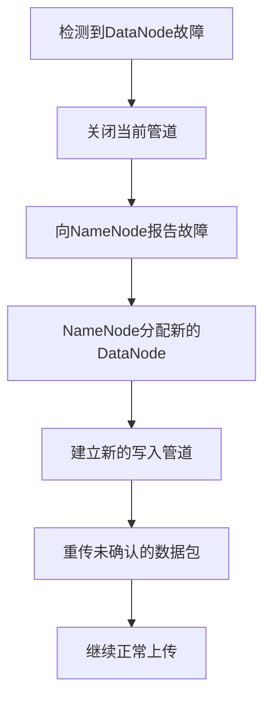

# 【问题】在上传文件的时候，其中一个DataNode突然挂掉了怎么办

## 【答案】

### 3-5分钟快速回答要点：

HDFS的设计天然支持DataNode故障容错。当上传过程中DataNode挂掉时，系统会：
1. **立即检测故障**：客户端检测到管道中断
2. **重建写入管道**：排除故障节点，获取新的健康节点
3. **继续上传**：在新管道中重传未确认的数据包
4. **保证数据完整性**：最终确保达到配置的副本数量

整个过程对用户基本透明，只会有短暂延迟。

---

### 详细技术解析

#### 一、HDFS写入管道机制

在深入故障处理前，先理解HDFS的写入机制：

**管道式写入流程：**
1. 客户端向NameNode请求写文件
2. NameNode返回DataNode列表（如DN1→DN2→DN3）
3. 客户端与这些DataNode建立写入管道
4. 数据包沿管道传输：客户端→DN1→DN2→DN3
5. 确认信号反向传回：DN3→DN2→DN1→客户端

#### 二、故障检测与处理机制

**1. 故障检测**
```
正常流程：客户端 → DN1 → DN2 → DN3 → 确认返回
故障情况：客户端 → DN1 → DN2(挂掉) ✗
```

- **TCP连接中断**：DN1向DN2转发数据时立即收到连接错误
- **超时检测**：如果DN2响应超时，也会被判定为故障
- **管道关闭**：整个写入管道立即关闭

**2. 恢复流程**



**具体步骤：**

1. **排除故障节点**
   - 客户端从管道中移除DN2
   - 保留健康节点DN1和DN3

2. **请求新节点**
   - 向NameNode汇报："正在写入block_123，DN2失败"
   - NameNode选择新的健康节点DN4
   - 确保DN4满足机架感知等策略

3. **重建管道**
   - 新管道：DN1→DN3→DN4
   - 分配新的世代戳（Generation Stamp）
   - 确保数据一致性

4. **数据重传**
   - 已确认的数据包：安全存储在DN1和DN3上
   - 未确认的数据包：重新发送到新管道
   - 继续后续数据传输

#### 三、数据一致性保证

**世代戳机制：**
```
原管道：block_123_gen1 (DN1, DN2, DN3)
新管道：block_123_gen2 (DN1, DN3, DN4)
```

- 每次管道重建都会生成新的世代戳
- 防止旧数据与新数据混淆
- 确保所有副本的一致性

**副本恢复：**
- 故障节点DN2上的不完整数据会被清理
- 如果DN2存储其他完整块，NameNode会安排复制
- 最终确保所有块都达到配置的副本数

#### 四、性能影响与优化

**影响程度：**
- **轻微延迟**：重建管道需要几秒钟
- **网络开销**：重传部分数据包
- **整体影响**：通常不超过总上传时间的5%

**优化策略：**
1. **快速故障检测**：调整心跳间隔和超时参数
2. **智能节点选择**：NameNode优先选择网络距离近的节点
3. **并行写入**：多个文件可以并行上传，分散风险

#### 五、实际案例分析

**场景：上传1GB文件，DN2在50%时故障**

```
时间线：
00:00 - 开始上传，建立管道 DN1→DN2→DN3
00:30 - 已上传500MB，DN2突然宕机
00:31 - 检测到故障，关闭管道
00:32 - 获取新节点DN4，建立新管道 DN1→DN3→DN4
00:33 - 重传最后几个未确认的数据包
00:34 - 继续上传剩余500MB
01:05 - 上传完成，总耗时65秒（正常60秒）
```

**结果：**
- 额外开销：5秒（约8%）
- 数据完整性：100%保证
- 用户体验：基本无感知

#### 六、故障节点的后续处理

**DN2恢复后：**
1. **重新加入集群**：向NameNode发送心跳
2. **数据清理**：删除不完整的block_123_gen1
3. **副本平衡**：如果其他块副本不足，参与复制任务
4. **正常服务**：重新接受新的写入请求

#### 七、最佳实践建议

**运维层面：**
1. **监控DataNode健康状态**：及时发现潜在故障
2. **合理配置副本数**：默认3副本可容忍2个节点故障
3. **网络优化**：确保集群内网络稳定
4. **硬件维护**：定期检查磁盘和网络设备

**开发层面：**
1. **异常处理**：客户端代码要处理IOException
2. **重试机制**：实现合理的重试策略
3. **进度监控**：提供上传进度反馈
4. **日志记录**：记录故障和恢复过程

### 总结

HDFS通过精心设计的管道机制和故障恢复流程，确保即使在DataNode故障的情况下，文件上传也能顺利完成。这种设计体现了分布式系统"故障是常态"的设计哲学，通过冗余和自动恢复机制，为用户提供了高可靠的存储服务。

## 【引流引导】

想要深入学习大数据技术栈？我们的AI面试助手小程序提供：
- 📚 完整的HDFS、MapReduce、Spark等技术知识库
- 🤖 AI驱动的简历分析和面试指导  
- 💡 真实面试题目和详细解答
- 🎯 个性化学习路径规划

扫描下方二维码，开启你的大数据学习之旅！让AI助手帮你在技术面试中脱颖而出！

*专业的技术，简单的学习方式*