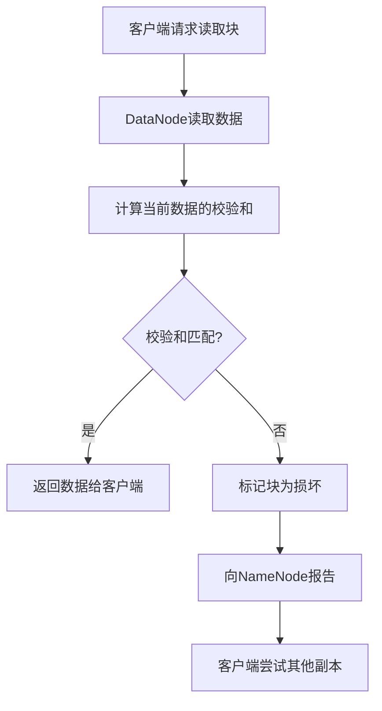
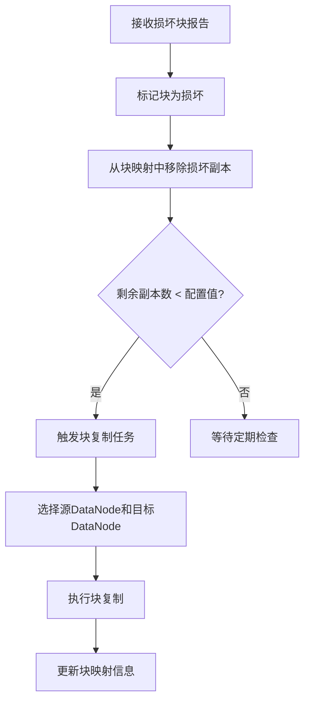

# 【问题】在读取文件的时候，其中一个块突然损坏了怎么办

## 【答案】

### 3-5分钟快速回答要点：

HDFS具备完善的块损坏检测和恢复机制：
1. **自动检测**：通过校验和（Checksum）检测块损坏
2. **透明切换**：客户端自动从其他副本读取数据
3. **后台修复**：NameNode触发损坏块的重新复制
4. **用户无感知**：整个过程对用户完全透明

HDFS的多副本机制确保即使有块损坏，数据读取也能正常进行。

---

### 详细技术解析

#### 一、块损坏的检测机制

**1. 校验和（Checksum）机制**

HDFS为每个数据块都计算并存储校验和：

```
数据块结构：
┌─────────────────┬──────────────┐
│   数据内容      │   校验和     │
│   (64MB)       │   (256字节)   │
└─────────────────┴──────────────┘
```

**校验和计算：**
- **算法**：CRC32C（循环冗余校验）
- **粒度**：每512字节计算一个校验和
- **存储**：与数据块一起存储在DataNode上
- **验证时机**：每次读取时都会验证

**2. 损坏检测流程**



#### 二、损坏块的处理流程

**1. 客户端层面的处理**

当客户端遇到损坏的块时：

```java
// 伪代码示例
try {
    data = datanode1.readBlock(blockId);
    if (!verifyChecksum(data)) {
        throw new ChecksumException();
    }
} catch (ChecksumException e) {
    // 尝试从其他副本读取
    data = datanode2.readBlock(blockId);
    if (!verifyChecksum(data)) {
        data = datanode3.readBlock(blockId);
    }
}
```

**处理步骤：**
1. **检测损坏**：校验和不匹配
2. **报告NameNode**：通知块损坏信息
3. **切换副本**：从其他DataNode读取
4. **继续读取**：对用户透明地继续操作

**2. NameNode层面的处理**



#### 三、自动修复机制

**1. 块复制任务调度**

NameNode维护一个**复制队列**：

```
复制队列结构：
┌──────────────┬─────────────┬─────────────┬──────────────┐
│   块ID       │  当前副本数  │  目标副本数  │   优先级     │
├──────────────┼─────────────┼─────────────┼──────────────┤
│ block_001    │     1       │     3       │   高(紧急)   │
│ block_002    │     2       │     3       │   中等       │
│ block_003    │     3       │     3       │   正常       │
└──────────────┴─────────────┴─────────────┴──────────────┘
```

**优先级策略：**
- **紧急**：副本数为1（数据面临丢失风险）
- **高**：副本数低于配置值的一半
- **中等**：副本数低于配置值但大于一半
- **低**：副本数等于配置值（正常状态）

**2. 复制执行过程**

```
复制任务执行：
源DataNode(DN1) ──读取完好块──> 目标DataNode(DN3)
                                      │
                                      ▼
                              写入新的副本块
                                      │
                                      ▼
                              向NameNode确认完成
```

#### 四、不同损坏场景的处理

**场景1：单个副本损坏**
```
原状态：block_123 存储在 DN1(损坏), DN2(正常), DN3(正常)
处理：客户端从DN2或DN3读取，NameNode安排DN4复制新副本
结果：block_123 存储在 DN2(正常), DN3(正常), DN4(新副本)
```

**场景2：多个副本同时损坏**
```
原状态：block_456 存储在 DN1(损坏), DN2(损坏), DN3(正常)
处理：客户端从DN3读取，NameNode紧急安排复制到DN4和DN5
结果：block_456 存储在 DN3(正常), DN4(新副本), DN5(新副本)
```

**场景3：所有副本都损坏（极端情况）**
```
状态：block_789 的所有副本都损坏
处理：
1. NameNode标记文件为损坏
2. 运行 hdfs fsck 会报告损坏文件
3. 需要从备份恢复或接受数据丢失
```

#### 五、主动检测机制

**1. DataNode自检**

每个DataNode定期执行块扫描：

```bash
# DataNode块扫描配置
dfs.datanode.scan.period.hours=504  # 每21天扫描一次
dfs.block.scanner.volume.bytes.per.second=1048576  # 扫描速度限制
```

**扫描流程：**
- **定期扫描**：按配置周期扫描所有本地块
- **校验和验证**：重新计算并验证每个块的校验和
- **主动报告**：发现损坏块立即报告给NameNode
- **性能控制**：限制扫描速度，避免影响正常服务

**2. 客户端检测**

```java
// 读取时的校验和验证
FSDataInputStream in = fs.open(path);
in.setVerifyChecksum(true);  // 启用校验和验证
byte[] buffer = new byte[1024];
int bytesRead = in.read(buffer);  // 自动验证校验和
```

#### 六、性能影响与优化

**1. 读取性能影响**

```
正常读取：客户端 → DataNode → 返回数据 (10ms)
损坏块读取：
  第一次尝试：客户端 → DN1(损坏) → 检测失败 (15ms)
  第二次尝试：客户端 → DN2(正常) → 返回数据 (10ms)
  总耗时：25ms (增加150%)
```

**2. 优化策略**

- **智能副本选择**：优先选择历史上更可靠的DataNode
- **本地副本优先**：减少网络传输时间
- **并行验证**：在可能的情况下并行检查多个副本
- **缓存机制**：缓存已验证的块信息

#### 七、监控和运维

**1. 关键监控指标**

```bash
# 检查文件系统健康状况
hdfs fsck / -files -blocks -locations

# 查看损坏块统计
hdfs dfsadmin -report

# 监控复制队列长度
hdfs dfsadmin -metasave /tmp/metasave.out
```

**2. 常用运维命令**

```bash
# 强制删除损坏的块（谨慎使用）
hdfs fsck / -delete-corrupted

# 手动触发块复制
hdfs debug recoverLease -path /path/to/file

# 查看特定文件的块信息
hdfs fsck /path/to/file -files -blocks -locations
```

#### 八、预防措施

**1. 硬件层面**
- 使用高质量的硬盘和内存
- 定期检查硬件健康状态
- 配置RAID提供额外保护

**2. 软件层面**
- 合理配置副本数（默认3个）
- 启用机架感知，分散副本位置
- 定期运行fsck检查文件系统健康

**3. 运维层面**
- 监控DataNode的健康状态
- 及时处理硬件故障
- 定期备份重要数据

### 总结

HDFS通过多层次的检测和修复机制，确保即使在块损坏的情况下，数据读取也能正常进行：

1. **预防**：校验和机制实时检测损坏
2. **应对**：多副本机制提供冗余保护  
3. **修复**：自动复制机制恢复副本数量
4. **监控**：完善的工具链支持运维管理

这种设计使HDFS能够在商用硬件上提供企业级的数据可靠性保证。

## 【引流引导】

想要深入学习大数据技术栈？我们的AI面试助手小程序提供：
- 📚 完整的HDFS、MapReduce、Spark等技术知识库
- 🤖 AI驱动的简历分析和面试指导  
- 💡 真实面试题目和详细解答
- 🎯 个性化学习路径规划

扫描下方二维码，开启你的大数据学习之旅！让AI助手帮你在技术面试中脱颖而出！

*专业的技术，简单的学习方式*