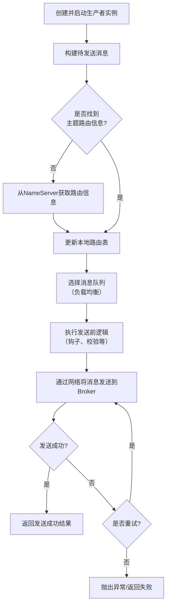

# Kafka生产者发送流程详解

## 【问题】

生产者发送流程

## 【答案】

### 快速回答（3-5分钟总结）

Kafka生产者发送消息的核心流程包括6个步骤：

1. **初始化生产者实例** - 配置参数并启动生产者
2. **构建消息** - 创建包含Topic、Key、Value等信息的Message对象
3. **路由发现与队列选择** - 获取Topic路由信息，选择目标分区
4. **发送消息** - 通过网络将消息发送到Broker
5. **处理响应与重试** - 等待Broker确认，失败时进行重试
6. **关闭生产者** - 释放资源

这个流程确保消息能够可靠、高效地从生产者送达Kafka集群。

### 详细解释

我们来详细解析一下消息队列中**生产者发送消息的完整流程**。

这个过程旨在确保消息能够**可靠、高效**地从生产者送达消息队列服务器（Broker）。下面我们以Kafka为例，分解其发送流程。

#### 生产者发送消息的核心流程

整个流程可以概括为以下几个核心步骤：

#### 步骤一：初始化生产者实例

1. **创建 Producer 对象**：应用程序实例化一个 Producer 对象。
2. **配置参数**：设置必要的参数，例如：
   - **NameServer 地址**：用于发现 Broker 信息（RocketMQ）。
   - **集群发现服务**：如 Bootstrap Servers（Kafka）。
   - **生产者组名**：标识一类生产者。
   - **重试次数**：发送失败时的重试策略。
   - **序列化方式**：指定消息体的序列化算法。
   - **压缩方式**：是否压缩消息以节省带宽。
   - **发送超时时间**：等待响应的最长时间。
3. **启动生产者**：调用 `start()` 方法。这时，生产者会初始化内部组件（如网络通信客户端、定时任务等），并尝试从 NameServer 或集群发现服务拉取最新的主题路由信息。

#### 步骤二：构建消息

应用程序构建要发送的 `Message` 对象，通常需要指定：
- **Topic**：消息的主题，用于分类和订阅。
- **Tags**：消息标签，用于更细粒度的过滤。
- **Keys**：消息业务标识，便于后续查询和追踪。
- **Body**：消息体，即要发送的实际数据（会被序列化成字节数组）。
- **自定义属性**：用户自定义的键值对。

#### 步骤三：路由发现与队列选择

这是确保消息能到达正确 Broker 的关键步骤。

1. **检查本地路由表**：生产者首先在本地缓存中查找该 Topic 的路由信息。路由信息包含了该 Topic 有哪些队列，每个队列在哪个 Broker 上。
2. **拉取/更新路由信息**：如果本地没有该 Topic 的路由信息，或者路由信息已过期，生产者会向 **NameServer**（RocketMQ）或直接向 Broker 集群（Kafka）发起请求，拉取最新的路由信息并更新本地缓存。
3. **选择消息队列**：根据 Topic 的路由信息，生产者需要从多个队列中选择一个来发送这条消息。这是一个**负载均衡**过程，常见的策略有：
   - **轮询**：依次选择每个队列，均匀分布。
   - **随机**：随机选择一个队列。
   - **哈希**：根据消息的 Key 或业务ID进行哈希，保证同一特征的消息总是进入同一个队列，以实现**顺序消息**。
   - **故障延迟**：优先选择上次发送耗时短的 Broker。

#### 步骤四：发送消息

1. **执行发送前钩子函数**：如果注册了发送前的拦截器或钩子函数，此时会执行，可以进行一些日志记录、参数修改等操作。
2. **序列化与压缩**：将消息对象序列化为字节数组，并根据配置进行压缩。
3. **网络传输**：生产者通过网络通道将消息发送到在步骤三中选出的那个 Broker 上指定的队列中。

#### 步骤五：处理 Broker 响应与重试

1. **等待响应**：生产者同步等待 Broker 返回发送结果。
2. **处理响应**：
   - **成功**：Broker 返回 `SEND_OK` 或类似状态，生产者向应用程序返回成功结果。
   - **失败**：Broker 返回失败，或发生网络异常、超时等。
3. **重试机制**：
   - 如果发送失败，且配置了重试次数，生产者会自动选择另一个队列（可能是另一个 Broker）进行重试。
   - 重试可以有效应对 Broker 宕机、网络抖动等临时性故障。
   - 重试次数用尽后，生产者会抛出异常或返回失败给应用程序，由业务方决定如何处理（如记录日志、入库等）。

#### 步骤六：关闭生产者

当应用程序退出时，需要调用 `shutdown()` 方法关闭生产者，释放连接、线程等资源。

#### 三种发送方式

在上述核心流程的基础上，生产者通常提供三种发送模式：

1. **同步发送**
   - **流程**：发送消息后，线程会阻塞，直到收到 Broker 的响应。
   - **优点**：可靠性高，能立即知道发送结果。
   - **缺点**：吞吐量较低，延迟较高。
   - **场景**：适用于重要通知、短信等对可靠性要求高，但吞吐量要求不极致的场景。

2. **异步发送**
   - **流程**：发送消息后，线程立即返回，不阻塞。当 Broker 返回响应时，会回调开发者提供的回调函数。
   - **优点**：吞吐量高，延迟低。
   - **缺点**：编程模型相对复杂，需要处理回调。
   - **场景**：适用于链路耗时长、对响应时间敏感的业务场景，如日志收集。

3. **单向发送**
   - **流程**：生产者只负责发送消息，不等待响应，也不处理回调。即"发完即忘"。
   - **优点**：吞吐量最高，耗时最短。
   - **缺点**：可能会丢失消息。
   - **场景**：适用于吞吐量要求极高，且允许少量消息丢失的场景，如日志收集。

#### 总结

生产者发送消息的流程是一个精心设计的、以**可靠性**和**高性能**为核心的过程。它通过**路由发现**、**队列负载均衡**、**重试机制**和**多种发送模式**来应对复杂的分布式环境，确保消息能够准确、高效地抵达消息队列。理解这个流程对于设计可靠的分布式系统和排查消息发送问题至关重要。

## 【引流引导】

想要深入学习更多Kafka和大数据技术面试知识？

我们的AI面试助手小程序为你提供：
- 200+精选大数据面试题库
- AI智能简历分析和优化建议  
- 个性化面试准备方案
- 实时模拟面试练习

扫描下方小程序码，让AI助手帮你在面试中脱颖而出！

*专业的技术，贴心的服务，助你拿到心仪offer！*