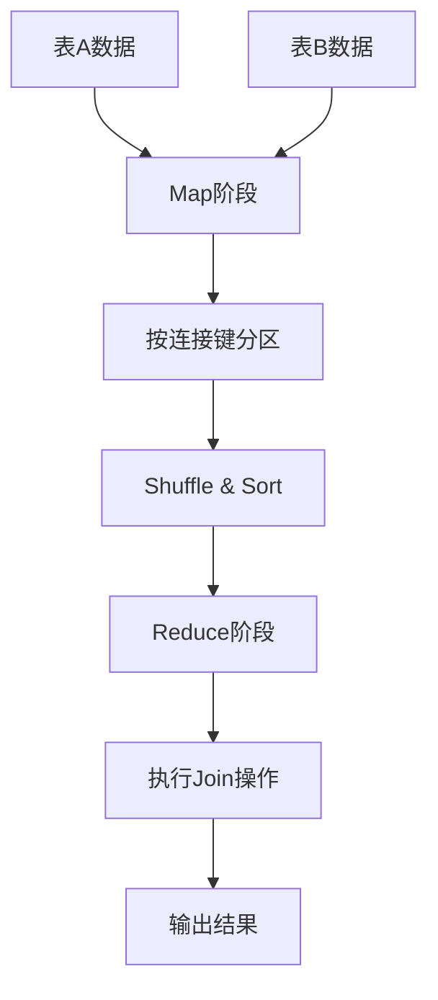
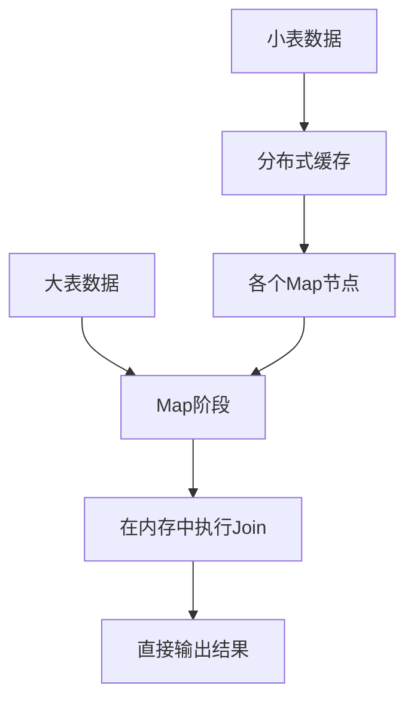

# 【问题】join原理

## 【答案】

### 3-5分钟快速回答要点：

MapReduce中的Join操作是将两个或多个数据集根据共同的键进行连接。主要有三种实现方式：
1. **Reduce-side Join**：在Reduce阶段进行连接，适用于大表连接
2. **Map-side Join**：在Map阶段进行连接，适用于一个大表和一个小表
3. **Semi Join**：先过滤再连接，适用于连接结果较小的场景

核心思想是通过MapReduce的分组机制，将相同键的数据聚集到同一个Reducer中进行连接操作。

---

### 详细技术解析

#### 一、Join操作的基本概念

**什么是Join？**
Join是将两个或多个数据集基于共同字段（连接键）进行合并的操作，类似于SQL中的JOIN语句。

**MapReduce中Join的挑战：**
- 数据分布在不同节点上
- 需要将相关数据聚集到同一位置
- 要处理数据倾斜问题
- 需要考虑内存限制

#### 二、Reduce-side Join（最常用）

**适用场景：**
- 两个都是大数据集
- 数据无法全部加载到内存
- 对性能要求不是特别苛刻

**实现原理：**



**详细流程：**

1. **Map阶段**
```java
// 伪代码示例
public class JoinMapper extends Mapper<LongWritable, Text, Text, Text> {
    @Override
    protected void map(LongWritable key, Text value, Context context) {
        String[] fields = value.toString().split(",");
        String joinKey = fields[0];  // 连接键
        String tableName = getTableName(context);  // 区分来源表
        
        // 输出格式：<连接键, "表名:数据">
        context.write(new Text(joinKey), 
                     new Text(tableName + ":" + value.toString()));
    }
}
```

2. **Shuffle阶段**
- 相同连接键的数据被发送到同一个Reducer
- 数据按键进行排序和分组

3. **Reduce阶段**
```java
public class JoinReducer extends Reducer<Text, Text, Text, Text> {
    @Override
    protected void reduce(Text key, Iterable<Text> values, Context context) {
        List<String> tableA = new ArrayList<>();
        List<String> tableB = new ArrayList<>();
        
        // 分离不同表的数据
        for (Text value : values) {
            String[] parts = value.toString().split(":", 2);
            if ("A".equals(parts[0])) {
                tableA.add(parts[1]);
            } else if ("B".equals(parts[0])) {
                tableB.add(parts[1]);
            }
        }
        
        // 执行笛卡尔积连接
        for (String recordA : tableA) {
            for (String recordB : tableB) {
                context.write(key, new Text(recordA + "," + recordB));
            }
        }
    }
}
```

**优缺点：**
- ✅ 适用于任意大小的数据集
- ✅ 实现相对简单
- ❌ 需要经过完整的MapReduce流程，性能较慢
- ❌ 可能存在数据倾斜问题

#### 三、Map-side Join（高性能）

**适用场景：**
- 一个大表和一个小表连接
- 小表能够完全加载到内存中
- 对性能要求较高

**实现原理：**



**详细实现：**

1. **预处理阶段**
```java
// 将小表加载到分布式缓存
job.addCacheFile(new URI("hdfs://path/to/small/table"));
```

2. **Map阶段**
```java
public class MapSideJoinMapper extends Mapper<LongWritable, Text, Text, Text> {
    private Map<String, String> smallTable = new HashMap<>();
    
    @Override
    protected void setup(Context context) throws IOException {
        // 从分布式缓存加载小表数据
        URI[] cacheFiles = context.getCacheFiles();
        BufferedReader reader = new BufferedReader(
            new FileReader(cacheFiles[0].toString()));
        
        String line;
        while ((line = reader.readLine()) != null) {
            String[] fields = line.split(",");
            smallTable.put(fields[0], line);  // 键值对存储
        }
        reader.close();
    }
    
    @Override
    protected void map(LongWritable key, Text value, Context context) {
        String[] fields = value.toString().split(",");
        String joinKey = fields[0];
        
        // 在内存中查找匹配记录
        String matchedRecord = smallTable.get(joinKey);
        if (matchedRecord != null) {
            context.write(new Text(joinKey), 
                         new Text(value.toString() + "," + matchedRecord));
        }
    }
}
```

**优缺点：**
- ✅ 性能很高，只需要一轮Map操作
- ✅ 避免了Shuffle开销
- ❌ 小表必须能完全加载到内存
- ❌ 只适用于一大一小的表连接

#### 四、Semi Join（优化的连接）

**适用场景：**
- 连接结果相对较小
- 需要先过滤数据再连接
- 网络带宽有限

**实现原理：**

Semi Join分为两个阶段：

**第一阶段：提取连接键**
```java
// 从大表中提取所有唯一的连接键
public class SemiJoinMapper1 extends Mapper<LongWritable, Text, Text, NullWritable> {
    @Override
    protected void map(LongWritable key, Text value, Context context) {
        String[] fields = value.toString().split(",");
        String joinKey = fields[0];
        context.write(new Text(joinKey), NullWritable.get());
    }
}

public class SemiJoinReducer1 extends Reducer<Text, NullWritable, Text, NullWritable> {
    @Override
    protected void reduce(Text key, Iterable<NullWritable> values, Context context) {
        // 输出唯一的连接键
        context.write(key, NullWritable.get());
    }
}
```

**第二阶段：过滤并连接**
```java
// 使用连接键过滤小表，然后执行Map-side Join
public class SemiJoinMapper2 extends Mapper<LongWritable, Text, Text, Text> {
    private Set<String> joinKeys = new HashSet<>();
    
    @Override
    protected void setup(Context context) throws IOException {
        // 加载第一阶段产生的连接键
        // ... 加载逻辑
    }
    
    @Override
    protected void map(LongWritable key, Text value, Context context) {
        String[] fields = value.toString().split(",");
        String joinKey = fields[0];
        
        // 只处理存在连接键的记录
        if (joinKeys.contains(joinKey)) {
            // 执行连接逻辑
        }
    }
}
```

#### 五、不同Join类型的实现

**1. Inner Join（内连接）**
```java
// 在Reduce阶段
if (!tableA.isEmpty() && !tableB.isEmpty()) {
    // 执行笛卡尔积
    for (String recordA : tableA) {
        for (String recordB : tableB) {
            output(recordA + "," + recordB);
        }
    }
}
```

**2. Left Outer Join（左外连接）**
```java
if (!tableA.isEmpty()) {
    if (!tableB.isEmpty()) {
        // 有匹配记录
        for (String recordA : tableA) {
            for (String recordB : tableB) {
                output(recordA + "," + recordB);
            }
        }
    } else {
        // 无匹配记录，用NULL填充
        for (String recordA : tableA) {
            output(recordA + ",NULL");
        }
    }
}
```

**3. Full Outer Join（全外连接）**
```java
// 处理A表有B表没有的情况
for (String recordA : tableA) {
    if (tableB.isEmpty()) {
        output(recordA + ",NULL");
    } else {
        for (String recordB : tableB) {
            output(recordA + "," + recordB);
        }
    }
}

// 处理B表有A表没有的情况
if (tableA.isEmpty() && !tableB.isEmpty()) {
    for (String recordB : tableB) {
        output("NULL," + recordB);
    }
}
```

#### 六、性能优化策略

**1. 数据倾斜处理**

```java
// 使用随机前缀分散热点键
public class SkewedJoinMapper extends Mapper<LongWritable, Text, Text, Text> {
    private Random random = new Random();
    
    @Override
    protected void map(LongWritable key, Text value, Context context) {
        String[] fields = value.toString().split(",");
        String joinKey = fields[0];
        
        // 为热点键添加随机前缀
        if (isHotKey(joinKey)) {
            int prefix = random.nextInt(10);  // 0-9的随机前缀
            joinKey = prefix + "_" + joinKey;
        }
        
        context.write(new Text(joinKey), value);
    }
}
```

**2. 内存优化**

```java
// 使用BloomFilter预过滤
public class BloomFilterJoinMapper extends Mapper<LongWritable, Text, Text, Text> {
    private BloomFilter<String> bloomFilter;
    
    @Override
    protected void setup(Context context) {
        // 根据小表构建BloomFilter
        bloomFilter = BloomFilter.create(Funnels.stringFunnel(), 1000000, 0.01);
        // ... 加载小表数据到BloomFilter
    }
    
    @Override
    protected void map(LongWritable key, Text value, Context context) {
        String joinKey = extractJoinKey(value);
        
        // 先用BloomFilter过滤
        if (bloomFilter.mightContain(joinKey)) {
            // 可能存在，进行实际连接
            context.write(new Text(joinKey), value);
        }
        // 不存在则直接丢弃
    }
}
```

#### 七、实际应用案例

**案例：用户订单关联分析**

```
用户表：user_id, name, age, city
订单表：order_id, user_id, product, amount, date

目标：分析不同城市用户的购买行为
```

**实现方案选择：**
- 如果用户表较小（<100MB）：使用Map-side Join
- 如果两表都很大：使用Reduce-side Join
- 如果只需要部分用户的订单：使用Semi Join

#### 八、最佳实践建议

**1. 方案选择原则**
```
数据规模判断：
├── 小表 < 100MB
│   └── 选择 Map-side Join
├── 连接结果 < 原数据的20%
│   └── 选择 Semi Join  
└── 其他情况
    └── 选择 Reduce-side Join
```

**2. 性能调优要点**
- 合理设置Reducer数量
- 使用Combiner减少数据传输
- 启用压缩减少I/O开销
- 监控数据倾斜情况

**3. 错误处理**
- 处理空值和异常数据
- 设置合理的超时时间
- 实现重试机制

### 总结

MapReduce中的Join操作通过巧妙地利用分布式计算的特性，将复杂的数据连接问题转化为可并行处理的任务。选择合适的Join策略对性能影响巨大：

- **Reduce-side Join**：通用但较慢
- **Map-side Join**：快速但有限制  
- **Semi Join**：适合特定场景的优化方案

理解这些原理有助于在实际项目中做出正确的技术选择。

## 【引流引导】

想要深入学习大数据技术栈？我们的AI面试助手小程序提供：
- 📚 完整的HDFS、MapReduce、Spark等技术知识库
- 🤖 AI驱动的简历分析和面试指导  
- 💡 真实面试题目和详细解答
- 🎯 个性化学习路径规划

扫描下方二维码，开启你的大数据学习之旅！让AI助手帮你在技术面试中脱颖而出！

*专业的技术，简单的学习方式*