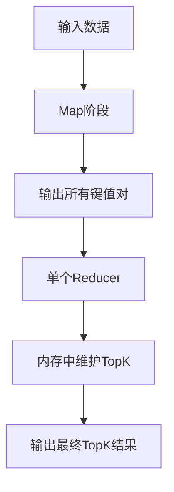
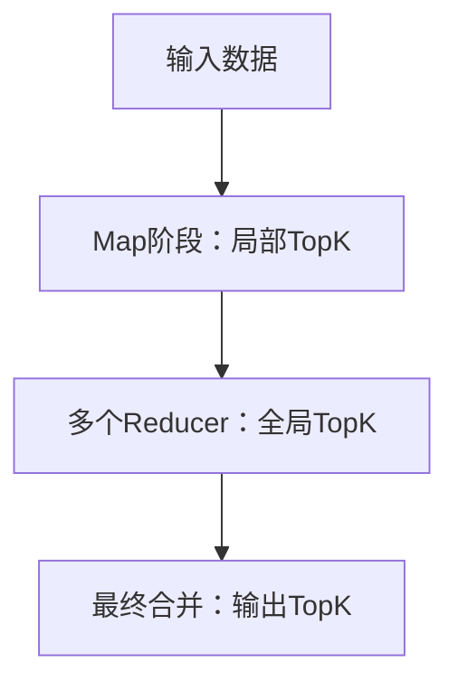

# 【问题】MapReduce实现TopK算法

## 【答案】

### 3-5分钟快速回答要点：

MapReduce实现TopK算法有两种主要方案：
1. **单Reducer方案**：所有数据发送到一个Reducer，适用于结果集较小的场景
2. **多Reducer方案**：使用二次排序，先局部TopK再全局TopK，适用于大数据场景

核心思想是利用MapReduce的排序机制，通过自定义排序规则实现数据的有序输出，然后取前K个结果。

---

### 详细技术解析

#### 一、TopK问题的挑战

**传统单机TopK算法：**
- 使用堆排序或快速选择算法
- 时间复杂度O(n log k)
- 内存复杂度O(k)

**分布式环境的挑战：**
- 数据分布在多个节点上
- 无法直接使用单机算法
- 需要考虑数据倾斜和网络传输

#### 二、方案一：单Reducer TopK

**适用场景：**
- TopK的K值较小（如Top10、Top100）
- 数据量中等，单个Reducer能处理
- 对性能要求不是特别高

**实现思路：**



**Map阶段实现：**

```java
public class TopKMapper extends Mapper<LongWritable, Text, Text, IntWritable> {
    
    @Override
    protected void map(LongWritable key, Text value, Context context) 
            throws IOException, InterruptedException {
        
        // 解析输入数据，假设格式为：word count
        String[] parts = value.toString().split("\\s+");
        if (parts.length == 2) {
            String word = parts[0];
            int count = Integer.parseInt(parts[1]);
            
            // 直接输出所有数据
            context.write(new Text(word), new IntWritable(count));
        }
    }
}
```

**Reducer阶段实现：**

```java
public class TopKReducer extends Reducer<Text, IntWritable, Text, IntWritable> {
    
    private int K = 10; // TopK的K值
    private TreeMap<Integer, String> topKMap = new TreeMap<>();
    
    @Override
    protected void reduce(Text key, Iterable<IntWritable> values, Context context)
            throws IOException, InterruptedException {
        
        int sum = 0;
        // 累加相同key的所有值
        for (IntWritable value : values) {
            sum += value.get();
        }
        
        // 维护TopK
        topKMap.put(sum, key.toString());
        
        // 如果超过K个元素，移除最小的
        if (topKMap.size() > K) {
            topKMap.remove(topKMap.firstKey());
        }
    }
    
    @Override
    protected void cleanup(Context context) throws IOException, InterruptedException {
        // 按降序输出TopK结果
        for (Map.Entry<Integer, String> entry : topKMap.descendingMap().entrySet()) {
            context.write(new Text(entry.getValue()), new IntWritable(entry.getKey()));
        }
    }
}
```

**Driver配置：**

```java
public class TopKDriver {
    public static void main(String[] args) throws Exception {
        Configuration conf = new Configuration();
        conf.setInt("topk.k", 10); // 设置K值
        
        Job job = Job.getInstance(conf, "topk");
        job.setJarByClass(TopKDriver.class);
        
        job.setMapperClass(TopKMapper.class);
        job.setReducerClass(TopKReducer.class);
        
        // 关键：设置只有一个Reducer
        job.setNumReduceTasks(1);
        
        job.setOutputKeyClass(Text.class);
        job.setOutputValueClass(IntWritable.class);
        
        FileInputFormat.addInputPath(job, new Path(args[0]));
        FileOutputFormat.setOutputPath(job, new Path(args[1]));
        
        System.exit(job.waitForCompletion(true) ? 0 : 1);
    }
}
```

#### 三、方案二：多Reducer TopK（推荐）

**适用场景：**
- 数据量很大，单Reducer处理困难
- 需要更好的并行性和扩展性
- 对性能要求较高

**实现思路：**



**第一阶段：Map端局部TopK**

```java
public class TopKMapperV2 extends Mapper<LongWritable, Text, NullWritable, Text> {
    
    private int K;
    private TreeMap<Integer, String> localTopK = new TreeMap<>();
    
    @Override
    protected void setup(Context context) {
        K = context.getConfiguration().getInt("topk.k", 10);
    }
    
    @Override
    protected void map(LongWritable key, Text value, Context context) 
            throws IOException, InterruptedException {
        
        String[] parts = value.toString().split("\\s+");
        if (parts.length == 2) {
            String word = parts[0];
            int count = Integer.parseInt(parts[1]);
            
            // 在Map端维护局部TopK
            localTopK.put(count, word);
            
            if (localTopK.size() > K) {
                localTopK.remove(localTopK.firstKey());
            }
        }
    }
    
    @Override
    protected void cleanup(Context context) throws IOException, InterruptedException {
        // 输出Map端的TopK结果
        for (Map.Entry<Integer, String> entry : localTopK.entrySet()) {
            String output = entry.getValue() + "\t" + entry.getKey();
            context.write(NullWritable.get(), new Text(output));
        }
    }
}
```

**第二阶段：Reduce端全局TopK**

```java
public class TopKReducerV2 extends Reducer<NullWritable, Text, Text, IntWritable> {
    
    private int K;
    private TreeMap<Integer, String> globalTopK = new TreeMap<>();
    
    @Override
    protected void setup(Context context) {
        K = context.getConfiguration().getInt("topk.k", 10);
    }
    
    @Override
    protected void reduce(NullWritable key, Iterable<Text> values, Context context)
            throws IOException, InterruptedException {
        
        // 收集所有Map端的TopK结果
        for (Text value : values) {
            String[] parts = value.toString().split("\\t");
            if (parts.length == 2) {
                String word = parts[0];
                int count = Integer.parseInt(parts[1]);
                
                globalTopK.put(count, word);
                
                if (globalTopK.size() > K) {
                    globalTopK.remove(globalTopK.firstKey());
                }
            }
        }
    }
    
    @Override
    protected void cleanup(Context context) throws IOException, InterruptedException {
        // 输出全局TopK结果
        int rank = 1;
        for (Map.Entry<Integer, String> entry : globalTopK.descendingMap().entrySet()) {
            context.write(new Text(rank + "\t" + entry.getValue()), 
                         new IntWritable(entry.getKey()));
            rank++;
        }
    }
}
```

#### 四、方案三：二次排序TopK

**适用于需要精确排序的场景**

**自定义组合键：**

```java
public class WordCountPair implements WritableComparable<WordCountPair> {
    private String word;
    private int count;
    
    public WordCountPair() {}
    
    public WordCountPair(String word, int count) {
        this.word = word;
        this.count = count;
    }
    
    @Override
    public int compareTo(WordCountPair other) {
        // 按count降序排列
        int result = Integer.compare(other.count, this.count);
        if (result == 0) {
            // count相同时按word升序
            result = this.word.compareTo(other.word);
        }
        return result;
    }
    
    @Override
    public void write(DataOutput out) throws IOException {
        out.writeUTF(word);
        out.writeInt(count);
    }
    
    @Override
    public void readFields(DataInput in) throws IOException {
        word = in.readUTF();
        count = in.readInt();
    }
    
    // getter和setter方法
    public String getWord() { return word; }
    public int getCount() { return count; }
    public void setWord(String word) { this.word = word; }
    public void setCount(int count) { this.count = count; }
    
    @Override
    public String toString() {
        return word + "\t" + count;
    }
}
```

**使用二次排序的Mapper：**

```java
public class SecondarySortMapper extends Mapper<LongWritable, Text, WordCountPair, NullWritable> {
    
    private WordCountPair outputKey = new WordCountPair();
    
    @Override
    protected void map(LongWritable key, Text value, Context context) 
            throws IOException, InterruptedException {
        
        String[] parts = value.toString().split("\\s+");
        if (parts.length == 2) {
            String word = parts[0];
            int count = Integer.parseInt(parts[1]);
            
            outputKey.setWord(word);
            outputKey.setCount(count);
            
            context.write(outputKey, NullWritable.get());
        }
    }
}
```

**使用二次排序的Reducer：**

```java
public class SecondarySortReducer extends Reducer<WordCountPair, NullWritable, Text, IntWritable> {
    
    private int K;
    private int currentRank = 0;
    
    @Override
    protected void setup(Context context) {
        K = context.getConfiguration().getInt("topk.k", 10);
    }
    
    @Override
    protected void reduce(WordCountPair key, Iterable<NullWritable> values, Context context)
            throws IOException, InterruptedException {
        
        // 由于已经排序，直接输出前K个
        if (currentRank < K) {
            context.write(new Text(key.getWord()), new IntWritable(key.getCount()));
            currentRank++;
        }
    }
}
```

#### 五、性能优化策略

**1. Map端预聚合**

```java
public class OptimizedTopKMapper extends Mapper<LongWritable, Text, Text, IntWritable> {
    
    private Map<String, Integer> wordCounts = new HashMap<>();
    private int K;
    
    @Override
    protected void setup(Context context) {
        K = context.getConfiguration().getInt("topk.k", 10);
    }
    
    @Override
    protected void map(LongWritable key, Text value, Context context) 
            throws IOException, InterruptedException {
        
        // 在Map端先进行词频统计
        String[] words = value.toString().toLowerCase().split("\\W+");
        for (String word : words) {
            if (!word.isEmpty()) {
                wordCounts.put(word, wordCounts.getOrDefault(word, 0) + 1);
            }
        }
    }
    
    @Override
    protected void cleanup(Context context) throws IOException, InterruptedException {
        // 在cleanup中输出Map端的TopK
        TreeMap<Integer, String> localTopK = new TreeMap<>();
        
        for (Map.Entry<String, Integer> entry : wordCounts.entrySet()) {
            localTopK.put(entry.getValue(), entry.getKey());
            if (localTopK.size() > K) {
                localTopK.remove(localTopK.firstKey());
            }
        }
        
        // 输出局部TopK结果
        for (Map.Entry<Integer, String> entry : localTopK.entrySet()) {
            context.write(new Text(entry.getValue()), new IntWritable(entry.getKey()));
        }
    }
}
```

**2. 内存优化**

```java
// 使用优先队列替代TreeMap
private PriorityQueue<WordCountPair> topKQueue = new PriorityQueue<>(K, 
    (a, b) -> Integer.compare(a.getCount(), b.getCount()));

// 添加元素时
if (topKQueue.size() < K) {
    topKQueue.offer(new WordCountPair(word, count));
} else if (count > topKQueue.peek().getCount()) {
    topKQueue.poll();
    topKQueue.offer(new WordCountPair(word, count));
}
```

#### 六、实际应用案例

**案例1：网站访问日志TopK分析**

```java
// 输入：IP地址访问日志
// 输出：访问量最高的Top10 IP地址

public class IPTopKMapper extends Mapper<LongWritable, Text, Text, IntWritable> {
    @Override
    protected void map(LongWritable key, Text value, Context context) 
            throws IOException, InterruptedException {
        
        // 解析日志格式：IP timestamp url status
        String[] fields = value.toString().split("\\s+");
        if (fields.length >= 4) {
            String ip = fields[0];
            context.write(new Text(ip), new IntWritable(1));
        }
    }
}
```

**案例2：电商商品销量TopK**

```java
// 输入：订单数据
// 输出：销量最高的Top20商品

public class ProductTopKMapper extends Mapper<LongWritable, Text, Text, IntWritable> {
    @Override
    protected void map(LongWritable key, Text value, Context context) 
            throws IOException, InterruptedException {
        
        // 解析订单：order_id,product_id,quantity,price
        String[] fields = value.toString().split(",");
        if (fields.length >= 3) {
            String productId = fields[1];
            int quantity = Integer.parseInt(fields[2]);
            context.write(new Text(productId), new IntWritable(quantity));
        }
    }
}
```

#### 七、测试和验证

**测试数据准备：**

```bash
# 创建测试数据
echo -e "apple 100\nbanana 200\ncherry 150\ndate 300\negg 250" > input.txt

# 上传到HDFS
hdfs dfs -put input.txt /input/
```

**运行程序：**

```bash
# 编译和打包
javac -cp $(hadoop classpath) *.java
jar cf topk.jar *.class

# 运行TopK程序
hadoop jar topk.jar TopKDriver /input /output

# 查看结果
hdfs dfs -cat /output/part-r-00000
```

**预期输出：**
```
date    300
egg     250
banana  200
cherry  150
apple   100
```

#### 八、常见问题和解决方案

**1. 内存溢出问题**
```bash
# 增加Map任务内存
-Dmapreduce.map.memory.mb=2048
-Dmapreduce.map.java.opts=-Xmx1638m
```

**2. 数据倾斜问题**
```java
// 使用随机分区器
public class RandomPartitioner extends Partitioner<Text, IntWritable> {
    @Override
    public int getPartition(Text key, IntWritable value, int numPartitions) {
        return (key.hashCode() & Integer.MAX_VALUE) % numPartitions;
    }
}
```

**3. 精度问题**
```java
// 处理相同计数值的排序
@Override
public int compareTo(WordCountPair other) {
    int result = Integer.compare(other.count, this.count);
    if (result == 0) {
        // 相同计数时按字典序排序，保证结果稳定
        result = this.word.compareTo(other.word);
    }
    return result;
}
```

### 总结

MapReduce实现TopK算法的关键在于：

1. **选择合适的方案**：根据数据规模和性能要求选择单Reducer或多Reducer方案
2. **利用排序机制**：充分利用MapReduce的自动排序功能
3. **Map端优化**：通过局部TopK减少网络传输
4. **内存管理**：使用合适的数据结构控制内存使用

理解这些实现方式有助于解决实际工作中的大数据排序和统计问题。

## 【引流引导】

想要深入学习大数据技术栈？我们的AI面试助手小程序提供：
- 📚 完整的HDFS、MapReduce、Spark等技术知识库
- 🤖 AI驱动的简历分析和面试指导  
- 💡 真实面试题目和详细解答
- 🎯 个性化学习路径规划

扫描下方二维码，开启你的大数据学习之旅！让AI助手帮你在技术面试中脱颖而出！

*专业的技术，简单的学习方式*