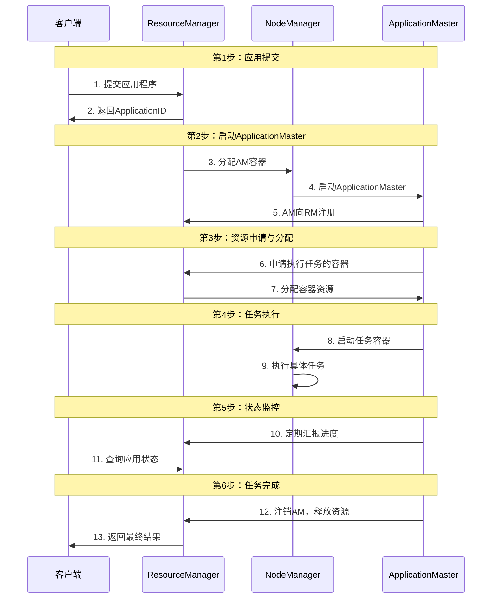

# 【问题】Yarn的任务提交流程是怎样的

## 【答案】

### 3-5分钟快速回答要点：

YARN任务提交流程包含以下关键步骤：
1. **客户端提交**：向ResourceManager提交应用程序
2. **ApplicationMaster启动**：RM为应用分配AM容器并启动
3. **资源申请**：AM向RM申请执行任务所需的容器资源
4. **任务执行**：在NodeManager上启动容器执行具体任务
5. **状态汇报**：AM定期向RM汇报应用进度和状态
6. **任务完成**：清理资源，返回执行结果

核心是通过ResourceManager统一调度资源，ApplicationMaster管理具体应用的生命周期。

---

### 详细技术解析

#### 一、YARN架构回顾

在深入任务提交流程前，先回顾YARN的核心组件：

```
YARN架构：
┌─────────────────────────────────────────────────────────────┐
│                    YARN Cluster                            │
│                                                             │
│  ┌─────────────────┐                                       │
│  │ ResourceManager │ ← 全局资源管理和调度                    │
│  │    (Master)     │                                       │
│  └─────────────────┘                                       │
│           │                                                 │
│           │ 管理                                            │
│           ▼                                                 │
│  ┌─────────────────┐  ┌─────────────────┐  ┌──────────────┐ │
│  │   NodeManager   │  │   NodeManager   │  │ NodeManager  │ │
│  │    (Slave)      │  │    (Slave)      │  │   (Slave)    │ │
│  │                 │  │                 │  │              │ │
│  │ ┌─────────────┐ │  │ ┌─────────────┐ │  │ ┌──────────┐ │ │
│  │ │ Container 1 │ │  │ │ Container 3 │ │  │ │Container │ │ │
│  │ └─────────────┘ │  │ └─────────────┘ │  │ │    5     │ │ │
│  │ ┌─────────────┐ │  │ ┌─────────────┐ │  │ └──────────┘ │ │
│  │ │ Container 2 │ │  │ │ Container 4 │ │  │              │ │
│  │ └─────────────┘ │  │ └─────────────┘ │  │              │ │
│  └─────────────────┘  └─────────────────┘  └──────────────┘ │
└─────────────────────────────────────────────────────────────┘
```

**核心组件职责：**
- **ResourceManager (RM)**：全局资源管理器，负责整个集群的资源分配和调度
- **NodeManager (NM)**：节点管理器，管理单个节点上的资源和容器
- **ApplicationMaster (AM)**：应用管理器，管理单个应用的生命周期
- **Container**：资源容器，封装了CPU、内存等资源的抽象

#### 二、详细任务提交流程



#### 三、各阶段详细分析

**第1步：客户端提交应用**

```java
// 客户端提交代码示例
public class YarnClient {
    public static void main(String[] args) throws Exception {
        Configuration conf = new Configuration();
        YarnClient yarnClient = YarnClient.createYarnClient();
        yarnClient.init(conf);
        yarnClient.start();
        
        // 创建应用提交上下文
        YarnClientApplication app = yarnClient.createApplication();
        ApplicationSubmissionContext appContext = app.getApplicationSubmissionContext();
        ApplicationId appId = appContext.getApplicationId();
        
        // 设置应用信息
        appContext.setApplicationName("MyMapReduceApp");
        appContext.setApplicationType("MAPREDUCE");
        appContext.setQueue("default");
        
        // 设置ApplicationMaster信息
        ContainerLaunchContext amContainer = Records.newRecord(ContainerLaunchContext.class);
        amContainer.setCommands(Collections.singletonList(
            "$JAVA_HOME/bin/java -Xmx1024m MyApplicationMaster"
        ));
        
        // 设置资源需求
        Resource capability = Records.newRecord(Resource.class);
        capability.setMemory(1024);
        capability.setVirtualCores(1);
        appContext.setResource(capability);
        
        appContext.setAMContainerSpec(amContainer);
        
        // 提交应用
        yarnClient.submitApplication(appContext);
        
        System.out.println("Application submitted with ID: " + appId);
    }
}
```

**关键信息包含：**
- 应用名称和类型
- ApplicationMaster的启动命令
- 所需资源（内存、CPU核数）
- 队列信息和优先级

**第2步：ResourceManager处理提交**

```java
// ResourceManager内部处理逻辑（简化版）
public class ResourceManagerService {
    
    public ApplicationId submitApplication(ApplicationSubmissionContext context) {
        // 1. 生成唯一的ApplicationID
        ApplicationId appId = generateApplicationId();
        
        // 2. 验证提交信息
        validateSubmission(context);
        
        // 3. 创建RMApp对象
        RMApp rmApp = new RMApp(appId, context);
        
        // 4. 将应用加入调度队列
        scheduler.addApplication(rmApp);
        
        // 5. 为ApplicationMaster分配容器
        Container amContainer = allocateAMContainer(rmApp);
        
        // 6. 通知NodeManager启动AM
        launchApplicationMaster(amContainer, context);
        
        return appId;
    }
}
```

**第3步：ApplicationMaster启动和注册**

```java
// ApplicationMaster启动代码
public class MyApplicationMaster {
    
    private AMRMClientAsync<ContainerRequest> rmClient;
    private NMClientAsync nmClient;
    
    public static void main(String[] args) throws Exception {
        MyApplicationMaster am = new MyApplicationMaster();
        am.run();
    }
    
    public void run() throws Exception {
        // 1. 初始化与RM的通信客户端
        rmClient = AMRMClientAsync.createAMRMClientAsync(1000, new RMCallbackHandler());
        rmClient.init(conf);
        rmClient.start();
        
        // 2. 初始化与NM的通信客户端
        nmClient = NMClientAsync.createNMClientAsync(new NMCallbackHandler());
        nmClient.init(conf);
        nmClient.start();
        
        // 3. 向ResourceManager注册
        RegisterApplicationMasterResponse response = rmClient.registerApplicationMaster(
            NetUtils.getHostname(), -1, "");
        
        // 4. 开始申请容器资源
        requestContainers();
        
        // 5. 等待任务完成
        waitForCompletion();
        
        // 6. 注销ApplicationMaster
        rmClient.unregisterApplicationMaster(FinalApplicationStatus.SUCCEEDED, "", "");
    }
}
```

**第4步：资源申请和容器分配**

```java
// ApplicationMaster申请容器
private void requestContainers() {
    // 设置资源需求
    Resource capability = Records.newRecord(Resource.class);
    capability.setMemory(2048);  // 2GB内存
    capability.setVirtualCores(1); // 1个CPU核
    
    // 设置位置偏好（数据本地性）
    String[] nodes = {"node1.example.com", "node2.example.com"};
    String[] racks = {"/rack1", "/rack2"};
    
    // 创建容器请求
    for (int i = 0; i < numContainers; i++) {
        ContainerRequest containerRequest = new ContainerRequest(
            capability,     // 资源需求
            nodes,         // 首选节点
            racks,         // 首选机架
            Priority.newInstance(1)  // 优先级
        );
        
        rmClient.addContainerRequest(containerRequest);
    }
}

// ResourceManager分配容器的回调
private class RMCallbackHandler implements AMRMClientAsync.CallbackHandler {
    @Override
    public void onContainersAllocated(List<Container> containers) {
        for (Container container : containers) {
            // 启动容器中的任务
            launchTask(container);
        }
    }
}
```

**第5步：任务执行**

```java
// 在分配的容器中启动任务
private void launchTask(Container container) {
    // 创建容器启动上下文
    ContainerLaunchContext ctx = Records.newRecord(ContainerLaunchContext.class);
    
    // 设置执行命令
    List<String> commands = new ArrayList<>();
    commands.add("$JAVA_HOME/bin/java -Xmx1024m MyTask");
    ctx.setCommands(commands);
    
    // 设置环境变量
    Map<String, String> env = new HashMap<>();
    env.put("CLASSPATH", "./app.jar");
    ctx.setEnvironment(env);
    
    // 设置本地资源（JAR文件等）
    Map<String, LocalResource> localResources = new HashMap<>();
    // ... 添加必要的文件资源
    ctx.setLocalResources(localResources);
    
    // 通过NodeManager启动容器
    nmClient.startContainerAsync(container, ctx);
}
```

**第6步：状态监控和汇报**

```java
// ApplicationMaster定期向ResourceManager汇报状态
private void reportProgress() {
    float progress = calculateProgress(); // 计算任务进度
    
    AllocateRequest allocateRequest = Records.newRecord(AllocateRequest.class);
    allocateRequest.setProgress(progress);
    allocateRequest.setResponseId(responseId++);
    
    // 发送心跳和进度报告
    AllocateResponse response = rmClient.allocate(allocateRequest);
    
    // 处理RM的响应
    handleRMResponse(response);
}

// 客户端查询应用状态
public ApplicationReport getApplicationReport(ApplicationId appId) {
    GetApplicationReportRequest request = Records.newRecord(GetApplicationReportRequest.class);
    request.setApplicationId(appId);
    
    GetApplicationReportResponse response = rmClient.getApplicationReport(request);
    return response.getApplicationReport();
}
```

#### 四、不同应用类型的提交差异

**1. MapReduce应用**

```java
// MapReduce特有的提交参数
appContext.setApplicationType("MAPREDUCE");

// 设置MapReduce特定的环境变量
Map<String, String> env = new HashMap<>();
env.put("HADOOP_MAPRED_HOME", "/opt/hadoop");
env.put("HADOOP_COMMON_HOME", "/opt/hadoop");
amContainer.setEnvironment(env);

// 设置MapReduce配置文件
LocalResource jobConf = Records.newRecord(LocalResource.class);
jobConf.setResource(ConverterUtils.getYarnUrlFromURI(jobConfPath));
jobConf.setType(LocalResourceType.FILE);
jobConf.setVisibility(LocalResourceVisibility.APPLICATION);
localResources.put("job.xml", jobConf);
```

**2. Spark应用**

```java
// Spark应用提交
appContext.setApplicationType("SPARK");

// Spark ApplicationMaster启动命令
String command = "$JAVA_HOME/bin/java " +
    "-server -Xmx1024m " +
    "org.apache.spark.deploy.yarn.ApplicationMaster " +
    "--class MySparkApp " +
    "--jar app.jar";

amContainer.setCommands(Collections.singletonList(command));
```

#### 五、资源调度策略

**1. FIFO调度器（默认）**

```xml
<!-- yarn-site.xml -->
<property>
    <name>yarn.resourcemanager.scheduler.class</name>
    <value>org.apache.hadoop.yarn.server.resourcemanager.scheduler.fifo.FifoScheduler</value>
</property>
```

**特点：**
- 按提交顺序执行应用
- 简单但可能导致小任务等待时间长

**2. Capacity调度器**

```xml
<property>
    <name>yarn.resourcemanager.scheduler.class</name>
    <value>org.apache.hadoop.yarn.server.resourcemanager.scheduler.capacity.CapacityScheduler</value>
</property>
```

**特点：**
- 支持多队列和资源配额
- 适合多租户环境

**3. Fair调度器**

```xml
<property>
    <name>yarn.resourcemanager.scheduler.class</name>
    <value>org.apache.hadoop.yarn.server.resourcemanager.scheduler.fair.FairScheduler</value>
</property>
```

**特点：**
- 公平共享资源
- 支持抢占机制

#### 六、故障处理机制

**1. ApplicationMaster故障**

```java
// RM检测到AM故障后的处理
public void handleAMFailure(ApplicationId appId) {
    RMApp app = applications.get(appId);
    
    if (app.getMaxAppAttempts() > app.getCurrentAttempt()) {
        // 重新启动ApplicationMaster
        restartApplicationMaster(app);
    } else {
        // 标记应用失败
        app.setFinalStatus(FinalApplicationStatus.FAILED);
    }
}
```

**2. NodeManager故障**

```java
// RM处理NM故障
public void handleNodeFailure(NodeId nodeId) {
    // 1. 标记节点为不可用
    scheduler.removeNode(nodeId);
    
    // 2. 重新调度该节点上的容器
    List<Container> lostContainers = getContainersOnNode(nodeId);
    for (Container container : lostContainers) {
        rescheduleContainer(container);
    }
}
```

#### 七、性能优化建议

**1. 合理设置资源参数**

```xml
<!-- 容器最小内存 -->
<property>
    <name>yarn.scheduler.minimum-allocation-mb</name>
    <value>1024</value>
</property>

<!-- 容器最大内存 -->
<property>
    <name>yarn.scheduler.maximum-allocation-mb</name>
    <value>8192</value>
</property>

<!-- 虚拟内存比率 -->
<property>
    <name>yarn.nodemanager.vmem-pmem-ratio</name>
    <value>2.1</value>
</property>
```

**2. 启用本地化优化**

```java
// 在容器请求中指定数据本地性
String[] preferredNodes = getDataLocalNodes(inputSplit);
ContainerRequest request = new ContainerRequest(
    capability,
    preferredNodes,  // 数据所在节点
    null,           // 机架
    priority
);
```

**3. 合理配置队列**

```xml
<!-- capacity-scheduler.xml -->
<property>
    <name>yarn.scheduler.capacity.root.queues</name>
    <value>default,production,development</value>
</property>

<property>
    <name>yarn.scheduler.capacity.root.production.capacity</name>
    <value>60</value>
</property>

<property>
    <name>yarn.scheduler.capacity.root.development.capacity</name>
    <value>40</value>
</property>
```

#### 八、监控和调试

**1. Web UI监控**

```
ResourceManager Web UI: http://rm-host:8088
NodeManager Web UI: http://nm-host:8042
ApplicationMaster Web UI: 动态分配端口
```

**2. 命令行工具**

```bash
# 查看应用列表
yarn application -list

# 查看应用详情
yarn application -status application_1234567890123_0001

# 杀死应用
yarn application -kill application_1234567890123_0001

# 查看队列信息
yarn queue -status default

# 查看节点信息
yarn node -list
```

**3. 日志查看**

```bash
# 查看ApplicationMaster日志
yarn logs -applicationId application_1234567890123_0001

# 查看特定容器日志
yarn logs -applicationId application_1234567890123_0001 -containerId container_1234567890123_0001_01_000001
```

### 总结

YARN任务提交流程体现了分布式资源管理的核心思想：

1. **统一资源管理**：ResourceManager统一管理集群资源
2. **应用生命周期管理**：ApplicationMaster负责单个应用的完整生命周期
3. **容器化执行**：通过Container抽象实现资源隔离
4. **故障容错**：多层次的故障检测和恢复机制

理解这个流程对于开发和调优大数据应用至关重要。

## 【引流引导】

想要深入学习大数据技术栈？我们的AI面试助手小程序提供：
- 📚 完整的HDFS、MapReduce、Spark等技术知识库
- 🤖 AI驱动的简历分析和面试指导  
- 💡 真实面试题目和详细解答
- 🎯 个性化学习路径规划

扫描下方二维码，开启你的大数据学习之旅！让AI助手帮你在技术面试中脱颖而出！

*专业的技术，简单的学习方式*